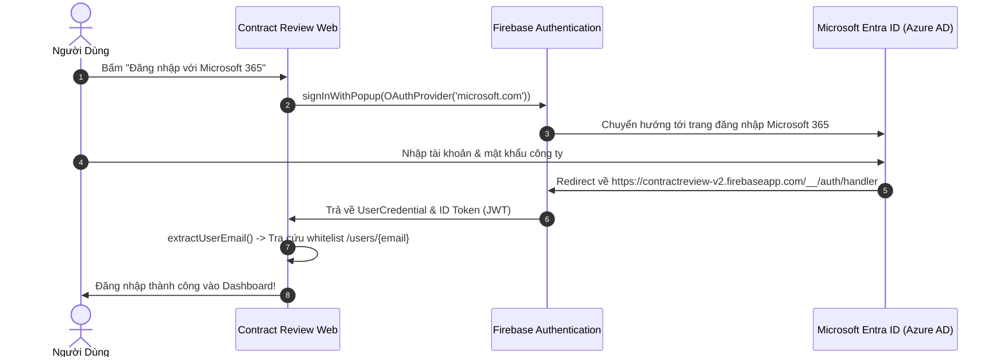

# 📘 HƯỚNG DẪN CẤU HÌNH XÁC THỰC MICROSOFT ENTRA ID (AZURE AD) CHO FIREBASE AUTH

> **Dự án:** Contract Review System v2.0  
> **Áp dụng cho:** Quản trị viên hệ thống (System Administrator / IT Admin)  
> **Mục tiêu:** Cho phép toàn bộ nhân sự công ty đăng nhập hệ thống bằng tài khoản Microsoft 365 (`@fes.foodempire.vn` hoặc tài khoản tổ chức được cấp phép).

---

## 📌 1. TỔNG QUAN LUỒNG XÁC THỰC MICROSOFT



---

## 🛠️ 2. BƯỚC 1: ĐĂNG KÝ ỨNG DỤNG TRÊN MICROSOFT ENTRA ID (AZURE PORTAL)

1. Truy cập vào **Microsoft Entra Admin Center** ([entra.microsoft.com](https://entra.microsoft.com/)) hoặc **Azure Portal** ([portal.azure.com](https://portal.azure.com/)).
2. Đăng nhập bằng tài khoản Quản trị viên (Global Admin hoặc Application Admin) của tổ chức.
3. Ở menu bên trái, điều hướng đến: **Identity** $\rightarrow$ **Applications** $\rightarrow$ **App registrations** (Đăng ký ứng dụng).
4. Bấm **+ New registration** (Đăng ký mới):
   * **Name**: Nhập `Contract Review System`
   * **Supported account types** (Loại tài khoản được hỗ trợ):
     * *Khuyến nghị nội bộ*: Chọn **Accounts in this organizational directory only (Single tenant)** nếu chỉ nhân sự thuộc tenant Food Empire được phép đăng nhập.
     * *Linh hoạt*: Chọn **Accounts in any organizational directory (Any Microsoft Entra ID tenant - Multitenant)** nếu có nhiều chi nhánh/tenant khác nhau.
   * **Redirect URI (optional)**:
     * Chọn nền tảng: **Web**.
     * Nhập chính xác Redirect URL của Firebase Auth:
       ```text
       https://contractreview-v2.firebaseapp.com/__/auth/handler
       ```
5. Bấm **Register** (Đăng ký).

---

## 🔑 3. BƯỚC 2: LẤY CLIENT ID VÀ TẠO CLIENT SECRET

1. Sau khi đăng ký xong, tại màn hình **Overview** của ứng dụng:
   * Copy giá trị **Application (client) ID** (Dạng chuỗi UUID, ví dụ: `xxxxxxxx-xxxx-xxxx-xxxx-xxxxxxxxxxxx`).
2. Ở menu bên trái, chọn **Certificates & secrets** $\rightarrow$ Tab **Client secrets**.
3. Bấm **+ New client secret**:
   * **Description**: Nhập `Firebase Auth Secret`
   * **Expires**: Chọn thời hạn (ví dụ: `180 days` hoặc `730 days / 24 months`).
   * Bấm **Add**.
4. ⚠️ **RẤT QUAN TRỌNG**:
   * Ngay sau khi bấm Add, hệ thống sẽ hiển thị cột **Value** và cột **Secret ID**.
   * Bạn **PHẢI COPY NGAY GIÁ TRỊ TẠI CỘT `Value`** (chuỗi ký tự bí mật).
   * *(Lưu ý: Không copy cột Secret ID. Giá trị Value chỉ hiển thị 1 lần duy nhất, nếu rời trang sẽ bị ẩn vĩnh viễn).*

---

## 🔥 4. BƯỚC 3: KÍCH HOẠT MICROSOFT TRÊN FIREBASE CONSOLE

1. Truy cập vào **Firebase Console**:
   * [https://console.firebase.google.com/project/contractreview-v2/authentication/providers](https://console.firebase.google.com/project/contractreview-v2/authentication/providers)
2. Chọn mục **Authentication** $\rightarrow$ Tab **Sign-in method** (hoặc Providers).
3. Bấm **Add new provider** $\rightarrow$ Chọn **Microsoft**.
4. Bật công tắc **Enable**.
5. Điền thông tin đã lấy từ Bước 2:
   * **Application ID**: Dán `Application (client) ID` từ Azure.
   * **Application secret**: Dán giá trị `Value` của Client Secret từ Azure.
6. Kiểm tra mục **Callback URL**:
   * Đảm bảo trùng khớp với Redirect URI đã khai báo trên Azure (`https://contractreview-v2.firebaseapp.com/__/auth/handler`).
7. Bấm **Save** (Lưu).

---

## 🌐 5. BƯỚC 4: KIỂM TRA AUTHORIZED DOMAINS

1. Tại **Firebase Console** $\rightarrow$ **Authentication** $\rightarrow$ Tab **Settings** $\rightarrow$ Mục **Authorized domains**.
2. Đảm bảo danh sách đã có đầy đủ các domain sau:
   * `localhost` (kiểm thử local)
   * `contractreview-v2.firebaseapp.com`
   * `contractreview-v2.web.app` (domain hosting chính thức)
   * *(Nếu sau này công ty gắn Custom Domain riêng như `contractreview.foodempire.vn`, bấm **Add domain** để thêm vào đây).*

---

## 👥 6. BƯỚC 5: CẤP QUYỀN WHITELIST CHO TÀI KHOẢN MICROSOFT

Hệ thống Contract Review áp dụng cơ chế Whitelist bảo mật 100%:
* Chỉ tài khoản có sẵn trong Firestore collection `/users/{email}` mới có thể đăng nhập.
* Khi muốn thêm một nhân viên mới dùng email Microsoft (ví dụ `tindn@fes.foodempire.vn`):
  1. Vào **Firestore Database** $\rightarrow$ Collection `users`.
  2. Bấm **Add document** với Document ID là email viết thường: `tindn@fes.foodempire.vn`.
  3. Thêm các trường dữ liệu:
     * `email`: `tindn@fes.foodempire.vn` (string)
     * `displayName`: `Đoàn Ngọc Tín` (string)
     * `role`: `USER` hoặc `LEGAL` hoặc `HOL` (string)
     * `department`: `Phòng Mua Hàng` (string)
     * `isActive`: `true` (boolean)
  4. Bấm **Save**. Người dùng có thể đăng nhập ngay lập tức bằng nút Microsoft 365!

---

## 🔍 7. XỬ LÝ LỖI THƯỜNG GẶP (TROUBLESHOOTING)

| Mã lỗi / Hiện tượng | Nguyên nhân | Cách khắc phục |
|---|---|---|
| `auth/operation-not-allowed` | Chưa bật Microsoft Provider trên Firebase Console. | Vào Firebase Console $\rightarrow$ Sign-in method $\rightarrow$ Enable Microsoft. |
| `auth/unauthorized-domain` | Domain web chưa được thêm vào Authorized Domains. | Thêm domain vào Authentication $\rightarrow$ Settings $\rightarrow$ Authorized domains. |
| `AADSTS50011: The reply URL does not match` | Redirect URI trên Azure không khớp với Firebase. | Kiểm tra lại Redirect URI trên Azure App Registration phải là `https://contractreview-v2.firebaseapp.com/__/auth/handler`. |
| `AADSTS7000215: Invalid client secret provided` | Client Secret bị sai hoặc copy nhầm Secret ID. | Tạo lại Client Secret mới trên Azure và copy cột **Value** dán vào Firebase Console. |
| Modal cảnh báo: *"Tài khoản chưa được cấp quyền"* | Đăng nhập Microsoft thành công nhưng email chưa được tạo trong Firestore `/users/{email}`. | Thêm document `/users/{email}` với `isActive: true` và `role: USER/LEGAL/HOL`. |
