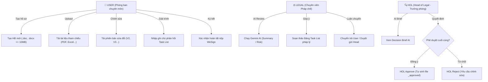

# Contract Review System

> **Hệ thống Quản lý, Thẩm định & Phê duyệt Hợp đồng Nội bộ Doanh nghiệp**  
> Giải pháp Serverless kết hợp giữa **Vercel Frontend (Vanilla JS + Vite)**, **Google Workspace Backend (Google Apps Script)** và **Google Gemini AI**.

[](https://vitejs.dev/)
[](https://developer.mozilla.org/en-US/docs/Web/JavaScript)
[](https://developers.google.com/apps-script)
[](https://deepmind.google/technologies/gemini/)
[-FFCA28?logo=firebase&logoColor=black)](https://firebase.google.com/)
[](https://vercel.com/)

---

## 📖 1. Giới thiệu Tổng quan

**Contract Review System** là nền tảng số hóa toàn diện quy trình xét duyệt hợp đồng trong doanh nghiệp, giúp rút ngắn thời gian thẩm định pháp lý, kiểm soát rủi ro điều khoản và quản lý tập trung toàn bộ hồ sơ hợp đồng.

### Điểm nổi bật về mặt kiến trúc (Decoupled Serverless)
- **Frontend độc lập**: Đặt trên Vercel CDN, xây dựng bằng Vanilla JS thuần tối ưu hiệu năng cao, dung lượng tải trang cực nhỏ (~50KB gzip), không phụ thuộc framework cồng kềnh.
- **Backend miễn phí vận hành**: Chạy trên Google Apps Script (GAS), tận dụng trọn vẹn hạ tầng Google Workspace có sẵn của doanh nghiệp: **Google Sheets** làm cơ sở dữ liệu quan hệ, **Google Drive** làm kho lưu trữ tệp, **GmailApp** làm máy chủ gửi thông báo và **Google Gemini API** hỗ trợ rà soát pháp lý tự động.
- **Chi phí hạ tầng 0 USD**: Không tốn chi phí thuê máy chủ (EC2/VPS), không phí bản quyền cơ sở dữ liệu, đáp ứng tiêu chuẩn bảo mật doanh nghiệp.

---

## ✨ 2. Các Tính năng Cốt lõi

### 📄 2.1. Quản lý Vòng đời Hợp đồng (Lifecycle Workflow)
- Quản lý quy trình qua các trạng thái chuẩn hóa: `DRAFT` ➔ `PENDING_LEGAL` ➔ `LEGAL_COMMENTED` / `LEGAL_APPROVED` ➔ `PENDING_HOL` ➔ `HOL_COMMENTED` / `HOL_APPROVED` ➔ `COMPLETED`.
- Khóa vai trò chặt chẽ (RBAC): Chỉ `USER` mới được tạo hợp đồng; chỉ `LEGAL` mới có thẩm quyền thẩm định và trả ý kiến; chỉ `HOL` (Head of Legal) mới có quyền phê duyệt cấp cao nhất.
- Tự động sinh phiên bản `{contractId}_approved` ở chế độ chỉ đọc (Read-only) ngay khi Trưởng phòng phê duyệt để sẵn sàng nộp lên cổng ký số WeSign.

### 🤖 2.2. Trí tuệ Nhân tạo Google Gemini (AI Legal Assistant)
- **Tóm tắt Hợp đồng (Summary)**: Tự động trích xuất các điều khoản trọng yếu: các bên tham gia, giá trị hợp đồng, thời hạn hiệu lực, điều khoản thanh toán, quyền và nghĩa vụ chính.
- **Phân tích Rủi ro Đa chiều (Risk Assessment)**:
  - Tùy biến đánh giá theo vai trò của công ty: **Bên mua (Buyer)** hoặc **Bên bán (Seller)**.
  - Phân loại rủi ro theo 4 mức độ: Nghiêm trọng (Critical), Cao (High), Trung bình (Medium), Thấp (Low).
  - Gợi ý câu chữ điều chỉnh cụ thể (Mitigation wording) để bảo vệ quyền lợi doanh nghiệp.
- **Báo cáo Tóm tắt Quyết định (Decision Brief)**: Tổng hợp nhanh cho Trưởng phòng Pháp chế (Head of Legal) trước khi bấm duyệt.

### 📋 2.3. Bảng Nhiệm vụ Rà soát Pháp lý (Task List Matrix)
- Bộ phận Pháp chế lập danh sách các vấn đề/điều khoản cần chỉnh sửa kèm khuyến nghị pháp lý.
- Người phụ trách hợp đồng (User) nhập nội dung phản hồi/giải trình trên từng nhiệm vụ.
- Tự động lưu trữ và đồng bộ trạng thái xử lý giữa hai bên qua từng phiên bản chỉnh sửa.

### 📧 2.4. Hệ thống Thông báo Email Bất đồng bộ (Non-Blocking Async UI)
- Tự động gửi email thông báo đúng đối tượng tại từng chặng chuyển trạng thái (User ➔ Legal, Legal ➔ User, Legal ➔ Head, Head Approve, Head Reject).
- **Trải nghiệm Non-Blocking**: Nút bấm chuyển trạng thái mở khóa giao diện ngay lập tức (~1 giây), luồng gửi Gmail được thực thi ngầm ở chế độ background; khi gửi xong sẽ bật **Toast Notification** nổi ở góc trên bên phải màn hình.
- Email tương thích hoàn hảo với **Microsoft Outlook Desktop / O365** (hỗ trợ `bgcolor` fallback, không dùng gradient lỗi thời).
- Đính kèm trực tiếp liên kết mở file `{contractId}_approved` trong email thông báo phê duyệt.
- Tự động lọc trùng lặp giữa danh sách TO và CC, hỗ trợ `EMAIL_WHITELIST` an toàn khi thử nghiệm.

### 📁 2.5. Quản lý Phiên bản & Tài liệu Tham chiếu Đính kèm
- **File Hợp đồng chính**: Ràng buộc định dạng văn bản Word (`.doc`, `.docx`) dung lượng $\le$ 10MB; tự động chuyển đổi sang Google Docs để người dùng xem trước và đặt bình luận (`COMMENT`) trực tiếp.
- **Tài liệu tham chiếu (Reference Files)**: Hỗ trợ nạp đồng thời nhiều tệp (PDF, Excel, Word, hình ảnh...) tối đa 10 tệp/hồ sơ, 10MB/tệp; bảo toàn định dạng gốc và cấp quyền xem (`VIEW`).

### 🎨 2.6. Dark / Light Theme & Giao diện Tương phản cao
- Chuyển đổi giao diện Sáng / Tối mượt mà thông qua nút toggle trên Topbar.
- Công nghệ **Zero-FOUC**: Script phát hiện theme siêu nhẹ đặt trong thẻ `<head>` đọc `localStorage` và `prefers-color-scheme`, loại bỏ hoàn toàn hiện tượng nhấp nháy giao diện khi tải trang.
- Bảng màu tương phản cao (High-Contrast Tokens) hiển thị rõ nét các nhãn trạng thái và mức độ rủi ro AI trên cả hai nền.

### ⚡ 2.7. Tối ưu Hiệu năng & Caching Siêu tốc
- **Pure RAM Cache**: Khởi tạo biến dữ liệu bằng `null`, chuyển đổi giữa tab "Tổng quan" và "Đã duyệt" trong **0ms (0 network call)**.
- **Nút 🔄 Làm mới (Force Refresh)**: Hỗ trợ nạp lại dữ liệu tươi trực tiếp từ Google Sheets khi cần.
- **Tìm kiếm Debounce 800ms**: Tối ưu ô tìm kiếm đa trường (Mã HĐ, Tên HĐ, NCC, Người tạo), giữ nguyên con trỏ chuột và vùng đệm gõ Tiếng Việt có dấu (IME).
- **Lưu trữ Lịch sử (Archive DB)**: Tự động di chuyển hồ sơ hoàn tất sang `Contract_Archive_DB`, hỗ trợ nạp 200 bản ghi mới nhất và công cụ Tìm kiếm sâu trên máy chủ (`searchArchivedContracts`).

---

## 🛠️ 3. Công nghệ Sử dụng (Tech Stack)

| Phân hệ | Công nghệ / Thư viện | Vai trò |
| :--- | :--- | :--- |
| **Frontend** | Vanilla JavaScript (ES6+), HTML5, CSS3 | Xây dựng Single Page Application gọn nhẹ, mượt mà |
| **Bundler** | Vite 8 | Module bundler, dev server tốc độ cao |
| **Hosting Frontend** | Vercel | Phục vụ ứng dụng tĩnh qua mạng lưới CDN toàn cầu |
| **Backend Runtime** | Google Apps Script (V8 Engine) | Xử lý nghiệp vụ, API Gateway tiếp nhận POST request |
| **Database** | Google Sheets (Dual-Spreadsheet) | Cơ sở dữ liệu: Active DB (`SPREADSHEET_ID`) + Archive DB |
| **File Storage** | Google Drive API | Lưu trữ thư mục case, chuyển đổi Google Docs, set permissions |
| **Email Service** | GmailApp (Apps Script) | Gửi email thông báo tự động theo mẫu HTML doanh nghiệp |
| **AI Engine** | Google Gemini (`gemini-3.1-flash-lite`) | Tóm tắt hợp đồng, phân tích rủi ro, tạo Decision Brief |
| **Authentication** | Firebase Auth Client SDK v10 | Xác thực Google Workspace OAuth & Microsoft Azure AD |
| **Security & Cache** | CacheService & LockService | Rate limiter (15 req/phút), token caching, khóa ghi đồng thời |

---

## 📂 4. Cấu trúc Thư mục Dự án

```text
ContractReview/
├── README.md                         # Tài liệu giới thiệu & hướng dẫn cài đặt (file này)
├── architecture.md                   # Đặc tả chi tiết kiến trúc kỹ thuật hệ thống
├── CHANGELOG.md                      # Nhật ký các phiên bản và cập nhật tính năng
│
├── docs/                             # Tài liệu kỹ thuật bổ trợ
│   ├── gas-firebase-auth-guide.md    # Hướng dẫn tích hợp Firebase Auth với Apps Script & Vercel
│   ├── pre-prod-test-checklist.md    # Danh mục kiểm thử End-to-End trước Go-Live
│   └── reports/                      # Báo cáo audit bảo mật và hiệu năng
│
├── backend/                          # Mã nguồn Google Apps Script
│   ├── .clasp.json                   # Cấu hình Google Clasp CLI
│   ├── appsscript.json               # Manifest cấu hình OAuth scopes & V8 runtime
│   ├── Code.js                       # Entry point doGet, setupSpreadsheet_, triggers
│   ├── ApiGateway.js                 # Hàm doPost, whitelist 22 actions an toàn
│   ├── Config.js                     # Cấu hình hằng số, transitions, script properties
│   ├── Auth.js                       # Xác thực token Firebase, rate limiter, phân quyền RBAC
│   ├── ContractService.js            # CRUD hợp đồng, workflow state machine, RAM stats
│   ├── VersionService.js             # Upload phiên bản mới, convert sang Google Docs
│   ├── ReferenceFileService.js       # Quản lý tài liệu tham chiếu (tối đa 10 files/case)
│   ├── CommentService.js             # Quản lý bình luận/trao đổi theo vai trò
│   ├── NotificationService.js        # Gửi email HTML chuẩn Outlook, whitelist, CC deduplication
│   ├── AIService.js                  # Tích hợp Google Gemini API (Summary, Risk, Decision Brief)
│   ├── DriveService.js               # Quản lý thư mục Drive, phân quyền COMMENT / VIEW
│   ├── ActivityLog.js                # Ghi nhận nhật ký kiểm toán (Audit Trail)
│   ├── Utils.js                      # Hàm tiện ích: UUID, date parser, chunked cache
│   ├── Maintenance.js                # Script dọn dẹp dữ liệu rác, reset bộ đếm ID
│   ├── Test.js                       # Bộ kiểm thử tích hợp backend (runAllTests)
│   └── Test_V2.js                    # Bộ đo kiểm micro-profiler 5 tầng (I/O, RAM, Lock)
│
└── frontend/                         # Mã nguồn Single Page Application (Vite)
    ├── package.json                  # Cấu hình gói và dependencies
    ├── vercel.json                   # Cấu hình rewrites proxy cho Firebase Auth
    ├── index.html                    # Entry point HTML nạp Firebase SDK & script Zero-FOUC
    ├── main.js                       # Toàn bộ logic SPA: State, Router, Views, Cache, API Client
    ├── style.css                     # Design tokens, Dark / Light theme, Glassmorphism UI
    ├── .env                          # Biến môi trường Vite (VITE_GAS_API_URL)
    └── public/                       # Tài nguyên tĩnh (favicon, logo, icons)
```

---

## 🚀 5. Hướng dẫn Cài đặt & Triển khai

### 5.1. Yêu cầu Tiên quyết
- **Node.js**: Phiên bản 18.x trở lên.
- **Tài khoản Google Workspace**: Có quyền truy cập Google Sheets, Google Drive, Gmail.
- **Dự án Firebase**: Đã kích hoạt dịch vụ Authentication.
- **Tài khoản Vercel**: Để triển khai Frontend.
- **Google Clasp CLI** *(tùy chọn nhưng khuyến nghị)*: `npm install -g @google/clasp` để đồng bộ code backend.

---

### 5.2. Triển khai Backend (Google Apps Script)

#### Bước 1: Chuẩn bị Google Spreadsheet & Thư mục Drive
1. Tạo một Google Spreadsheet mới trên Google Drive đặt tên là `Contract_Review_DB`.
2. Tạo một Thư mục mới trên Google Drive đặt tên là `ContractReview_Storage`.
3. Lấy `Spreadsheet ID` và `Drive Folder ID` từ thanh địa chỉ trình duyệt.

#### Bước 2: Đẩy mã nguồn lên Google Apps Script
- Sử dụng Clasp CLI:
  ```bash
  cd backend
  clasp login
  # Gắn Script ID dự án của bạn vào file .clasp.json
  clasp push
  ```
- Hoặc mở giao diện [script.google.com](https://script.google.com), tạo dự án mới và copy toàn bộ các file `.js` trong thư mục `backend/` vào trình soạn thảo.

#### Bước 3: Cấu hình Script Properties
Trong giao diện Google Apps Script Editor, vào **Project Settings (Biểu tượng bánh răng)** ➔ **Script Properties** ➔ Thêm các cặp key/value:

| Key | Giá trị mẫu | Ý nghĩa |
| :--- | :--- | :--- |
| `SPREADSHEET_ID` | `1IszP3Y_ekSAU61msgSO8IAowz4fZKkySWfb0g5aW_iY` | ID Google Sheet Active DB |
| `ARCHIVE_SPREADSHEET_ID`| *(Để trống, hệ thống sẽ tự động tạo)* | ID Google Sheet Archive DB |
| `ROOT_FOLDER_ID` | `1CB-qgErqsB9h7DN3mgtRDmrskrH90x9B` | ID Thư mục gốc lưu trữ trên Google Drive |
| `GEMINI_API_KEY` | `AIzaSy...` | Khóa API Google Gemini từ Google AI Studio |
| `FIREBASE_API_KEY` | `AIzaSy...` | Web API Key lấy từ Firebase Project Settings |
| `WEB_APP_URL` | `https://script.google.com/macros/s/.../exec` | URL triển khai Web App của Apps Script |

#### Bước 4: Chạy Hàm Khởi tạo Bảng (Setup)
- Trong Apps Script Editor, chọn hàm `setupSpreadsheet_` và nhấp **Run**.
- Cấp quyền truy cập cho script (DriveApp, SpreadsheetApp, GmailApp).
- Script sẽ tự động tạo đủ 8 sheet với màu sắc chuẩn và thêm người dùng mẫu vào sheet `users`.

#### Bước 5: Triển khai Web App
1. Nhấp **Deploy** ➔ **New deployment**.
2. Chọn loại: **Web app**.
3. **Execute as**: `Me (your-email@domain.com)`.
4. **Who has access**: `Anyone` *(Bắt buộc chọn Anyone để hỗ trợ cả người dùng đăng nhập bằng Google lẫn Microsoft OAuth)*.
5. Sao chép đường dẫn **Web App URL** vừa tạo.

---

### 5.3. Cấu hình Firebase Authentication & Vercel Proxy

Chi tiết các bước thiết lập được hướng dẫn tại [docs/gas-firebase-auth-guide.md](file:///Users/tindn/Documents/Code/ContractReview/docs/gas-firebase-auth-guide.md):
1. Vào [Firebase Console](https://console.firebase.google.com/) ➔ Chọn Project ➔ **Authentication** ➔ **Sign-in method**:
   - Bật provider **Google**.
   - Bật provider **Microsoft** (điền Application ID và Secret từ Azure AD).
2. Thêm domain frontend (Vercel domain và `localhost:5173`) vào danh sách **Authorized domains**.
3. Cấu hình proxy trong file `frontend/vercel.json` để chuyển tiếp các request auth về Firebase:
   ```json
   {
     "rewrites": [
       {
         "source": "/__/auth/:path*",
         "destination": "https://<your-firebase-app>.firebaseapp.com/__/auth/:path*"
       },
       {
         "source": "/__/firebase/init.json",
         "destination": "https://<your-firebase-app>.firebaseapp.com/__/firebase/init.json"
       }
     ]
   }
   ```

---

### 5.4. Cài đặt & Chạy Frontend

#### Bước 1: Cài đặt Dependencies
```bash
cd frontend
npm install
```

#### Bước 2: Cấu hình Biến môi trường
Cập nhật file `frontend/.env`:
```env
VITE_GAS_API_URL="https://script.google.com/macros/s/<YOUR_DEPLOYMENT_ID>/exec"
```

#### Bước 3: Chạy môi trường Local Development
```bash
npm run dev
```
Truy cập ứng dụng tại `http://localhost:5173`.

#### Bước 4: Đóng gói và Triển khai lên Vercel
```bash
# Kiểm tra build production
npm run build

# Triển khai trực tiếp bằng Vercel CLI
vercel --prod
```

---

## 🔒 6. Ma trận Phân quyền (RBAC)

Hệ thống phân định rõ ranh giới quyền hạn thông qua 3 vai trò:



---

## 🧪 7. Kiểm thử & Đảm bảo Chất lượng

Dự án cung cấp bộ công cụ kiểm thử toàn diện:

1. **Bộ Kiểm thử Đơn vị & Tích hợp (`backend/Test.js`)**:
   - Mở Apps Script Editor ➔ Chọn hàm `runAllTests()` ➔ Nhấp **Run**.
   - Tự động kiểm tra: Hằng số hệ thống, máy trạng thái State Machine, ma trận phân quyền RBAC và cấu trúc bảng tính.
2. **Bộ Đo kiểm Hiệu năng Micro-Profiler (`backend/Test_V2.js`)**:
   - Mở Apps Script Editor ➔ Chọn hàm `runFullLifecycleProfiler_()` ➔ Nhấp **Run**.
   - Bóc tách thời gian chạy chi tiết của 5 tầng: `SHEETS_IO`, `DRIVE_IO`, `JS_LOGIC`, `CACHE`, `LOCK`.
   - Mô phỏng khép kín 100% vòng đời hợp đồng mà không làm biến đổi cấu trúc bảng hay để lại rác dữ liệu.
3. **Bảng Checklist Kiểm thử End-to-End**:
   - Vui lòng tham khảo bảng checklist 10 phần chi tiết trước khi bàn giao đưa vào vận hành tại [docs/pre-prod-test-checklist.md](file:///Users/tindn/Documents/Code/ContractReview/docs/pre-prod-test-checklist.md).

---

## 📚 8. Tài liệu Kỹ thuật Liên quan

- [architecture.md](file:///Users/tindn/Documents/Code/ContractReview/architecture.md) — Tài liệu đặc tả kiến trúc kỹ thuật chi tiết nhất của hệ thống.
- [CHANGELOG.md](file:///Users/tindn/Documents/Code/ContractReview/CHANGELOG.md) — Lịch sử cập nhật và thay đổi qua các phiên bản.
- [docs/gas-firebase-auth-guide.md](file:///Users/tindn/Documents/Code/ContractReview/docs/gas-firebase-auth-guide.md) — Cẩm nang hướng dẫn xác thực Firebase Auth trên nền tảng Google Apps Script.
- [docs/pre-prod-test-checklist.md](file:///Users/tindn/Documents/Code/ContractReview/docs/pre-prod-test-checklist.md) — Checklist kiểm thử tiền triển khai.
