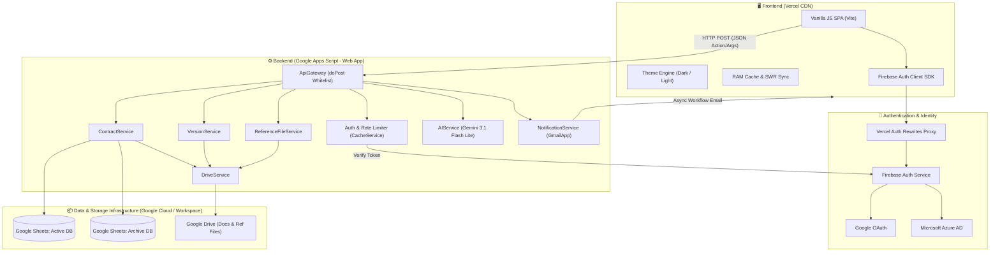
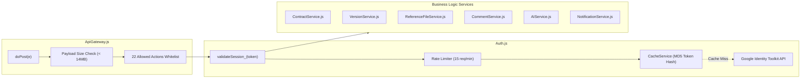
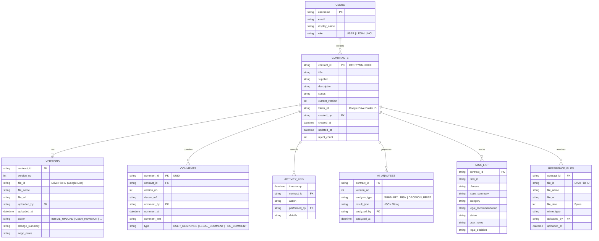
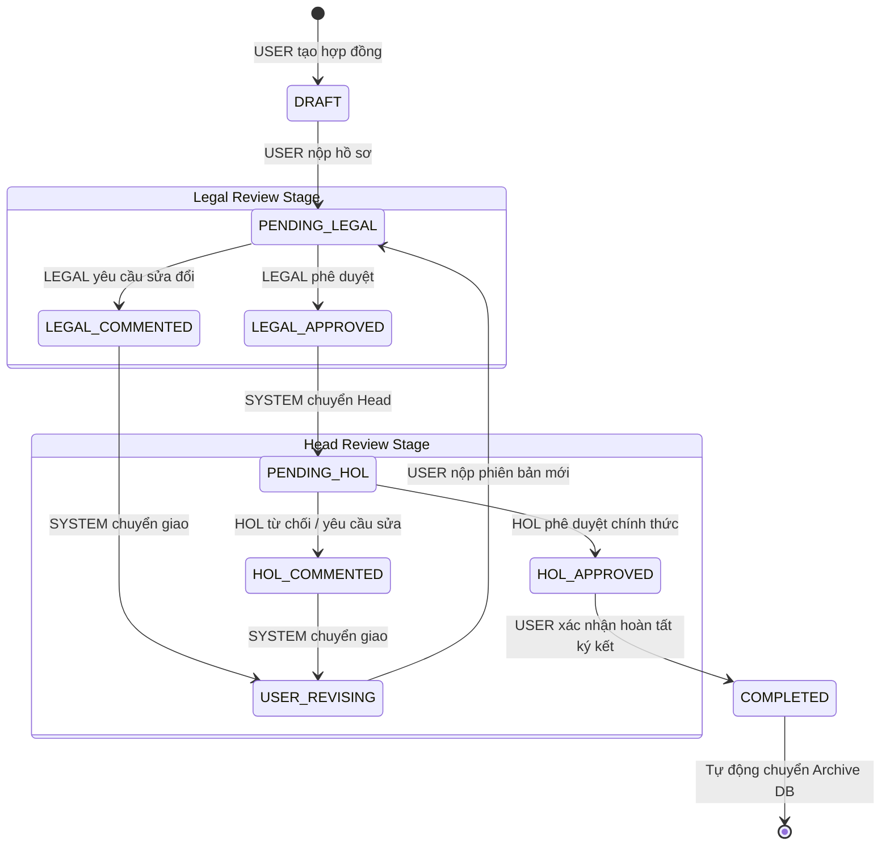
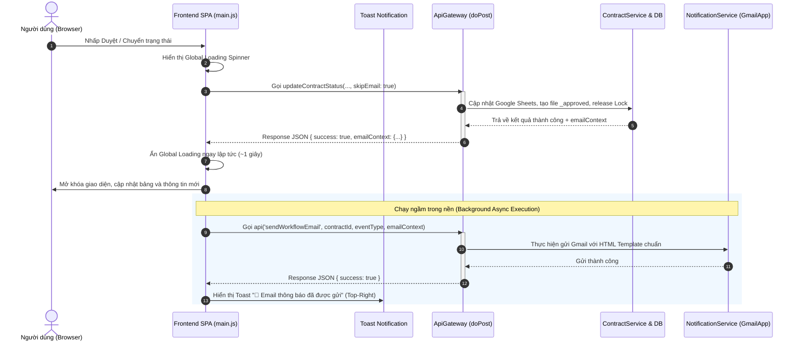

# Architecture Document: Contract Review System

> **Phiên bản:** v2.0 (Cập nhật toàn diện theo Codebase)  
> **Cập nhật lần cuối:** 2026-09-23  
> **Mục đích:** Tài liệu đặc tả kiến trúc kỹ thuật toàn diện cho hệ thống Thẩm định & Phê duyệt Hợp đồng (Contract Review System).

---

## 1. Tổng quan hệ thống (System Overview)

Hệ thống **Contract Review** là ứng dụng quản lý, thẩm định và xét duyệt hợp đồng nội bộ. Ứng dụng được thiết kế theo kiến trúc tách rời độc lập (**Decoupled Architecture**):
- **Backend & Database**: Lưu trữ và xử lý toàn bộ logic nghiệp vụ trên hạ tầng **Google Workspace** (Google Apps Script V8 runtime, Google Sheets làm Database, Google Drive làm Document Storage, GmailApp làm Notification Engine, và Google Gemini API làm AI Engine).
- **Frontend**: Giao diện người dùng độc lập (**SPA - Single Page Application**) được phát triển bằng Vanilla JavaScript hiện đại (ES6+), HTML5, CSS3 Glassmorphism tokens, đóng gói bằng **Vite**, và triển khai trên hạ tầng CDN tốc độ cao của **Vercel**.
- **Authentication**: Xác thực tập trung thông qua **Firebase Authentication** hỗ trợ đa nền tảng đăng nhập (Google Workspace OAuth & Microsoft Azure AD Multitenant OAuth) được proxy qua Vercel Rewrites.



Kiến trúc này tối ưu chi phí vận hành (0 USD server), tận dụng dung lượng Google Workspace của doanh nghiệp, đồng thời mang lại trải nghiệm mượt mà, tải trang tức thì (0ms tab switching) cho người dùng.

---

## 2. Cấu trúc thư mục (Directory Structure)

Dự án được tổ chức thành các phân hệ rõ ràng:

```text
/ContractReview
├── README.md                         # Tài liệu hướng dẫn tổng quan dự án
├── architecture.md                   # Đặc tả kiến trúc kỹ thuật toàn diện (file này)
├── CHANGELOG.md                      # Lịch sử các phiên bản và thay đổi chi tiết
│
├── docs/                             # Tài liệu hướng dẫn kỹ thuật và kiểm thử
│   ├── gas-firebase-auth-guide.md    # Hướng dẫn chi tiết setup Firebase Auth + GAS + Vercel
│   ├── pre-prod-test-checklist.md    # Bảng checklist kiểm thử End-to-End trước Go-Live
│   └── reports/                      # Báo cáo kỹ thuật và nhật ký kiểm thử
│       └── audit_2026-06-29.md       # Báo cáo bảo mật và audit hệ thống
│
├── backend/                          # Mã nguồn Google Apps Script (Backend Standalone Web App)
│   ├── .clasp.json                   # Cấu hình Google Clasp (quản lý mã nguồn GAS qua git)
│   ├── appsscript.json               # Manifest cấu hình OAuth Scopes, runtime V8, timezone
│   ├── Code.js                       # Entry point (doGet), setupSpreadsheet_, email trigger
│   ├── ApiGateway.js                 # Endpoint doPost tiếp nhận HTTP POST, whitelist router
│   ├── Config.js                     # Cấu hình hằng số, rules chuyển trạng thái, ScriptProperties
│   ├── Auth.js                       # Xác thực Firebase JWT token, rate limiter 15 req/min, RBAC
│   ├── ContractService.js            # CRUD hợp đồng, workflow transitions, in-memory stats, archive
│   ├── VersionService.js             # Upload phiên bản mới, convert file sang Google Docs
│   ├── ReferenceFileService.js       # Quản lý tài liệu tham chiếu đính kèm (đa định dạng)
│   ├── CommentService.js             # Quản lý bình luận/trao đổi theo vai trò người dùng
│   ├── NotificationService.js        # Gửi email thông báo, template HTML Outlook, whitelist, CC
│   ├── AIService.js                  # Tích hợp Google Gemini API (Summary, Risk, Decision Brief)
│   ├── DriveService.js               # Quản lý Google Drive folder/file, set permission COMMENT/VIEW
│   ├── ActivityLog.js                # Ghi nhận lịch sử thao tác (Audit Trail)
│   ├── Utils.js                      # Helpers (UUID, Date formatting, CacheService chunking)
│   ├── Maintenance.js                # Công cụ dọn dẹp dữ liệu thử nghiệm, reset counters
│   ├── Test.js                       # Bộ kiểm thử đơn vị và tích hợp GAS (runAllTests)
│   ├── Test_V2.js                    # Bộ công cụ Micro-Profiler & đo đạc hiệu năng 5 lớp (I/O, RAM, Lock)
│   ├── Index.html                    # View HTML gốc phục vụ Web App trực tiếp trên GAS (dự phòng)
│   ├── App.html                      # Script xử lý giao diện cho phiên bản GAS HtmlService
│   ├── Components.html               # Thành phần UI nhúng trong GAS HtmlService
│   └── Styles.html                   # CSS cho phiên bản GAS HtmlService
│
└── frontend/                         # Mã nguồn Single Page Application (Vite + Vanilla JS)
    ├── package.json                  # Cấu hình npm và dependencies (Vite)
    ├── package-lock.json             # Khóa phiên bản dependency
    ├── vercel.json                   # Cấu hình Vercel rewrites proxy cho Firebase Auth
    ├── index.html                    # File HTML gốc, nạp Firebase SDK và Zero-FOUC theme script
    ├── main.js                       # Toàn bộ logic SPA: State, Router, Views, Cache, API Client
    ├── style.css                     # CSS Design Tokens, Glassmorphism theme, Dark/Light palette
    ├── .env                          # Biến môi trường Vite (VITE_GAS_API_URL)
    ├── .env.local                    # Biến môi trường cục bộ (tùy chọn)
    └── public/                       # Tài nguyên tĩnh (favicon, icons, assets)
```

---

## 3. Kiến trúc Frontend (Vercel + Vite)

### 3.1. Công nghệ & Nguyên tắc cốt lõi
- **Vanilla JavaScript (ES6+)**: Không sử dụng framework nặng (React/Vue/Angular), giúp dung lượng bundle siêu nhỏ (~50KB gzip), nạp trang tức thì và không bị overhead từ Virtual DOM.
- **Vite Bundler**: Đảm bảo tốc độ Hot Module Replacement (HMR) cực nhanh khi phát triển và tối ưu hóa tài nguyên tĩnh khi build production.
- **Single Page Architecture (SPA)**: Toàn bộ điều hướng trang diễn ra mượt mà thông qua hàm `navigateTo(view, contractId)` và cơ chế Hash Router (`#dashboard`, `#archived`, `#contract/:id`).

### 3.2. Hệ thống Giao diện Đa chế độ (Dark / Light Theme System)
- **Zero-FOUC (Flash of Unstyled Content)**: Một script blocking nhỏ đặt ngay trong thẻ `<head>` của `frontend/index.html` đọc giá trị `cr_theme` từ `localStorage` hoặc truy vấn Media Query hệ điều hành `(prefers-color-scheme: light)` và gắn thuộc tính `data-theme` lên thẻ `<html>` trước khi render nội dung DOM.
- **Design Tokens bằng CSS Variables**: `style.css` định nghĩa hệ thống biến màu sắc, viền, bóng đổ và độ trong suốt (Glassmorphism) tách biệt cho `[data-theme="dark"]` và `[data-theme="light"]`.
- **Bảng màu tương phản cao (High-Contrast Palette)**: Đảm bảo các Status Badge (Draft, Legal Review, Head Review, Approved) và nhãn Rủi ro AI (Cao, Trung bình, Thấp) luôn dễ đọc trên cả nền tối lẫn nền sáng.
- **Bộ chuyển đổi Theme trên Topbar**: Nút toggle giao diện trên thanh Topbar cho phép người dùng đổi theme ngay lập tức và lưu lựa chọn vào `localStorage`.

### 3.3. Chiến lược Lưu trữ đệm (Caching & Synchronization Architecture)
1. **Pure In-Memory RAM Cache**:
   - `AppState.contracts` và `AppState.stats` được khởi tạo bằng `null` (thay vì mảng rỗng `[]`) để phân biệt rõ ràng giữa trạng thái "chưa tải dữ liệu" và "dữ liệu rỗng".
   - Chuyển đổi tab giữa **Tổng quan (Dashboard)** và **Đã duyệt (Archived)** diễn ra tức thì trong **0ms (0 network call)** khi đã có RAM data.
   - Nút **🔄 Làm mới (Force Refresh)** trên giao diện cho phép bỏ qua cache và truy vấn dữ liệu mới nhất từ Google Sheets khi người dùng cần.
2. **SWR & LocalStorage Session Persistence**:
   - Dữ liệu người dùng và danh sách hợp đồng được đồng bộ định kỳ vào `localStorage` (`cr_dashboard_cache`, `cr_archived_cache`, `cr_user_session`) giúp khôi phục trạng thái ngay khi mở lại tab hoặc tải lại trang.
   - Hỗ trợ đồng bộ đa tab (`storage` event listener).
3. **Single Round-Trip Mutation Synchronization**:
   - Khi thực hiện các thao tác thay đổi dữ liệu (cập nhật trạng thái, upload phiên bản, thêm tài liệu tham chiếu, bình luận), response trả về từ backend chứa toàn bộ đối tượng chi tiết hợp đồng đã cập nhật (`contractDetail`).
   - Frontend cập nhật thẳng vào `AppState.contractDetailsMap[contractId]` mà không cần thực hiện thêm round-trip GET phụ, giảm 50% độ trễ mạng.

### 3.4. Cải tiến Bố cục Chi tiết Hợp đồng (Detail View Layout)
- **Tỉ lệ vàng 6:4**: 
  - Cột trái (60%): Chứa thông tin tổng quan hợp đồng, xem trước văn bản Google Docs nhúng iframe, và khu vực phân tích Trí tuệ nhân tạo Gemini AI.
  - Cột phải (40%): Sticky panel chứa Bảng nhiệm vụ rà soát (Task List), Lịch sử phiên bản, Trao đổi bình luận, và Quản lý tài liệu tham chiếu.
- **Timeline ngược chiều thời gian (Reverse Chronological Sorting)**: Hoạt động và bình luận mới nhất luôn hiển thị ở trên cùng.
- **Auto-expanding Textarea**: Các ô nhập nội dung góp ý và xử lý trong Task List tự động co giãn theo dung lượng text, không làm ẩn nội dung trong cả chế độ chỉnh sửa lẫn xem chỉ đọc.

### 3.5. Hệ thống Thông báo Toast Nổi Độc lập
- Vị trí cố định ở góc trên bên phải màn hình: `top: 24px, right: 24px, z-index: 99999`.
- Thuộc tính `pointer-events: none` cho container và `pointer-events: auto` cho từng toast card giúp thông báo hiển thị đè lên Sidebar và Modals mà không cản trở thao tác click của người dùng.

---

## 4. Kiến trúc Backend (Google Apps Script)

Backend hoạt động dưới dạng một Standalone Google Apps Script Web App được cấp quyền truy cập các dịch vụ Google Workspace:



### 4.1. API Gateway & Cơ chế Whitelist (`ApiGateway.js`)
- Điểm tiếp nhận duy nhất cho toàn bộ HTTP POST requests từ Frontend độc lập.
- **Kiểm tra kích thước Payload**: Giới hạn 14.680.064 ký tự (tương đương file đính kèm binary 10MB sau khi encode Base64).
- **Cơ chế Whitelist chặt chẽ (22 Actions được cấp phép)**:
  1. `checkSession`: Kiểm tra tính hợp lệ của Firebase token và quyền người dùng.
  2. `getDashboardInit`: Khởi tạo dữ liệu Tổng quan (danh sách hợp đồng active + thống kê).
  3. `getDashboardVersion`: Kiểm tra version cập nhật của dữ liệu.
  4. `getContracts`: Lấy danh sách hợp đồng active theo phân trang/lọc.
  5. `getContractStats`: Thống kê số lượng theo nhóm trạng thái.
  6. `getArchivedContracts`: Lấy danh sách hợp đồng đã hoàn tất (mặc định 200 bản ghi mới nhất).
  7. `searchArchivedContracts`: Tìm kiếm sâu trên toàn bộ cơ sở dữ liệu Archive.
  8. `getContractDetail`: Đọc toàn bộ chi tiết hồ sơ hợp đồng (versions, comments, activity, tasks, ref files).
  9. `updateContractStatus`: Chuyển đổi trạng thái quy trình xét duyệt.
  10. `deleteContract`: Xóa hợp đồng (chỉ cho phép ở trạng thái DRAFT bởi người tạo).
  11. `saveTaskList`: Lưu nháp bảng nhiệm vụ thẩm định pháp lý.
  12. `analyzeContract`: Gọi Gemini AI phân tích tóm tắt hoặc đánh giá rủi ro hợp đồng.
  13. `checkRiskAvailability`: Kiểm tra tính khả dụng của bản phân tích rủi ro trong cache.
  14. `generateDecisionBrief`: Gọi Gemini AI lập báo cáo tóm tắt quyết định cho Head of Legal.
  15. `submitTaskListToUser`: Legal gửi bảng rà soát cho User chỉnh sửa.
  16. `submitTaskListToLegal`: User gửi lại bảng rà soát đã phản hồi cho Legal.
  17. `createContract`: Tạo hồ sơ hợp đồng mới cùng file đính kèm chính và tài liệu tham chiếu.
  18. `uploadNewVersion`: Tải lên phiên bản chỉnh sửa mới (chuyển đổi tự động sang Google Docs).
  19. `addComment`: Gửi bình luận/trao đổi vào hồ sơ.
  20. `uploadReferenceFile`: Tải thêm tài liệu tham chiếu đính kèm.
  21. `deleteReferenceFile`: Xóa tài liệu tham chiếu đính kèm (chỉ người tải lên mới được xóa).
  22. `sendWorkflowEmail`: Kích hoạt gửi email thông báo ngầm (Non-blocking Asynchronous Email).

### 4.2. Xác thực, Phân quyền & Giới hạn Tần suất (`Auth.js`)
- **Xác thực Firebase Token**: Sử dụng Google Identity Toolkit REST API để kiểm tra tính hợp lệ của token Firebase JWT.
- **Cache Token**: Hash MD5 của token được lưu trong `CacheService` (ScriptCache) giúp giảm thiểu số lần gọi sang Identity Toolkit API.
- **Rate Limiting**: Giới hạn tối đa **15 requests/phút** trên mỗi token hash. Nếu vượt ngưỡng, hệ thống trả về mã lỗi `HTTP 429 - Quá giới hạn 15 request/phút`.
- **Kiểm soát Domain**: Hỗ trợ danh sách `ALLOWED_DOMAINS` (ví dụ: `@foodempire.vn`) với cờ bật/tắt `BYPASS_DOMAIN_CHECK`.
- **Bảo vệ BOLA / IDOR**: Hàm `assertContractAccess_` xác thực quyền hạn trên từng hợp đồng trước khi thực hiện đọc/ghi dữ liệu.
- **Khóa đồng thời (Concurrency Control)**: Sử dụng `LockService.getScriptLock()` với thời gian chờ tối đa 15 giây cho mọi thao tác ghi dữ liệu vào Google Sheets.

### 4.3. Tối ưu hóa Bộ nhớ & Hiệu năng Backend
- **Tách biệt hoàn toàn Archive DB khỏi Thống kê Tổng quan**: Hàm `calculateContractStatsFromObjects_` tính toán số liệu thống kê hoàn toàn in-memory từ danh sách active contracts, loại bỏ thao tác mở Spreadsheet Archive I/O vốn tốn từ 500ms - 1.5s.
- **Chunked Caching (`Utils.js`)**: Do `CacheService` của GAS giới hạn kích thước mỗi item là 100KB, hệ thống sử dụng thuật toán chia nhỏ (`putChunkedCache_`, `getChunkedCache_`) để lưu trữ an toàn các danh sách dữ liệu lớn.

---

## 5. Cấu trúc cơ sở dữ liệu (Database Schema)

Hệ thống triển khai theo mô hình **Dual-Spreadsheet Architecture**:
1. **Active DB (`SPREADSHEET_ID`)**: Lưu trữ các hợp đồng đang trong quy trình xử lý. Tiêu đề các sheet có màu xanh (`#4a86c8`).
2. **Archive DB (`ARCHIVE_SPREADSHEET_ID` / `Contract_Archive_DB`)**: Lưu trữ các hợp đồng đã hoàn tất (`COMPLETED`). Tiêu đề các sheet có màu xám (`#666666`). Tự động khởi tạo nếu chưa có.



### 5.1. Bảng `users` (Chỉ tồn tại ở Active DB)
| Cột | Tên trường | Kiểu dữ liệu | Mô tả |
| :---: | :--- | :--- | :--- |
| **A** | `username` | String (PK) | Tên tài khoản định danh |
| **B** | `email` | String | Địa chỉ email người dùng (dùng để gửi thông báo) |
| **C** | `display_name` | String | Tên hiển thị đầy đủ |
| **D** | `role` | String | Vai trò: `USER` (Soạn thảo), `LEGAL` (Pháp chế), `HOL` (Head of Legal) |

### 5.2. Bảng `contracts`
| Cột | Tên trường | Kiểu dữ liệu | Mô tả |
| :---: | :--- | :--- | :--- |
| **A** | `contract_id` | String (PK) | Mã định danh hợp đồng (định dạng `CTR-YYMM-XXXX`) |
| **B** | `title` | String | Tên/tiêu đề hợp đồng (bắt buộc) |
| **C** | `supplier` | String | Tên đối tác/nhà cung cấp (bắt buộc) |
| **D** | `description` | String | Mô tả tóm tắt nội dung hợp đồng |
| **E** | `status` | String | Trạng thái vòng đời hiện tại |
| **F** | `current_version` | Integer | Phiên bản văn bản hiện tại (bắt đầu từ 1) |
| **G** | `folder_id` | String | ID thư mục Google Drive riêng biệt của case |
| **H** | `created_by` | String | Username người khởi tạo |
| **I** | `created_at` | String | Thời gian khởi tạo (`yyyy/MM/dd HH:mm:ss`) |
| **J** | `updated_at` | String | Thời gian cập nhật gần nhất |
| **K** | `reject_count` | Integer | Số lần hồ sơ bị yêu cầu chỉnh sửa |

### 5.3. Bảng `versions`
| Cột | Tên trường | Kiểu dữ liệu | Mô tả |
| :---: | :--- | :--- | :--- |
| **A** | `contract_id` | String (FK) | Mã hợp đồng |
| **B** | `version_no` | Integer | Số phiên bản (1, 2, 3...) |
| **C** | `file_id` | String | ID file Google Docs trên Drive |
| **D** | `file_name` | String | Tên file gốc |
| **E** | `file_url` | String | Đường dẫn trực tiếp tới Google Docs |
| **F** | `uploaded_by` | String | Username người tải lên |
| **G** | `uploaded_at` | String | Thời điểm tải lên |
| **H** | `action` | String | Loại hành động: `INITIAL_UPLOAD`, `USER_REVISION`, `LEGAL_MARKUP`, `HOL_MARKUP` |
| **I** | `change_summary` | String | Tóm tắt các thay đổi trong phiên bản mới |
| **J** | `nego_notes` | String | Ghi chú quá trình đàm phán với đối tác |

### 5.4. Bảng `comments`
| Cột | Tên trường | Kiểu dữ liệu | Mô tả |
| :---: | :--- | :--- | :--- |
| **A** | `comment_id` | String (PK) | Mã UUID của bình luận |
| **B** | `contract_id` | String (FK) | Mã hợp đồng |
| **C** | `version_no` | Integer | Số phiên bản văn bản liên quan |
| **D** | `clause_ref` | String | Điều khoản tham chiếu cụ thể |
| **E** | `comment_by` | String | Username người gửi |
| **F** | `comment_at` | String | Thời điểm gửi |
| **G** | `comment_text` | String | Nội dung bình luận |
| **H** | `type` | String | Phân loại: `USER_RESPONSE`, `LEGAL_COMMENT`, `HOL_COMMENT` |

### 5.5. Bảng `activity_log`
| Cột | Tên trường | Kiểu dữ liệu | Mô tả |
| :---: | :--- | :--- | :--- |
| **A** | `timestamp` | String | Thời điểm thực hiện hành động |
| **B** | `contract_id` | String (FK) | Mã hợp đồng |
| **C** | `action` | String | Mã định danh hành động (ví dụ: `CREATE_CONTRACT`, `STATUS_CHANGE`) |
| **D** | `performed_by` | String | Username người thực hiện |
| **E** | `details` | String | Chi tiết hành động |

### 5.6. Bảng `ai_analyses`
| Cột | Tên trường | Kiểu dữ liệu | Mô tả |
| :---: | :--- | :--- | :--- |
| **A** | `contract_id` | String (FK) | Mã hợp đồng |
| **B** | `version_no` | Integer | Phiên bản văn bản được AI thẩm định |
| **C** | `analysis_type` | String | Loại phân tích: `SUMMARY`, `RISK`, `DECISION_BRIEF` |
| **D** | `result_json` | String | Nội dung kết quả phân tích có cấu trúc dạng JSON string |
| **E** | `analyzed_by` | String | Người yêu cầu phân tích |
| **F** | `analyzed_at` | String | Thời điểm phân tích |

### 5.7. Bảng `task_list`
| Cột | Tên trường | Kiểu dữ liệu | Mô tả |
| :---: | :--- | :--- | :--- |
| **A** | `contract_id` | String (FK) | Mã hợp đồng |
| **B** | `task_id` | String | Mã nhiệm vụ thẩm định |
| **C** | `clauses` | String | Điều khoản hợp đồng cần chỉnh lý |
| **D** | `issue_summary` | String | Tóm tắt vấn đề hoặc rủi ro phát hiện |
| **E** | `category` | String | Phân loại vấn đề pháp lý |
| **F** | `legal_recommendation` | String | Ý kiến/khuyến nghị từ bộ phận Pháp chế |
| **G** | `status` | String | Trạng thái xử lý nhiệm vụ |
| **H** | `user_notes` | String | Phản hồi/giải trình từ người phụ trách hợp đồng (User) |
| **I** | `legal_decision` | String | Quyết định chốt cuối cùng của Pháp chế |

### 5.8. Bảng `reference_files`
| Cột | Tên trường | Kiểu dữ liệu | Mô tả |
| :---: | :--- | :--- | :--- |
| **A** | `contract_id` | String (FK) | Mã hợp đồng |
| **B** | `file_id` | String | ID file trên Google Drive |
| **C** | `file_name` | String | Tên file gốc kèm phần mở rộng |
| **D** | `file_url` | String | Đường dẫn xem file trên Google Drive |
| **E** | `file_size` | Integer | Kích thước file tính theo bytes |
| **F** | `mime_type` | String | Chuỗi định dạng MIME |
| **G** | `uploaded_by` | String | Username người nạp file |
| **H** | `uploaded_at` | String | Thời điểm nạp file |

> [!NOTE]
> **Quy định đối với Tài liệu Tham chiếu**:
> - Tài liệu tham chiếu được giữ nguyên định dạng gốc (không chuyển đổi sang Google Docs) để hỗ trợ đầy đủ PDF, Excel (.xlsx, .xls), PowerPoint, hình ảnh...
> - Giới hạn tối đa **10 file đang tồn tại/hồ sơ**, mỗi file tối đa **10MB**.
> - Chỉ chính người tải lên (`uploaded_by`) mới có quyền xóa file tham chiếu.
> - Khóa toàn bộ quyền tải lên và xóa file khi hợp đồng đã ở trạng thái `HOL_APPROVED` hoặc `COMPLETED`.

---

## 6. Vòng đời Trạng thái Hợp đồng (Contract Status Flow)

Quy trình xét duyệt tuân thủ nghiêm ngặt bộ quy tắc State Machine định nghĩa trong `Config.js`:



| Mã trạng thái | Nhãn giao diện | Vai trò phụ trách | Mô tả chi tiết |
| :--- | :--- | :---: | :--- |
| `DRAFT` | Draft | `USER` | Bản nháp, người tạo đang hoàn thiện thông tin và tài liệu |
| `PENDING_LEGAL` | Legal Review | `LEGAL` | Hồ sơ đang chờ chuyên viên Pháp chế thẩm định |
| `LEGAL_COMMENTED` | Legal Review | `SYSTEM` | Pháp chế đã gửi yêu cầu chỉnh sửa kèm Task List |
| `USER_REVISING` | Draft | `USER` | Người phụ trách đang chỉnh sửa hợp đồng theo ý kiến Pháp chế |
| `LEGAL_APPROVED` | Head Review | `SYSTEM` | Pháp chế đã duyệt, hệ thống tự động chuyển tiếp lên cấp Trưởng phòng |
| `PENDING_HOL` | Head Review | `HOL` | Hồ sơ đang chờ Trưởng phòng Pháp chế (Head of Legal) xem xét |
| `HOL_COMMENTED` | Head Review | `SYSTEM` | Head of Legal từ chối hoặc yêu cầu sửa đổi |
| `HOL_APPROVED` | Approved | `USER` | Head of Legal đã phê duyệt; tự động sinh bản `{contractId}_approved` |
| `COMPLETED` | Approved | `SYSTEM` | Đã hoàn tất ký kết trên WeSign; dữ liệu chuyển sang Archive DB |

---

## 7. Cơ chế Lưu trữ Dữ liệu Lịch sử (Archive Mechanism)

Nhằm đảm bảo hiệu năng tối đa cho Active DB và duy trì tốc độ đọc tức thì của trang Tổng quan, khi hợp đồng chuyển sang trạng thái `COMPLETED`:
1. **Batch Data Transfer**: Toàn bộ dữ liệu liên quan đến hợp đồng từ 7 sheet (`contracts`, `versions`, `comments`, `activity_log`, `ai_analyses`, `task_list`, `reference_files`) được trích xuất hàng loạt và ghi nối tiếp vào `Archive DB`.
2. **Xóa khỏi Active DB**: Sau khi đối soát ghi thành công sang Archive DB, các dòng dữ liệu tương ứng trong Active DB sẽ được dọn dẹp sạch.
3. **Bảo toàn File trên Google Drive**: File Google Docs và tài liệu tham chiếu trên Google Drive **không bị di chuyển hay đổi ID**, đảm bảo toàn vẹn các liên kết tài liệu.
4. **Tra cứu Archive thông minh**:
   - Trang "Đã duyệt" nạp sẵn **200 hợp đồng mới nhất** để bảo vệ hạn ngạch bộ nhớ.
   - Khi tìm kiếm, nếu không tìm thấy trong danh sách nạp sẵn, người dùng có thể nhấp **"Tìm kiếm sâu trên máy chủ"** (`searchArchivedContracts`) để truy vấn toàn bộ lịch sử lưu trữ.

---

## 8. Cấu trúc và Phân quyền Thư mục Google Drive

Mỗi hồ sơ hợp đồng được cấp phát một thư mục con riêng biệt trên Google Drive, áp dụng mô hình phân quyền chặt chẽ:

```text
Google Drive Root
└── ContractReview/                              (ROOT_FOLDER_ID - Quyền: Restricted / Only Me)
    ├── [Spreadsheet] Main DB                    (SPREADSHEET_ID - Quyền: Restricted)
    ├── [Spreadsheet] Contract_Archive_DB        (ARCHIVE_SPREADSHEET_ID - Quyền: Restricted)
    │
    ├── {contractId}_{supplier}/                 (Thư mục case - Kế thừa Restricted từ Root)
    │   ├── [Google Doc] {contractId}_origin     (Bản gốc V1 - Quyền: ANYONE_WITH_LINK + COMMENT)
    │   ├── [Google Doc] {contractId}_v2         (Bản sửa đổi V2 - Quyền: ANYONE_WITH_LINK + COMMENT)
    │   ├── [Google Doc] {contractId}_approved   (Bản phê duyệt cuối - Quyền: ANYONE_WITH_LINK + VIEW)
    │   ├── Bao_gia_thiet_bi.xlsx                (File tham chiếu - Quyền: ANYONE_WITH_LINK + VIEW)
    │   └── Giay_phep_kinh_doanh.pdf             (File tham chiếu - Quyền: ANYONE_WITH_LINK + VIEW)
    │
    └── ...
```

- **Quyền thư mục (Folder Security)**: Thư mục gốc và các thư mục hồ sơ con luôn duy trì ở trạng thái **Restricted (Only Me)**. Người dùng không thể tự ý vào Drive duyệt danh sách để xem hồ sơ của phòng ban khác.
- **Quyền tệp tin (File-Level Access Control)**:
  - **Tệp văn bản hợp đồng (`versions`)**: Khi convert sang Google Docs, backend tự động gán quyền `DriveApp.Access.ANYONE_WITH_LINK` kết hợp `DriveApp.Permission.COMMENT`. Người dùng chỉ có quyền xem và đặt bình luận, không thể sửa đổi nội dung trực tiếp trên file gốc nếu không qua luồng upload version.
  - **Tệp phê duyệt chính thức (`_approved`) & Tệp tham chiếu (`reference_files`)**: Được tự động gán quyền `DriveApp.Access.ANYONE_WITH_LINK` kết hợp `DriveApp.Permission.VIEW` (chỉ đọc tuyệt đối, chống chỉnh sửa).

---

## 9. Hệ thống Thông báo Email & Kiến trúc Bất đồng bộ (Non-Blocking UI)

### 9.1. Ma trận Kích hoạt Email Thông báo (Event Matrix)
| Chặng chuyển trạng thái | Người nhận chính (TO) | Đồng kính gửi (CC) | Tiêu đề Email | Nội dung & Hành động |
| :--- | :--- | :--- | :--- | :--- |
| `DRAFT` ➔ `PENDING_LEGAL` | Toàn bộ chuyên viên `LEGAL` | Người tạo hợp đồng (`USER`) | `[Contract Review] Hợp đồng mới cần review: {contractId}` | Thông báo có hợp đồng mới cần thẩm định |
| `PENDING_LEGAL` ➔ `LEGAL_COMMENTED` | Người tạo hợp đồng (`USER`) | Toàn bộ chuyên viên `LEGAL` | `[Contract Review] Có góp ý mới cho: {contractId}` | Yêu cầu xem xét Task List và tải lên bản sửa đổi |
| `PENDING_LEGAL` ➔ `LEGAL_APPROVED` | Toàn bộ `HOL` | Người tạo (`USER`) + Đội ngũ `LEGAL` | `[Contract Review] Cần phê duyệt: {contractId}` | Pháp chế đã thẩm định xong, đề nghị Head duyệt |
| `PENDING_HOL` ➔ `HOL_COMMENTED` | Người tạo hợp đồng (`USER`) | Đội ngũ `LEGAL` + Toàn bộ `HOL` | `[Contract Review] Head of Legal yêu cầu chỉnh sửa: {contractId}` | Trưởng phòng từ chối và yêu cầu làm rõ |
| `PENDING_HOL` ➔ `HOL_APPROVED` | Người tạo hợp đồng (`USER`) | Đội ngũ `LEGAL` + Toàn bộ `HOL` | `[Contract Review] Hợp đồng đã được duyệt: {contractId}` | Đính kèm link trực tiếp file `{contractId}_approved` để nộp WeSign |

### 9.2. Kiến trúc Xử lý Email Bất đồng bộ (Non-Blocking Flow)
Thao tác gửi email qua `GmailApp.sendEmail()` trong Google Apps Script có độ trễ I/O từ 1.5 đến 3 giây. Nếu chạy đồng bộ trong API chuyển trạng thái, người dùng sẽ phải chờ spinner xoay rất lâu. Hệ thống giải quyết triệt để vấn đề này bằng kiến trúc bất đồng bộ:



### 9.3. Tiêu chuẩn Kỹ thuật Email
- **Định danh Tiêu đề**: Sử dụng mã hợp đồng cố định `[Contract Review] ...: {contractId}` (thay vì tên hợp đồng dài dòng) để đảm bảo hiển thị đồng bộ trên mọi thiết bị.
- **Tương thích Client Doanh nghiệp**: Giao diện email sử dụng cấu trúc HTML Table, bổ sung thuộc tính `bgcolor="#1a237e"` và background-color CSS fallback để render hiển thị chính xác trên Microsoft Outlook Desktop & Office 365.
- **An toàn Mã hóa Ký tự (Anti-Artifacts)**: Tuyệt đối không nhúng raw Unicode emoji trong file mã nguồn GAS để tránh lỗi mã hóa ký tự `????` trên hộp thư người nhận.
- **Khử trùng lặp (TO/CC Deduplication)**: Tự động lọc bỏ các email ở trường CC nếu địa chỉ đó đã xuất hiện trong danh sách TO.
- **Gộp người nhận TO (Consolidated TO)**: Gộp toàn bộ người nhận nhóm Legal hoặc HOL thành chuỗi phân tách bằng dấu phẩy, chỉ dispatch 1 luồng email duy nhất thay vì lặp qua từng người.
- **Danh sách an toàn (Testing Whitelist)**: Mảng `EMAIL_WHITELIST` trong `Config.js` hỗ trợ lọc chặt chẽ địa chỉ người nhận trong giai đoạn UAT. Khi Go-Live, mảng được để rỗng `[]` để hệ thống tự động gửi đến đúng email của nhân sự.

---

## 10. Trí tuệ Nhân tạo Thẩm định Hợp đồng (Gemini AI Integration)

Hệ thống tích hợp trực tiếp mô hình **Google Gemini (`gemini-3.1-flash-lite`)** thông qua `AIService.js`, cung cấp 3 bộ công cụ thẩm định tự động:

1. **Tóm tắt Nội dung Hợp đồng (Contract Summary)**:
   - Trích xuất tự động: Tên các bên tham gia, giá trị hợp đồng, thời hạn hiệu lực, phương thức thanh toán, nghĩa vụ chính và điều kiện chấm dứt.
2. **Phân tích Rủi ro Đa chiều (Risk Assessment)**:
   - Đánh giá rủi ro pháp lý theo vị thế được chọn của doanh nghiệp: **Bên mua (Buyer)** hoặc **Bên bán (Seller)**.
   - Bóc tách theo 4 cấp độ: Nghiêm trọng (Critical), Cao (High), Trung bình (Medium), Thấp (Low).
   - Đề xuất câu chữ chỉnh sửa cụ thể (Mitigation Wording) cho từng điều khoản có rủi ro.
3. **Báo cáo Tóm tắt Quyết định (Decision Brief)**:
   - Dành riêng cho **Head of Legal** trước khi bấm phê duyệt.
   - Tổng hợp nhanh bức tranh toàn cảnh: Các điểm nhượng bộ trong đàm phán, rủi ro còn tồn đọng, và khuyến nghị chốt hợp đồng.

---

## 11. Bộ công cụ Kiểm thử & Đo kiểm Hiệu năng (Testing & Profiling)

Hệ thống trang bị 2 bộ kiểm thử chuyên sâu chạy trực tiếp trên môi trường Google Apps Script:

### 11.1. Bộ Kiểm thử Đơn vị & Tích hợp (`Test.js`)
- Hàm thực thi: `runAllTests()`.
- Kiểm tra toàn diện: Định nghĩa hằng số cấu hình, quy tắc State Machine, phân quyền chuyển trạng thái giữa các role, kết nối Google Sheets, và cơ chế an toàn tắt mở email thông báo.

### 11.2. Bộ Công cụ Micro-Profiler & Đo kiểm Hiệu năng (`Test_V2.js`)
- Hàm thực thi: `runFullLifecycleProfiler_()`.
- Bóc tách và đo đạc thời gian thực thi (ms) của từng phân lớp:
  1. `SHEETS_IO`: Thời gian đọc/ghi dữ liệu trên bảng tính Google Sheets.
  2. `DRIVE_IO`: Thời gian khởi tạo folder, chuyển đổi tài liệu Google Docs trên Drive.
  3. `JS_LOGIC`: Thời gian xử lý logic JavaScript in-memory (lọc mảng, parse JSON, format ngày tháng).
  4. `CACHE`: Tỉ lệ cache hit/miss và tốc độ truy xuất của CacheService.
  5. `LOCK`: Thời gian tranh chấp và giữ khóa của LockService.
- Mô phỏng khép kín trọn vẹn một vòng đời hợp đồng mẫu (Tạo ➔ Đọc ➔ Chuyển trạng thái ➔ Lưu trữ ➔ Dọn dẹp) mà **tuyệt đối không làm biến đổi cấu trúc bảng hay để lại rác dữ liệu**.
