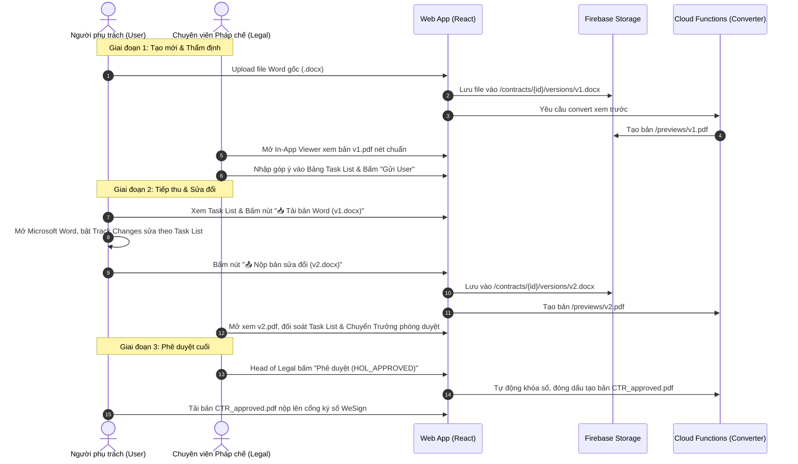
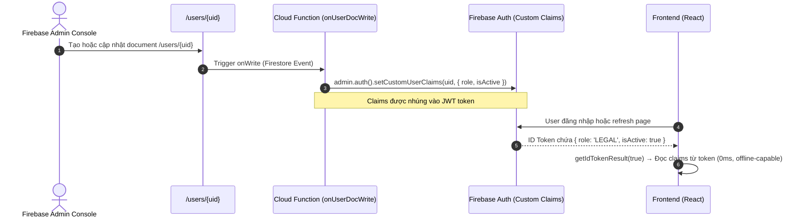
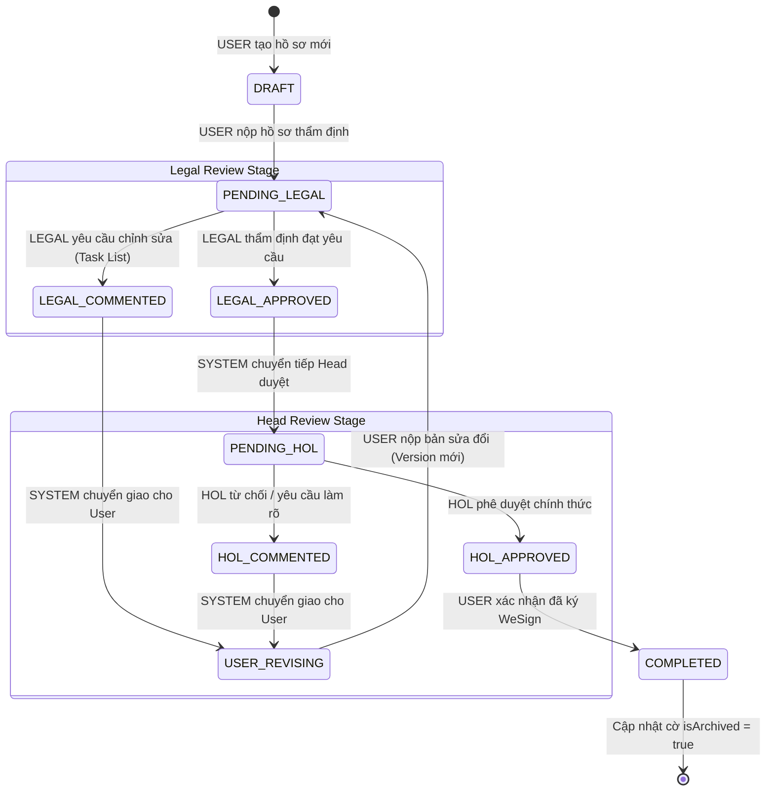
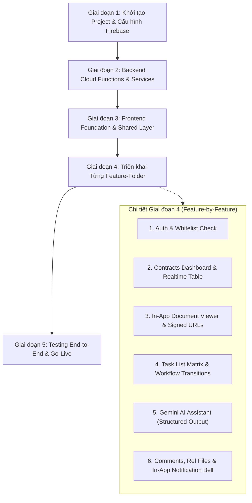

# TÀI LIỆU ĐẶC TẢ KIẾN TRÚC HỆ THỐNG MỚI (NEW ARCHITECTURE SPECIFICATION)
## DỰ ÁN: CONTRACT REVIEW SYSTEM v2.0 (FIRESTORE & MODULAR CLEAN ARCHITECTURE)

> **Phiên bản:** v2.0 — Cập nhật toàn diện sau Interview ngày 2026-09-28  
> **Nguyên tắc cốt lõi:** Clean Architecture, Feature-Driven Modular Pattern, Security-First, Professional Enterprise UI.  
> **Trạng thái:** Bản thiết kế kiến trúc hoàn thiện (Architecture Final Draft - No Code Yet).

---

## MỤC LỤC
1. [Tổng kết Kết quả Phỏng vấn Định hình Hệ thống (Interview Decisions Summary)](#1-tổng-kết-kết-quả-phỏng-vấn-định-hình-hệ-thống-interview-decisions-summary)
2. [Mô hình Kiến trúc Hệ thống Tổng thể (Target System Architecture)](#2-mô-hình-kiến-trúc-hệ-thống-tổng-thể-target-system-architecture)
3. [Thiết kế Cơ sở Dữ liệu Cloud Firestore (Data Schema & Modeling)](#3-thiết-kế-cơ-sở-dữ-liệu-cloud-firestore-data-schema--modeling)
4. [Kiến trúc Tệp tin & Trải nghiệm Đọc Văn bản (In-App Viewer, Storage Rules & Converter)](#4-kiến-trúc-tệp-tin--trải-nghiệm-đọc-văn-bản-in-app-viewer--signed-urls)
5. [Quy tắc Phân quyền & Bảo mật (RBAC, Custom Claims & Security Rules)](#5-quy-tắc-phân-quyền--bảo-mật-rbac--firestore-security-rules)
6. [Quy trình Xét duyệt & Vòng đời Hợp đồng (Contract Review State Machine)](#6-quy-trình-xét-duyệt--vòng-đời-hợp-đồng-contract-review-state-machine)
7. [Tổ chức Cấu trúc Codebase Chuẩn Modular (Modular Code Architecture)](#7-tổ-chức-cấu-trúc-codebase-chuẩn-modular-modular-code-architecture)
8. [Tích hợp Trí tuệ Nhân tạo Google Gemini (AI Engine)](#8-tích-hợp-trí-tuệ-nhân-tạo-google-gemini-ai-engine)
9. [Hệ thống Thông báo (Gmail SMTP & In-App Notification Bell)](#9-hệ-thống-thông-báo-gmail-smtp--in-app-notification-bell)
10. [Ngôn ngữ Thiết kế UI/UX Mới (Clean Professional Enterprise)](#10-ngôn-ngữ-thiết-kế-uiux-mới-clean-professional-enterprise)
11. [Chiến lược Kỹ thuật Bổ sung (Error Handling, Pagination)](#11-chiến-lược-kỹ-thuật-bổ-sung-technical-strategies)
12. [Lộ trình Triển khai Xây dựng từ đầu (Implementation Roadmap)](#12-lộ-trình-triển-khai-xây-dựng-từ-đầu-implementation-roadmap)

---

## 1. Tổng kết Kết quả Phỏng vấn Định hình Hệ thống (Interview Decisions Summary)

Sau buổi phỏng vấn chi tiết từng cụm tính năng với Quản trị viên dự án, các quyết định kiến trúc then chốt đã được thống nhất 100%:

| Cụm tính năng | Quyết định Thống nhất | Rationale / Lý do kỹ thuật |
| :--- | :--- | :--- |
| **Frontend Stack** | **React + TypeScript + Vite** | Hệ sinh thái hooks & components mạnh mẽ, type-safe, dễ bảo trì lâu dài. |
| **Backend Architecture** | **Client-First Firestore SDK + Cloud Functions v2** | Tận dụng độ trễ <30ms và Realtime của Firestore SDK; Cloud Functions chỉ dùng cho tác vụ nhạy cảm (AI, Email, Convert file). |
| **File Storage & Viewer** | **Firebase Storage + In-App Web Viewer (Signed URLs)** | Bỏ Google Drive/Docs để **xóa bỏ hoàn toàn lỗ hổng `ANYONE_WITH_LINK`**; hỗ trợ người dùng Microsoft 365 đọc mượt mà không cần tài khoản Google. |
| **Quản lý Phiên bản** | **Luồng Versioning chuẩn pháp chế (Track Changes)** | Không sửa đè lên file; User tải bản Word (`.docx`) về sửa trên máy $\rightarrow$ Nộp bản mới (`v2`, `v3`). Duyệt xong xuất bản `_approved`. |
| **Bảo mật Dữ liệu** | **Data Isolation (Cách ly dữ liệu hợp đồng)** | `USER` chỉ thấy hợp đồng do chính mình tạo ra; `LEGAL` và `HOL` thấy toàn bộ hợp đồng trong công ty. |
| **User Whitelist** | **Whitelist nhập trực tiếp trên Firebase Console** | Chỉ email nhân sự đã được Admin nhập sẵn vào collection `users` mới được đăng nhập. |
| **Vòng đời State Machine** | **Giữ nguyên 9 trạng thái chuẩn mực của bản cũ** | `DRAFT` $\rightarrow$ `PENDING_LEGAL` $\rightarrow$ `LEGAL_COMMENTED` $\rightarrow$ `USER_REVISING` $\rightarrow$ `LEGAL_APPROVED` $\rightarrow$ `PENDING_HOL` $\rightarrow$ `HOL_COMMENTED` $\rightarrow$ `HOL_APPROVED` $\rightarrow$ `COMPLETED`. |
| **Bảng Nhiệm vụ (Task List)** | **Legal tự nhập tay + Lưu trạng thái mới nhất** | Đảm bảo tính pháp lý chặt chẽ theo chuyên môn của Legal; giao diện gọn nhẹ tập trung giải quyết các task mở. |
| **Động cơ AI Gemini** | **Chạy On-Demand (Bấm nút mới chạy)** | Tiết kiệm chi phí; `USER` xem Tóm tắt, `LEGAL` xem Đánh giá Rủi ro (Buyer/Seller), `HOL` xem Decision Brief. |
| **Hệ thống Gửi Email** | **1 tài khoản Gmail qua Google App Password (Nodemailer)** | Chi phí 0đ, vĩnh viễn miễn phí, không cần IT sửa DNS, setup trong 2 phút. |
| **Thông báo Trên Web** | **Bổ sung Quả chuông Thông báo (In-App Notification Bell)** | Hiển thị chấm đỏ và danh sách việc cần xử lý ngay trên web app song song với email. |
| **Dữ liệu Lịch sử** | **Fresh Start (Bắt đầu mới hoàn toàn)** | Không cần viết script migration phức tạp; dữ liệu cũ lưu trữ trên Google Sheets để tra cứu riêng. |
| **Ngôn ngữ Thiết kế UI** | **Clean Professional Enterprise (Bỏ Glassmorphism)** | Bỏ hiệu ứng kính mờ/neon (quá giống template AI); chuyển sang phong cách phẳng, tối giản, thanh lịch chuẩn Stripe/Linear/GitHub; Dark/Light Mode. |

---

## 2. Mô hình Kiến trúc Hệ thống Tổng thể (Target System Architecture)

```mermaid
flowchart TB
    subgraph Client["🖥️ Frontend (React + TypeScript + Vite)"]
        UI["Clean Enterprise UI (Dark/Light)"]
        InAppViewer["In-App Document Viewer (PDF/DOCX)"]
        NotifBell["In-App Notification Bell"]
        State["Zustand / TanStack Query"]
        FBCore["Firebase Client SDK v10+"]
    end

    subgraph Security["🛡️ Security & Identity"]
        MSAuth["Microsoft Azure AD OAuth"]
        GoogleAuth["Google Workspace OAuth"]
        CustomClaims["Custom Claims Engine (Role: USER / LEGAL / HOL)"]
        SecRules["Firestore Security Rules (Declarative RBAC)"]
    end

    subgraph Database["🔥 Primary Database (Cloud Firestore)"]
        ColUsers["/users/{uid} (Whitelist)"]
        ColContracts["/contracts/{contractId}"]
        SubVersions[".../versions/{versionId}"]
        SubTasks[".../tasks/{taskId}"]
        SubComments[".../comments/{commentId}"]
        SubAI[".../ai_analyses/{analysisId}"]
        SubRefs[".../reference_files/{fileId}"]
        SubLogs[".../activities/{activityId}"]
        ColNotifs["/notifications/{userId}/items/{notifId}"]
    end

    subgraph StorageEngine["📦 Secure Storage (Firebase Cloud Storage)"]
        ContractFiles["/contracts/{contractId}/versions/*.docx"]
        PreviewPdfs["/contracts/{contractId}/previews/*.pdf"]
        RefFiles["/contracts/{contractId}/references/*.*"]
        SignedUrlEngine["Signed URL Generator (15-min Expire)"]
    end

    subgraph CloudFunctions["⚙️ Backend Serverless (Firebase Cloud Functions v2)"]
        APIGateway["Callable Functions & REST API"]
        DocConverter["Docx-to-Pdf Converter Worker"]
        AIEngine["Gemini AI Service (@google/genai)"]
        EmailWorker["Nodemailer Gmail SMTP Worker"]
    end

    subgraph ExternalServices["☁️ External Cloud APIs"]
        GeminiAPI["Google Gemini 2.5 / 3.1 Flash API"]
        GmailSMTP["Gmail SMTP Server (smtp.gmail.com)"]
    end

    UI --> State --> FBCore
    FBCore -->|"Realtime onSnapshot (<30ms)"| SecRules --> Database
    FBCore -->|"Direct Auth"| MSAuth
    FBCore -->|"Direct Auth"| GoogleAuth
    CustomClaims -.->|"Embeds Role in JWT"| SecRules

    FBCore -->|"Complex Actions (Create, Upload, AI, Status Change)"| APIGateway
    APIGateway --> DocConverter --> StorageEngine
    APIGateway --> AIEngine --> GeminiAPI
    APIGateway --> EmailWorker --> GmailSMTP
    APIGateway -->|"Admin SDK (Atomic Transactions)"| Database

    InAppViewer -->|"Read-only Stream"| SignedUrlEngine --> StorageEngine
    NotifBell -.->|"Listen realtime"| ColNotifs
```



---

## 3. Thiết kế Cơ sở Dữ liệu Cloud Firestore (Data Schema & Modeling)

Toàn bộ hệ thống tổ chức theo cấu trúc Document - Subcollection tự nhiên, tận dụng tối đa khả năng mở rộng và tốc độ truy vấn của Firestore.

### 3.1. Collection: `/users/{uid}` (Whitelist Người dùng)
Tài khoản chỉ được tạo nếu email đã có sẵn trong collection này:
```typescript
interface UserDocument {
  uid: string;                       // Firebase Auth UID
  email: string;                     // Địa chỉ email (VD: tindn@foodempire.vn)
  displayName: string;               // Tên hiển thị đầy đủ
  role: 'USER' | 'LEGAL' | 'HOL';    // Vai trò hệ thống
  department?: string;               // Phòng ban (Kinh doanh, Mua hàng, Kế toán...)
  isActive: boolean;                 // Trạng thái kích hoạt tài khoản
  createdAt: FirebaseFirestore.Timestamp;
  updatedAt: FirebaseFirestore.Timestamp;
}
```

### 3.2. Collection: `/contracts/{contractId}` (Hồ sơ Hợp đồng)
```typescript
type ContractStatus =
  | 'DRAFT'
  | 'PENDING_LEGAL'
  | 'LEGAL_COMMENTED'
  | 'USER_REVISING'
  | 'LEGAL_APPROVED'
  | 'PENDING_HOL'
  | 'HOL_COMMENTED'
  | 'HOL_APPROVED'
  | 'COMPLETED';

interface ContractDocument {
  contractId: string;                // Primary Key (định dạng: CTR-YYMM-XXXX)
  title: string;                     // Tên / Tiêu đề hợp đồng
  supplier: string;                  // Tên đối tác / Nhà cung cấp
  description: string;               // Mô tả tóm tắt nội dung hợp đồng
  status: ContractStatus;            // 9 trạng thái chuẩn
  currentVersion: number;            // Phiên bản hiện tại (bắt đầu từ 1)
  createdBy: {
    uid: string;
    email: string;
    displayName: string;
  };
  rejectCount: number;               // Số lần hồ sơ bị yêu cầu sửa đổi
  isArchived: boolean;               // False: Đang xử lý; True: Đã hoàn tất (COMPLETED)
  companyRole: 'BUYER' | 'SELLER';   // Vị thế công ty (Bên mua hoặc Bên bán)
  
  // File xem trước của phiên bản hiện tại
  currentVersionFile: {
    versionNo: number;
    originalFileName: string;
    storagePath: string;             // Đường dẫn trong Firebase Storage
    previewPdfPath: string;          // Đường dẫn bản PDF xem trước
  };
  
  // File duyệt cuối cùng (sinh ra khi HOL_APPROVED)
  approvedFile?: {
    storagePath: string;               // Đường dẫn Firebase Storage — Signed URL sinh on-the-fly
    approvedAt: FirebaseFirestore.Timestamp;
  };

  createdAt: FirebaseFirestore.Timestamp;
  updatedAt: FirebaseFirestore.Timestamp;
}
```

### 3.3. Các Subcollection Trực thuộc `/contracts/{contractId}`

#### 1. Subcollection `/versions/{versionId}`
```typescript
interface VersionDocument {
  versionId: string;                 // 'v1', 'v2', 'v3'...
  versionNo: number;                 // 1, 2, 3...
  fileName: string;                  // Tên file gốc (.docx)
  storagePath: string;               // Vị trí lưu trên Firebase Storage
  previewPdfPath: string;            // Vị trí bản PDF preview
  action: 'INITIAL_UPLOAD' | 'USER_REVISION';
  changeSummary: string;             // Tóm tắt các điểm chỉnh sửa của bản này
  negoNotes: string;                 // Ghi chú đàm phán với đối tác
  uploadedBy: {
    uid: string;
    displayName: string;
    email: string;
  };
  uploadedAt: FirebaseFirestore.Timestamp;
}
```

#### 2. Subcollection `/tasks/{taskId}` (Bảng Nhiệm vụ Rà soát)
Chỉ lưu trạng thái mới nhất; Legal nhập tay, User giải trình phản hồi:
```typescript
interface TaskDocument {
  taskId: string;                    // UUID
  order: number;                     // Thứ tự hiển thị trong bảng
  clauses: string;                   // Điều khoản hợp đồng cần chỉnh lý (VD: Điều 5.2)
  issueSummary: string;              // Tóm tắt vấn đề / rủi ro phát hiện
  category: string;                  // Phân loại: Pháp lý, Thanh toán, Phạt vi phạm, SLA...
  legalRecommendation: string;       // Ý kiến / khuyến nghị của Pháp chế
  status: 'OPEN' | 'RESOLVED' | 'WAIVED'; // OPEN: Chưa xử lý; RESOLVED: Đã sửa; WAIVED: Bỏ qua
  userNotes: string;                 // Phản hồi / giải trình của User
  legalDecision: string;             // Quyết định chốt cuối cùng của Pháp chế
  createdBy: {                       // Legal/HOL đã tạo task này
    uid: string;
    displayName: string;
  };
  updatedAt: FirebaseFirestore.Timestamp;
}
```

#### 3. Subcollection `/comments/{commentId}` (Bình luận Trao đổi)
> **Immutable**: Bình luận không được phép sửa hoặc xóa sau khi gửi — đảm bảo tính toàn vẹn pháp lý của lịch sử trao đổi.
```typescript
interface CommentDocument {
  commentId: string;                 // UUID
  versionNo: number;                 // Gắn với phiên bản văn bản nào
  clauseRef?: string;                // Điều khoản tham chiếu cụ thể
  commentText: string;               // Nội dung bình luận
  type: 'USER_RESPONSE' | 'LEGAL_COMMENT' | 'HOL_COMMENT';
  author: {
    uid: string;
    displayName: string;
    email: string;
    role: 'USER' | 'LEGAL' | 'HOL';
  };
  createdAt: FirebaseFirestore.Timestamp;
}
```

#### 4. Subcollection `/ai_analyses/{analysisId}` (Kết quả Phân tích Gemini)
Lưu trữ Map/Object cấu trúc trực tiếp, không ép chuỗi JSON:
```typescript
/** Kết quả Tóm tắt Hợp đồng (cho USER) */
interface SummaryResult {
  contractType: string;              // Loại hợp đồng (Mua bán, Dịch vụ, Thuê...)
  parties: {
    partyA: string;                  // Bên A
    partyB: string;                  // Bên B
  };
  keyObligations: string[];          // Các nghĩa vụ chính
  financialTerms: string;            // Điều khoản tài chính / Giá trị hợp đồng
  duration: string;                  // Thời hạn hợp đồng
  terminationConditions: string[];   // Điều kiện chấm dứt
  specialClauses: string[];          // Điều khoản đặc biệt cần lưu ý
}

/** Kết quả Đánh giá Rủi ro (cho LEGAL) */
interface RiskAssessmentResult {
  overallRiskLevel: 'CRITICAL' | 'HIGH' | 'MEDIUM' | 'LOW';
  risks: Array<{
    clause: string;                  // Điều khoản liên quan
    riskLevel: 'CRITICAL' | 'HIGH' | 'MEDIUM' | 'LOW';
    description: string;             // Mô tả rủi ro
    impact: string;                  // Tác động tiềm ẩn
    mitigationWording: string;       // Câu chữ gợi ý sửa đổi
  }>;
  favorableTerms: string[];          // Điều khoản có lợi cho công ty
  summary: string;                   // Nhận định tổng quan
}

/** Kết quả Báo cáo Quyết định (cho HOL) */
interface DecisionBriefResult {
  recommendation: 'APPROVE' | 'APPROVE_WITH_CONDITIONS' | 'REJECT';
  executiveSummary: string;          // Tóm tắt cho lãnh đạo
  keyRisksRemaining: string[];       // Rủi ro còn tồn đọng sau chỉnh sửa
  negotiationConcessions: Array<{
    originalClause: string;          // Điều khoản gốc ban đầu
    revisedClause: string;           // Điều khoản đã sửa đổi
    concessionType: 'OUR_CONCESSION' | 'THEIR_CONCESSION' | 'MUTUAL';
  }>;
  unresolvedIssues: string[];        // Vấn đề chưa giải quyết
  finalNotes: string;                // Ghi chú cuối cùng
}

interface AIAnalysisDocument {
  analysisId: string;                // 'SUMMARY_v1', 'RISK_v1_BUYER', 'DECISION_BRIEF_v2'
  analysisType: 'SUMMARY' | 'RISK' | 'DECISION_BRIEF';
  versionNo: number;
  companyRole?: 'BUYER' | 'SELLER';
  result: SummaryResult | RiskAssessmentResult | DecisionBriefResult;
  analyzedBy: {
    uid: string;
    displayName: string;
  };
  createdAt: FirebaseFirestore.Timestamp;
}
```

#### 5. Subcollection `/reference_files/{fileId}` (Tài liệu Tham chiếu Đính kèm)
```typescript
interface ReferenceFileDocument {
  fileId: string;                    // UUID
  fileName: string;
  storagePath: string;               // Firebase Storage Path
  fileSize: number;                  // Bytes
  mimeType: string;
  uploadedBy: {
    uid: string;
    displayName: string;
  };
  uploadedAt: FirebaseFirestore.Timestamp;
}
```

#### 6. Subcollection `/activities/{activityId}` (Nhật ký Kiểm toán - Audit Trail)
```typescript
interface ActivityDocument {
  activityId: string;
  action: string;                    // CONTRACT_CREATED, STATUS_CHANGE, TASK_SAVED, VERSION_UPLOADED...
  performedBy: {
    uid: string;
    displayName: string;
    role: 'USER' | 'LEGAL' | 'HOL' | 'SYSTEM';
  };
  details: string;                   // Mô tả chi tiết hành động
  timestamp: FirebaseFirestore.Timestamp;
}
```

### 3.4. Collection: `/notifications/{userId}/items/{notifId}` (In-App Notification)
```typescript
interface NotificationItem {
  notifId: string;
  contractId: string;
  title: string;                     // Tiêu đề: "Có góp ý mới từ Pháp chế"
  message: string;                   // "Hồ sơ CTR-2609-0001 cần bạn xem Task List và chỉnh sửa"
  type: 'STATUS_CHANGE' | 'NEW_COMMENT' | 'TASK_ASSIGNED';
  isRead: boolean;                   // Đã đọc / Chưa đọc
  createdAt: FirebaseFirestore.Timestamp;
}
```

### 3.5. Chỉ mục Composite Indexes (`firestore.indexes.json`)
1. **Lọc hồ sơ Active**: `isArchived` (ASC) + `updatedAt` (DESC)
2. **Lọc hồ sơ của cá nhân USER**: `createdBy.uid` (ASC) + `isArchived` (ASC) + `updatedAt` (DESC)
3. **Lọc hồ sơ theo trạng thái**: `isArchived` (ASC) + `status` (ASC) + `updatedAt` (DESC)

---

## 4. Kiến trúc Tệp tin & Trải nghiệm Đọc Văn bản (In-App Viewer & Signed URLs)

### 4.1. Giải quyết Triệt để Vấn đề Bảo mật & Tài khoản Microsoft
* **Không dùng Google Drive `ANYONE_WITH_LINK`**: File văn bản hợp đồng được lưu trữ an toàn 100% trong **Firebase Storage** private bucket.
* **Cơ chế Signed URL**: Khi người dùng mở trang chi tiết hợp đồng, hệ thống sinh một **Signed URL** chỉ có hiệu lực trong **15 phút**. URL này chỉ phục vụ riêng cho phiên làm việc hiện tại, hết hạn là vô hiệu, tuyệt đối không thể copy chia sẻ ra ngoài internet.
* **In-App Document Viewer**:
  * Tích hợp **React-PDF / PDF.js** trực tiếp vào ứng dụng web (chiếm 60% màn hình bên trái).
  * Hỗ trợ zoom phóng to/thu nhỏ, xem thumbnail các trang, nhảy đến trang cụ thể, tìm kiếm từ khóa trong hợp đồng.
  * Nhân sự sử dụng tài khoản **Microsoft 365** hay bất kỳ tài khoản nào đều mở đọc ngay lập tức, không phụ thuộc tài khoản Google, không bao giờ bị báo lỗi "You need access".

### 4.2. Luồng Xử lý Phiên bản (Track Changes Workflow)


### 4.3. Firebase Storage Security Rules (`storage.rules`)
Bảo vệ tệp tin hợp đồng trên Firebase Storage, phối hợp với Signed URL Engine:
```javascript
rules_version = '2';
service firebase.storage {
  match /b/{bucket}/o {

    // ── Helpers (Custom Claims-based) ──
    function isAuthenticated() {
      return request.auth != null;
    }
    function isWhitelisted() {
      return isAuthenticated()
        && request.auth.token.role != null
        && request.auth.token.isActive == true;
    }
    function isStaff() {
      return isWhitelisted()
        && request.auth.token.role in ['LEGAL', 'HOL'];
    }

    // ── Contract Version Files (.docx) ──
    // READ: Qua Signed URL (Cloud Function kiểm tra ownership) → không cần check ở đây
    // WRITE: Client upload trực tiếp khi tạo/sửa hợp đồng
    match /contracts/{contractId}/versions/{fileName} {
      allow read: if isWhitelisted();
      allow create: if isWhitelisted()
        && request.resource.size < 50 * 1024 * 1024              // Max 50MB
        && request.resource.contentType.matches('application/.*');
      allow update, delete: if false;          // Immutable — không sửa/xóa version đã upload
    }

    // ── Preview PDFs (chỉ Cloud Functions tạo) ──
    match /contracts/{contractId}/previews/{fileName} {
      allow read: if isWhitelisted();
      allow write: if false;                   // Chỉ Admin SDK (Cloud Functions) ghi
    }

    // ── Reference Files (Tài liệu đính kèm) ──
    match /contracts/{contractId}/references/{fileName} {
      allow read: if isWhitelisted();
      allow create: if isWhitelisted()
        && request.resource.size < 20 * 1024 * 1024;             // Max 20MB
      allow delete: if isWhitelisted();        // Ownership check ở Firestore rules
      allow update: if false;
    }

    // ── Catch-all: Từ chối tất cả path khác ──
    match /{allPaths=**} {
      allow read, write: if false;
    }
  }
}
```

### 4.4. Chiến lược Chuyển đổi Docx sang PDF (Conversion Strategy)

| Tiêu chí | Phương án đề xuất |
| :--- | :--- |
| **Thư viện** | `libreoffice-convert` (NPM) — Giao tiếp headless LibreOffice |
| **Môi trường** | **Cloud Functions Gen 2** (chạy trên Cloud Run, hỗ trợ custom Docker image chứa LibreOffice) |
| **Tại sao chọn** | Độ trung thực cao nhất cho `.docx` có Track Changes, header/footer, bảng biểu phức tạp — vượt trội so với các thư viện JS-only (`mammoth`, `docx-pdf`) |
| **Giới hạn** | Container image ~800MB, cold start ~5–8s. Khuyến nghị set `minInstances: 1` cho production |
| **Fallback** | Nếu LibreOffice quá nặng cho giai đoạn MVP: dùng **ConvertAPI** (SaaS, 250 free conversions/tháng) hoặc **Gotenberg** (self-hosted) |

**Luồng xử lý:**
1. Client upload `.docx` lên Firebase Storage → Trigger Cloud Function `onVersionUploaded`
2. Cloud Function tải `.docx` từ Storage → Gọi LibreOffice headless convert sang PDF
3. Upload bản `.pdf` vào `/contracts/{id}/previews/v{n}.pdf`
4. Cập nhật trường `previewPdfPath` trong Firestore subcollection `versions/{versionId}`

---

## 5. Quy tắc Phân quyền & Bảo mật (RBAC & Firestore Security Rules)

### 5.1. Ma trận Phân quyền Dữ liệu (Data Isolation Matrix)
* **`USER`**:
  * Chỉ được xem và tương tác với các hợp đồng **do chính mình tạo ra** (`createdBy.uid == request.auth.uid`).
  * Không nhìn thấy hợp đồng của nhân sự hoặc phòng ban khác trên Dashboard.
* **`LEGAL` & `HOL`**:
  * Nhìn thấy **toàn bộ hợp đồng** trong toàn công ty để thực hiện nhiệm vụ thẩm định, đối soát và phê duyệt.

### 5.2. Bản dự thảo `firestore.rules` (Custom Claims-Based)

> **Nguyên tắc**: Sử dụng **Custom Claims** (`request.auth.token.role`, `request.auth.token.isActive`) để kiểm tra vai trò và trạng thái kích hoạt, giúp **giảm document reads xuống 0** cho permission check (trừ subcollection cần kiểm tra ownership contract cha — tốn tối đa 1 read).

> ⚠️ **Quy tắc quan trọng**: Tất cả **STATUS TRANSITIONS** (chuyển trạng thái hợp đồng) đều phải đi qua Cloud Function `transitionContractStatus` sử dụng Admin SDK. Client **KHÔNG ĐƯỢC** tự ý thay đổi trường `status` trực tiếp. Firestore Rules chỉ bảo vệ quyền đọc/ghi DATA FIELDS.

```javascript
rules_version = '2';
service cloud.firestore {
  match /databases/{database}/documents {

    // ══════════════════════════════════════════════════════════════
    // HELPER FUNCTIONS — Custom Claims-Based (0 document reads)
    // ══════════════════════════════════════════════════════════════
    function isAuthenticated() {
      return request.auth != null;
    }

    // Kiểm tra user đã được whitelist VÀ đang active
    // → Dựa hoàn toàn vào Custom Claims, không cần get() đọc /users/{uid}
    function isWhitelisted() {
      return isAuthenticated()
        && request.auth.token.role != null
        && request.auth.token.isActive == true;
    }

    function getRole() {
      return request.auth.token.role;
    }

    function isUser() {
      return isWhitelisted() && getRole() == 'USER';
    }

    function isLegal() {
      return isWhitelisted() && getRole() == 'LEGAL';
    }

    function isHOL() {
      return isWhitelisted() && getRole() == 'HOL';
    }

    function isStaff() {
      return isLegal() || isHOL();
    }

    // Đọc document contract cha — CHỈ dùng trong subcollection rules (tốn 1 read)
    function getContract(contractId) {
      return get(/databases/$(database)/documents/contracts/$(contractId)).data;
    }

    function ownsContract(contractId) {
      return getContract(contractId).createdBy.uid == request.auth.uid;
    }

    // ══════════════════════════════════════════════════════════════
    // COLLECTION: /users/{uid} — Whitelist Người dùng
    // ══════════════════════════════════════════════════════════════
    match /users/{userId} {
      allow read: if isAuthenticated();
      allow write: if false;           // Chỉ Admin nhập trực tiếp trên Firebase Console
    }

    // ══════════════════════════════════════════════════════════════
    // COLLECTION: /contracts/{contractId} — Hồ sơ Hợp đồng
    // ══════════════════════════════════════════════════════════════
    match /contracts/{contractId} {
      // ─── READ: Data Isolation ───
      // USER chỉ đọc hợp đồng do chính mình tạo; Staff đọc toàn bộ
      allow read: if isWhitelisted() && (
        isStaff() || resource.data.createdBy.uid == request.auth.uid
      );

      // ─── CREATE: Chỉ USER, status = DRAFT, createdBy = chính mình ───
      allow create: if isUser()
        && request.resource.data.status == 'DRAFT'
        && request.resource.data.createdBy.uid == request.auth.uid;

      // ─── UPDATE: Sửa DATA FIELDS từ client ───
      // ⚠️ Mọi STATUS TRANSITIONS → Cloud Function transitionContractStatus (Admin SDK)
      allow update: if isWhitelisted() && (
        // USER: sửa metadata DRAFT hoặc upload bản sửa khi USER_REVISING
        (isUser()
          && resource.data.createdBy.uid == request.auth.uid
          && resource.data.status in ['DRAFT', 'USER_REVISING']) ||
        // LEGAL: sửa data khi đang review hoặc đã gửi comment
        (isLegal()
          && resource.data.status in ['PENDING_LEGAL', 'LEGAL_COMMENTED']) ||
        // HOL: sửa data khi đang review hoặc đã gửi comment
        (isHOL()
          && resource.data.status in ['PENDING_HOL', 'HOL_COMMENTED'])
      );

      // ─── DELETE: Chỉ User tạo, chỉ khi còn DRAFT ───
      allow delete: if isUser()
        && resource.data.createdBy.uid == request.auth.uid
        && resource.data.status == 'DRAFT';

      // ════════════════════════════════════════════════════════════
      // SUBCOLLECTIONS RULES
      // ════════════════════════════════════════════════════════════

      // ─── Versions: Phiên bản văn bản ───
      match /versions/{versionId} {
        allow read: if isWhitelisted() && (isStaff() || ownsContract(contractId));
        allow create: if isWhitelisted();
      }

      // ─── Tasks: Bảng Nhiệm vụ Rà soát ───
      match /tasks/{taskId} {
        allow read:   if isWhitelisted() && (isStaff() || ownsContract(contractId));
        allow create: if isStaff();        // Chỉ Legal/HOL tạo task
        allow update: if isWhitelisted()   // User ghi notes phản hồi, Legal ghi decision
                      && (isStaff() || ownsContract(contractId));
        allow delete: if isStaff();        // Chỉ Legal/HOL xóa task
      }

      // ─── Comments: Bình luận Trao đổi ───
      match /comments/{commentId} {
        allow read: if isWhitelisted() && (isStaff() || ownsContract(contractId));
        allow create: if isWhitelisted()
                      && request.resource.data.author.uid == request.auth.uid;
      }

      // ─── AI Analyses: Kết quả Phân tích Gemini ───
      match /ai_analyses/{analysisId} {
        allow read: if isWhitelisted() && (isStaff() || ownsContract(contractId));
        allow create: if isWhitelisted();
      }

      // ─── Reference Files: Tài liệu Tham chiếu Đính kèm ───
      match /reference_files/{fileId} {
        allow read: if isWhitelisted() && (isStaff() || ownsContract(contractId));
        allow create: if isWhitelisted();
        allow delete: if isWhitelisted()
                      && resource.data.uploadedBy.uid == request.auth.uid;
      }

      // ─── Activities: Nhật ký Kiểm toán ───
      match /activities/{activityId} {
        allow read: if isWhitelisted() && (isStaff() || ownsContract(contractId));
        allow create: if isWhitelisted();
      }
    }

    // ══════════════════════════════════════════════════════════════
    // COLLECTION: /notifications/{userId}/items — Thông báo cá nhân
    // ══════════════════════════════════════════════════════════════
    match /notifications/{userId}/items/{notifId} {
      allow read, write: if isAuthenticated() && request.auth.uid == userId;
    }
  }
}
```

### 5.3. Custom Claims Engine (Gán Vai trò vào JWT Token)

Thay vì đọc `/users/{uid}` mỗi lần check quyền (tốn Firestore reads), hệ thống nhúng `role` và `isActive` trực tiếp vào **Firebase Auth Custom Claims** trên JWT token.

**Luồng thiết lập Custom Claims:**


**Chi tiết kỹ thuật:**
1. **Cloud Function Trigger** (`onUserDocWrite`):
   * Lắng nghe sự kiện `onDocumentWritten('/users/{uid}')` (Cloud Functions v2).
   * Khi Admin tạo mới hoặc chỉnh sửa document user trên Console → Tự động gọi `admin.auth().setCustomUserClaims(uid, { role, isActive })`.
2. **Frontend Force Token Refresh**:
   * Sau khi đăng nhập thành công, gọi `user.getIdTokenResult(true)` để lấy token mới nhất chứa claims.
   * Nếu claims chưa sẵn sàng (user vừa được tạo), hiển thị màn hình chờ *"Đang kích hoạt tài khoản..."* và retry sau 2 giây.
3. **Tại sao không dùng `get()` trong Security Rules?**:
   * Mỗi `get()` trong Security Rules tốn **1 document read** và **tăng latency ~20-50ms** cho mỗi request.
   * Custom Claims nằm sẵn trong JWT token → **0 reads**, **0ms thêm**, và **hoạt động offline**.

### 5.4. Chuyển Trạng thái qua Cloud Functions (Server-Side Status Transitions)

> ⚠️ **Quy tắc bất khả xâm phạm**: Client **KHÔNG BAO GIỜ** được phép tự thay đổi trường `status` của hợp đồng trực tiếp qua Firestore SDK. Tất cả status transitions PHẢI đi qua Cloud Function `transitionContractStatus`.

**Tại sao phải xử lý phía server?**
1. **State Machine Validation**: Server kiểm tra transition hợp lệ (ví dụ: `DRAFT` → `PENDING_LEGAL` ✅, `DRAFT` → `HOL_APPROVED` ❌).
2. **Side Effects bắt buộc**: Mỗi transition cần kèm theo actions (gửi email, tạo notification, ghi audit log, sinh approved file).
3. **Atomic Operations**: Dùng `admin.firestore().runTransaction()` đảm bảo status + side effects thay đổi đồng bộ, tránh race condition.
4. **Bypass Rules**: Admin SDK vượt qua Firestore Security Rules → Rules client-side không cần xử lý tất cả trường hợp transition.

**Cloud Function `transitionContractStatus` (Callable):**
```typescript
interface TransitionRequest {
  contractId: string;
  targetStatus: ContractStatus;
  payload?: {
    changeSummary?: string;       // Khi USER nộp bản sửa đổi
    taskListComplete?: boolean;   // Khi LEGAL hoàn thành Task List
    rejectReason?: string;        // Khi HOL từ chối
  };
}
```

**Ma trận Transitions hợp lệ:**

| Từ trạng thái | Sang trạng thái | Ai được phép | Side Effects |
| :--- | :--- | :--- | :--- |
| `DRAFT` | `PENDING_LEGAL` | USER (owner) | Email Legal team, Notification |
| `PENDING_LEGAL` | `LEGAL_COMMENTED` | LEGAL | Email User, Notification, Ghi activity |
| `PENDING_LEGAL` | `LEGAL_APPROVED` | LEGAL | Auto → `PENDING_HOL`, Email HOL |
| `LEGAL_COMMENTED` | `USER_REVISING` | SYSTEM (auto) | Notification User |
| `USER_REVISING` | `PENDING_LEGAL` | USER (owner) | Email Legal, rejectCount++ |
| `LEGAL_APPROVED` | `PENDING_HOL` | SYSTEM (auto) | Email HOL, Notification |
| `PENDING_HOL` | `HOL_COMMENTED` | HOL | Email User + Legal, Notification |
| `PENDING_HOL` | `HOL_APPROVED` | HOL | Sinh `approved.pdf`, Email all, Notification |
| `HOL_COMMENTED` | `USER_REVISING` | SYSTEM (auto) | Notification User |
| `HOL_APPROVED` | `COMPLETED` | USER (owner) | Set `isArchived = true`, Ghi activity |

---

## 6. Quy trình Xét duyệt & Vòng đời Hợp đồng (Contract Review State Machine)

Giữ nguyên vẹn 100% logic vòng đời chuẩn nghiệp vụ đã được kiểm chứng ở hệ thống cũ:



* **Tiếp nhận hồ sơ tại Legal**: Cả đội ngũ Pháp chế cùng nhìn thấy các hồ sơ ở trạng thái `PENDING_LEGAL` trên Dashboard, ai rảnh sẽ vào mở hồ sơ tác nghiệp ngay mà không cần bước phân công rườm rà.
* **Khóa sổ tự động khi `HOL_APPROVED`**: Khi Trưởng phòng bấm duyệt, hệ thống tự động sinh bản `CTR_approved.pdf` chế độ chỉ đọc tuyệt đối, đồng thời gửi email đính kèm đường dẫn trực tiếp để User nộp lên WeSign.

### 6.2. Cơ chế Trao đổi Hai Luồng (Two-Track Communication Pattern)
Một điểm cải tiến đột phá so với bản cũ (vốn bắt buộc phải chuyển trạng thái mới gửi được trao đổi):
1. **Luồng Trao đổi Tự do (Ad-hoc In-Case Discussion Thread)**:
   * Nằm tại tab **"Trao đổi" (Comments)** bên cột phải (40%).
   * User, Legal và HOL có thể thoải mái nhắn tin, hỏi đáp, làm rõ thắc mắc về điều khoản bất cứ lúc nào.
   * **TUYỆT ĐỐI KHÔNG làm thay đổi trạng thái hợp đồng**: Hợp đồng đang ở `PENDING_LEGAL` thì vẫn giữ nguyên `PENDING_LEGAL`.
   * Tin nhắn nhảy tức thì (Realtime) và bắn **Quả chuông thông báo (In-App Notification)** cho người liên quan, lưu lại toàn bộ lịch sử trao đổi trên hồ sơ mà không cần chat qua Zalo/Teams bên ngoài.
2. **Luồng Chuyển Trạng thái Chính thức (Formal Workflow Transitions)**:
   * Chỉ kích hoạt qua các nút hành động chuyên biệt (Action Buttons) ở góc trên màn hình khi một bên đã hoàn thành xong nhiệm vụ và chính thức **bàn giao trách nhiệm**:
     * Legal hoàn thành Task List $\rightarrow$ Bấm *"Gửi Yêu Cầu Chỉnh Sửa"* (nhảy sang `LEGAL_COMMENTED`).
     * User upload bản Word sửa đổi mới $\rightarrow$ Bấm *"Nộp Thẩm Định Lại"* (nhảy sang `PENDING_LEGAL`).
     * Head duyệt văn bản $\rightarrow$ Bấm *"Phê Duyệt Chính Thức"* (nhảy sang `HOL_APPROVED`).

### 6.3. Thẻ Thống kê Trạng thái Trên Dashboard (Status Metric Cards & Click-to-Filter)
Giữ nguyên trải nghiệm trực quan từ bản cũ nhưng nâng cấp sang phong cách Clean Enterprise:
* **4 Thẻ Thống kê đầu trang**:
  1. 📝 **Draft**: Đếm tổng hợp đồng nháp hoặc đang chờ User sửa (`DRAFT`, `USER_REVISING`).
  2. ⚖️ **Legal Review**: Đếm tổng hồ sơ đang chờ Pháp chế thẩm định (`PENDING_LEGAL`, `LEGAL_COMMENTED`).
  3. 👔 **Head Review**: Đếm tổng hồ sơ đang trình Trưởng phòng (`PENDING_HOL`, `HOL_COMMENTED`).
  4. ✅ **Approved**: Đếm tổng hồ sơ đã được duyệt hoặc hoàn tất ký kết (`HOL_APPROVED`, `COMPLETED`).
* **Tính năng Click-to-Filter**:
  * Người dùng bấm vào thẻ nào $\rightarrow$ Bảng danh sách bên dưới tự động lọc đúng nhóm trạng thái đó tức thì trong 0ms.
* **Số liệu Realtime**:
  * Dữ liệu các thẻ được đồng bộ tự động theo thời gian thực từ Firestore, không cần người dùng phải bấm "Force Refresh".

---

## 7. Tổ chức Cấu trúc Codebase Chuẩn Modular (Modular Code Architecture)

Tuân thủ nghiêm ngặt kỹ năng **`modular-code-architect`**:
* **Presentation**: Chỉ chứa React Components, không chứa API calls hay state mutation phức tạp.
* **Business Logic**: Tách riêng vào Custom Hooks (`useContracts`, `useTaskList`, `useAIEngine`).
* **Data / Service**: Tương tác với Firestore SDK và Cloud Functions.
* **Shared / Core**: Định nghĩa types, constants, formatters dùng chung.
* **Barrel Exports (`index.ts`)**: Mỗi feature-folder là một hộp đen, bên ngoài chỉ import qua `index.ts`.

```text
/ContractReview_firestore/
├── frontend/                                # Ứng dụng React + TypeScript (Vite)
│   ├── package.json
│   ├── tsconfig.json
│   ├── vite.config.ts
│   ├── index.html
│   └── src/
│       ├── app/                             # Shell, Router, Providers
│       │   ├── App.tsx
│       │   ├── routes.tsx
│       │   └── providers.tsx
│       │
│       ├── features/                        # CÁC FEATURE FOLDERS ĐỘC LẬP
│       │   ├── auth/                        # Xác thực & Kiểm tra Whitelist
│       │   │   ├── components/              # LoginCard.tsx, WhitelistBlockModal.tsx
│       │   │   ├── hooks/                   # useAuth.ts, useCurrentUser.ts
│       │   │   ├── services/                # authService.ts
│       │   │   ├── types.ts
│       │   │   └── index.ts                 # ⭐ Barrel export
│       │   │
│       │   ├── contracts/                   # Quản lý Hợp đồng & Dashboard
│       │   │   ├── components/              # ContractTable.tsx, ContractHeader.tsx, CreateModal.tsx
│       │   │   ├── hooks/                   # useContracts.ts, useContractDetail.ts
│       │   │   ├── services/                # contractService.ts (Firestore realtime queries)
│       │   │   ├── types.ts
│       │   │   └── index.ts                 # ⭐ Barrel export
│       │   │
│       │   ├── document-viewer/             # Trình đọc Văn bản In-App
│       │   │   ├── components/              # PdfViewer.tsx, VersionDropdown.tsx, DownloadButton.tsx
│       │   │   ├── hooks/                   # useDocumentViewer.ts
│       │   │   ├── services/                # storageService.ts (Signed URL fetch)
│       │   │   └── index.ts                 # ⭐ Barrel export
│       │   │
│       │   ├── review-tasks/                # Bảng Nhiệm vụ Rà soát (Task List)
│       │   │   ├── components/              # TaskMatrix.tsx, TaskRow.tsx, ActionButtons.tsx
│       │   │   ├── hooks/                   # useTaskList.ts
│       │   │   ├── services/                # taskService.ts (Batched write subcollection)
│       │   │   ├── types.ts
│       │   │   └── index.ts                 # ⭐ Barrel export
│       │   │
│       │   ├── ai-assistant/                # Trợ lý AI Gemini
│       │   │   ├── components/              # AISummaryBox.tsx, RiskRadar.tsx, DecisionBrief.tsx
│       │   │   ├── hooks/                   # useAIEngine.ts
│       │   │   ├── services/                # aiService.ts (Gọi Cloud Function)
│       │   │   ├── types.ts
│       │   │   └── index.ts                 # ⭐ Barrel export
│       │   │
│       │   ├── comments/                    # Thảo luận theo Điều khoản
│       │   │   ├── components/              # CommentThread.tsx, CommentInput.tsx
│       │   │   ├── hooks/                   # useComments.ts
│       │   │   └── index.ts                 # ⭐ Barrel export
│       │   │
│       │   ├── reference-files/             # Tài liệu Tham chiếu Đính kèm
│       │   │   ├── components/              # RefFileList.tsx, UploadRefDropzone.tsx
│       │   │   ├── hooks/                   # useReferenceFiles.ts
│       │   │   └── index.ts                 # ⭐ Barrel export
│       │   │
│       │   └── notifications/               # Quả chuông Thông báo Trong Ứng dụng
│       │       ├── components/              # NotificationBell.tsx, NotificationDropdown.tsx
│       │       ├── hooks/                   # useNotifications.ts
│       │       └── index.ts                 # ⭐ Barrel export
│       │
│       ├── shared/                          # DÙNG CHUNG (≥ 2 FEATURES)
│       │   ├── components/                  # Button.tsx, Input.tsx, Badge.tsx, Modal.tsx, Toast.tsx
│       │   ├── hooks/                       # useTheme.ts, useDebounce.ts, useToast.ts
│       │   ├── services/                    # firebaseClient.ts (Khởi tạo Firebase)
│       │   ├── types/                       # statusEnums.ts, commonTypes.ts
│       │   ├── utils/                       # dateUtils.ts, formatters.ts, validators.ts
│       │   └── constants/                   # statusLabels.ts, config.ts
│       │
│       └── styles/                          # Design Tokens & Theme Clean Enterprise
│           ├── theme.css                    # Bảng màu Dark/Light chuẩn Stripe/Linear
│           └── global.css
│
└── backend/                                 # Serverless Firebase Cloud Functions (v2)
    ├── package.json
    ├── tsconfig.json
    ├── firebase.json
    ├── firestore.rules
    ├── firestore.indexes.json
    └── src/
        ├── config/                          # Admin SDK, Gemini SDK, Gmail SMTP
        │   ├── firebaseAdmin.ts
        │   ├── geminiClient.ts
        │   └── mailerConfig.ts
        │
        ├── modules/
        │   ├── auth/                        # Custom Claims Sync & Whitelist Check
        │   │   └── customClaimsSync.ts      # onUserDocWrite → setCustomUserClaims()
        │   │
        │   ├── contracts/                   # State Machine validation & Approved file generator
        │   │   ├── contractTransitions.ts
        │   │   └── contractService.ts
        │   │
        │   ├── converter/                   # Word to PDF Preview conversion worker
        │   │   └── docxConverter.ts          # onVersionUploaded trigger + LibreOffice convert
        │   │
        │   ├── ai/                          # Gemini 2.5/3.1 Flash với Structured Outputs
        │   │   ├── prompts/                 # summaryPrompt.ts, riskPrompt.ts, decisionBriefPrompt.ts
        │   │   └── aiService.ts
        │   │
        │   └── notifications/               # Gửi Email Gmail SMTP & Tạo In-App Notification
        │       ├── emailDispatcher.ts
        │       └── templates/               # Outlook-ready HTML email templates
        │
        └── index.ts                         # Export Cloud Functions endpoints
```

---

## 8. Tích hợp Trí tuệ Nhân tạo Google Gemini (AI Engine)

1. **Chế độ kích hoạt (On-Demand Execution)**:
   * AI **chỉ chạy khi người dùng chủ động bấm nút** (tránh lãng phí chi phí token khi không cần thiết).
   * Khi đã phân tích xong một phiên bản, kết quả được lưu vĩnh viễn vào subcollection `/contracts/{id}/ai_analyses/{analysisId}`. Lần sau mở lại sẽ nạp trực tiếp từ Firestore trong **5ms**, không tốn tiền gọi lại Gemini.
2. **Phân quyền tính năng AI**:
   * `USER`: Sử dụng tính năng **Tóm tắt Hợp đồng (Contract Summary)** để hiểu nhanh các nghĩa vụ chính, thời hạn và số tiền.
   * `LEGAL`: Sử dụng tính năng **Đánh giá Rủi ro (Risk Assessment)** theo vị thế Bên mua (`BUYER`) hoặc Bên bán (`SELLER`), nhận diện 4 cấp độ rủi ro (`CRITICAL`, `HIGH`, `MEDIUM`, `LOW`) và câu chữ gợi ý sửa đổi (*Mitigation Wording*).
   * `HOL`: Sử dụng tính năng **Báo cáo Tóm tắt Quyết định (Decision Brief)** tổng hợp nhượng bộ đàm phán trước khi ký duyệt.
3. **Structured Outputs**:
   * Dùng thư viện `@google/genai` với thuộc tính `responseSchema` dạng JSON Schema chính quy.
   * Đảm bảo 100% trả về đúng đối tượng JSON hợp lệ, không dính thẻ ````json ```` và không thiếu trường.

---

## 9. Hệ thống Thông báo (Gmail SMTP & In-App Notification Bell)

### 9.1. Gửi Email Tự động qua Gmail SMTP (Google App Password)
* **Phương thức**: Dùng thư viện **Nodemailer** kết nối cổng SMTP của Gmail (`smtp.gmail.com:465`).
* **Tài khoản**: Dùng 1 tài khoản Gmail chuyên dụng (ví dụ: `contractreview.bot@gmail.com`) kích hoạt Mật khẩu Ứng dụng (App Password 16 ký tự).
* **Chi phí**: **0 đồng vĩnh viễn** (Hạn mức 500 mail/ngày, dư sức cho quy trình duyệt hợp đồng).
* **Định dạng Email**: Chuẩn HTML Table tương thích hoàn hảo với **Microsoft Outlook Desktop & Office 365**, có nút bấm dẫn trực tiếp về hợp đồng trong web app.

### 9.2. Quả chuông Thông báo Trong Ứng dụng (In-App Notification Bell)
* Đặt cố định trên thanh Topbar cạnh avatar người dùng.
* Lắng nghe Realtime (`onSnapshot`) từ collection `/notifications/{userId}/items`.
* Hiển thị chấm đỏ thông báo số lượng việc chưa đọc.
* Khi có sự kiện: Legal gửi Task List, Head duyệt/từ chối, hoặc có comment mới $\rightarrow$ Vừa gửi email, vừa đẩy 1 bản ghi vào Notification của người nhận.

---

## 10. Ngôn ngữ Thiết kế UI/UX Mới (Clean Professional Enterprise)

### 10.1. Rũ bỏ Glassmorphism – Chuyển sang Professional Flat Enterprise
* **Vấn đề của bản cũ**: Hiệu ứng kính mờ (Glassmorphism), viền neon, bóng đổ dày khiến giao diện nhìn giống "sản phẩm đồ chơi do AI tự sinh", không phù hợp với tính trang trọng của phần mềm pháp lý doanh nghiệp.
* **Phong cách mới (Clean Enterprise Design System)**:
  * Lấy cảm hứng từ ngôn ngữ thiết kế của **Stripe, Linear, GitHub, Vercel**.
  * Bố cục phẳng, viền xám siêu mảnh (1px border), bề mặt card màu trắng mờ/xám đậm rõ ràng.
  * Phông chữ chuẩn doanh nghiệp: **Inter / Roboto**, khoảng cách dòng (line-height) thoáng đãng, dễ đọc các đoạn văn bản luật dài.
  * Màu sắc chủ đạo: **Slate / Deep Navy / Corporate Blue** kết hợp các Status Badge có độ tương phản cao đạt chuẩn trợ năng WCAG AA.
* **Hỗ trợ Đa chế độ Sáng / Tối (Dark / Light Theme)**:
  * Nút chuyển theme đặt trên Topbar.
  * Cơ chế Zero-FOUC (không nhấp nháy khi tải trang).

### 10.2. Bố cục Làm việc Tiêu chuẩn (6:4 Split Layout)
* **Cột trái (60%)**: In-App Document Viewer đọc văn bản PDF/Word, zoom, điều hướng trang.
* **Cột phải (40%)**: Tab-based panel gồm:
  1. *Nhiệm vụ rà soát (Task List Matrix)*: Bảng các điều khoản cần sửa kèm ô ghi chú phản hồi.
  2. *Trợ lý AI (Gemini Assistant)*: Tóm tắt, Radar rủi ro, Decision Brief.
  3. *Trao đổi & Bình luận (Comments)*: Timeline bình luận theo thời gian thực.
  4. *Tài liệu tham chiếu (Reference Files)*: Danh sách file kèm theo (báo giá, giấy phép...).
  5. *Lịch sử phiên bản (Version History)*: Xem lại các bản v1, v2 và tóm tắt thay đổi.

---

## 11. Chiến lược Kỹ thuật Bổ sung (Technical Strategies)

### 11.1. Xử lý Lỗi & Khả năng Phục hồi (Error Handling & Resilience)

| Tình huống lỗi | Chiến lược xử lý |
| :--- | :--- |
| **Firestore offline / mất mạng** | Bật `enableMultiTabIndexedDbPersistence()` → Dữ liệu tự cache local, tự đồng bộ khi có mạng lại. Hiển thị banner *"Đang offline — thay đổi sẽ đồng bộ khi có mạng"*. |
| **Upload file thất bại** | Retry với **exponential backoff** (tối đa 3 lần: 1s → 2s → 4s). Sau 3 lần → hiển thị toast lỗi + nút *"Thử lại"*. |
| **Gemini AI timeout** | Đặt timeout **30 giây**. Nếu quá → hiển thị *"Phân tích mất nhiều thời gian hơn dự kiến. Vui lòng thử lại."* + nút retry. Không block UI. |
| **Cloud Function cold start** | Hiển thị skeleton loading + spinner. Với function quan trọng (`transitionContractStatus`, `getSignedDocumentUrl`): cân nhắc set `minInstances: 1` ở production. |
| **Docx → PDF conversion lỗi** | Ghi log lỗi chi tiết vào `activities/`. Hiển thị *"Không thể tạo bản xem trước. Vui lòng tải file Word về xem."* + cung cấp nút download `.docx`. |
| **Token expired / Claims chưa sẵn sàng** | Tự động `getIdToken(true)` refresh token. Nếu claims vẫn thiếu sau 3 lần retry → redirect về trang Login với thông báo *"Tài khoản chưa được kích hoạt"*. |

**Nguyên tắc chung:**
* Không bao giờ hiển thị stack trace hoặc lỗi kỹ thuật thô cho người dùng cuối.
* Mọi lỗi đều phải có **user-friendly message** bằng tiếng Việt + **hành động cụ thể** (retry, download, liên hệ IT).
* Ghi log lỗi structured (`{ errorCode, message, contractId, userId, timestamp }`) vào Cloud Logging để debug.

### 11.2. Chiến lược Phân trang & Hiệu năng Danh sách (Pagination Strategy)

**Dashboard Contract List:**
* Sử dụng **cursor-based pagination** với `startAfter()` + `limit(20)` trên Firestore.
* Mặc định sort theo `updatedAt` DESC (hợp đồng mới cập nhật hiển thị trước).
* Pattern: **"Load More" button** ở cuối danh sách (không dùng infinite scroll — tránh load data không cần thiết cho quy trình pháp lý).

**Tích hợp với TanStack Query:**
```typescript
// Pseudocode minh hoạ cách phân trang
const PAGE_SIZE = 20;

// TanStack Query useInfiniteQuery
useInfiniteQuery({
  queryKey: ['contracts', { status, isArchived }],
  queryFn: ({ pageParam }) => contractService.getContracts({
    status,
    isArchived,
    limit: PAGE_SIZE,
    startAfterDoc: pageParam,   // Firestore DocumentSnapshot cursor
  }),
  getNextPageParam: (lastPage) =>
    lastPage.length === PAGE_SIZE ? lastPage[lastPage.length - 1]._snapshot : undefined,
});
```

**Composite Indexes hỗ trợ phân trang:**
1. `isArchived` (ASC) + `updatedAt` (DESC) → Lọc hồ sơ đang xử lý / đã hoàn tất
2. `createdBy.uid` (ASC) + `isArchived` (ASC) + `updatedAt` (DESC) → Dashboard cá nhân USER
3. `isArchived` (ASC) + `status` (ASC) + `updatedAt` (DESC) → Lọc theo trạng thái + click-to-filter

---

## 12. Lộ trình Triển khai Xây dựng từ đầu (Implementation Roadmap)

Quá trình xây dựng lại sẽ diễn ra theo 5 giai đoạn tuần tự, kiểm soát chất lượng chặt chẽ:



1. **Giai đoạn 1: Khởi tạo Project & Cấu hình Firebase**:
   - Tạo mới cấu trúc thư mục `frontend/` (React + TS + Vite) và `backend/` (Cloud Functions v2).
   - Thiết lập `firestore.rules`, `firestore.indexes.json` và import whitelist người dùng ban đầu.
2. **Giai đoạn 2: Backend Cloud Functions & Services**:
   - Viết module chuyển đổi Word sang PDF preview.
   - Cấu hình Gemini AI SDK (`@google/genai`) và Gmail SMTP Nodemailer.
   - Xây dựng các Cloud Functions callable: `transitionContractStatus`, `analyzeContractAI`, `getSignedDocumentUrl`.
3. **Giai đoạn 3: Frontend Foundation & Shared Layer**:
   - Dựng Design Tokens Clean Enterprise (Dark/Light Mode), Toast, Modal, Button primitives.
   - Kết nối Firebase Client SDK, Router và Global State.
4. **Giai đoạn 4: Triển khai Từng Feature-Folder (Theo thứ tự ưu tiên)**:
   - Dựng tính năng đăng nhập và kiểm tra Whitelist.
   - Dựng trang Dashboard và bảng hợp đồng Realtime.
   - Dựng In-App Document Viewer đọc file an toàn qua Signed URLs.
   - Dựng Bảng Task List và cơ chế nộp phiên bản mới (Versioning).
   - Tích hợp các tab Gemini AI, Bình luận và Quả chuông Thông báo.
5. **Giai đoạn 5: Kiểm thử End-to-End & Go-Live**:
   - Kiểm thử toàn bộ vòng đời xét duyệt từ User $\rightarrow$ Legal $\rightarrow$ Head.
   - Build tối ưu hóa bundle frontend và deploy lên Vercel / Firebase Hosting.

---

> **BẢN QUYỀN KIẾN TRÚC THUỘC VỀ:** Dự án Contract Review v2.0  
> Tài liệu này là cơ sở kỹ thuật duy nhất và chuẩn mực nhất để tiến hành giai đoạn lập trình tiếp theo.
