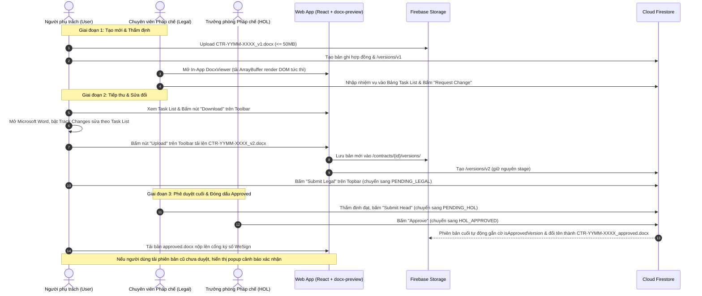
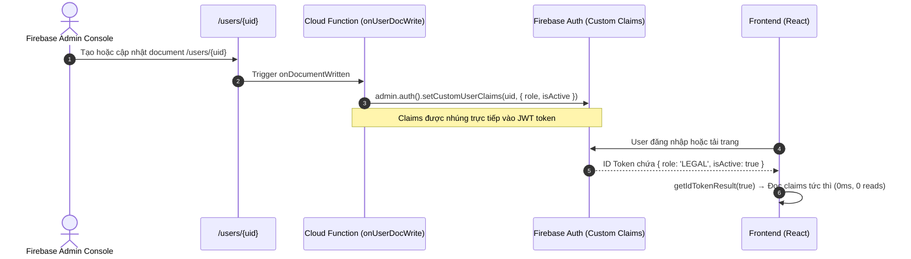
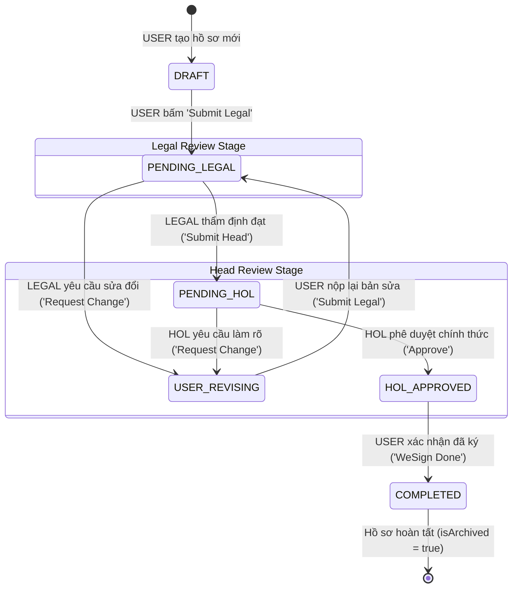
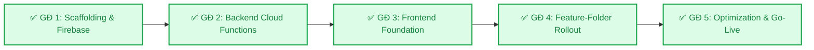

# TÀI LIỆU ĐẶC TẢ KIẾN TRÚC HỆ THỐNG MỚI (NEW ARCHITECTURE SPECIFICATION)
## DỰ ÁN: CONTRACT REVIEW SYSTEM v2.0 (FIRESTORE & MODULAR CLEAN ARCHITECTURE)

> **Phiên bản:** v2.2 — Cập nhật chuẩn hóa toàn diện sau hoàn thành Giai đoạn 5 (2026-10-06)  
> **Nguyên tắc cốt lõi:** Clean Architecture, Feature-Driven Modular Pattern, Security-First, Professional Enterprise UI.  
> **Trạng thái:** Tài liệu Đặc tả Kiến trúc Chuẩn mực Duy nhất (Single Source of Truth — Production Ready).

---

## MỤC LỤC
1. [Tổng kết Kết quả Phỏng vấn & Chuẩn hóa Nghiệp vụ (Core Decisions Summary)](#1-tổng-kết-kết-quả-phỏng-vấn--chuẩn-hóa-nghiệp-vụ-core-decisions-summary)
2. [Mô hình Kiến trúc Hệ thống Tổng thể (Target System Architecture)](#2-mô-hình-kiến-trúc-hệ-thống-tổng-thể-target-system-architecture)
3. [Thiết kế Cơ sở Dữ liệu Cloud Firestore (Data Schema & Modeling)](#3-thiết-kế-cơ-sở-dữ-liệu-cloud-firestore-data-schema--modeling)
4. [Kiến trúc Tệp tin & Trải nghiệm Đọc Văn bản (Client-Side DOCX Preview & Storage Rules)](#4-kiến-trúc-tệp-tin--trải-nghiệm-đọc-văn-bản-client-side-docx-preview--storage-rules)
5. [Quy tắc Phân quyền & Bảo mật (RBAC, Custom Claims, Security Rules, Deletion & Threat Model)](#5-quy-tắc-phân-quyền--bảo-mật-rbac-custom-claims-security-rules-deletion--threat-model)
6. [Quy trình Xét duyệt & Vòng đời Hợp đồng (Golden 6-State Lifecycle & Unified Chat)](#6-quy-trình-xét-duyệt--vòng-đời-hợp-đồng-golden-6-state-lifecycle--unified-chat)
7. [Tổ chức Cấu trúc Codebase Chuẩn Modular (Modular Code Architecture)](#7-tổ-chức-cấu-trúc-codebase-chuẩn-modular-modular-code-architecture)
8. [Tích hợp Trí tuệ Nhân tạo Google Gemini 3.8 Flash (AI Engine)](#8-tích-hợp-trí-tuệ-nhân-tạo-google-gemini-38-flash-ai-engine)
9. [Hệ thống Thông báo (Gmail SMTP & In-App Notification Bell)](#9-hệ-thống-thông-báo-gmail-smtp--in-app-notification-bell)
10. [Ngôn ngữ Thiết kế UI/UX Mới & Tối ưu Viewport (Clean Professional Enterprise)](#10-ngôn-ngữ-thiết-kế-uiux-mới-clean-professional-enterprise)
11. [Chiến lược Kỹ thuật Bổ sung (Error Handling, Pagination, In-Memory Search, Counter)](#11-chiến-lược-kỹ-thuật-bổ-sung-technical-strategies)
12. [Lộ trình Triển khai & Trạng thái Hoàn thành (Implementation Status)](#12-lộ-trình-triển-khai--trạng-thái-hoàn-thành-implementation-status)

---

## 1. Tổng kết Kết quả Phỏng vấn & Chuẩn hóa Nghiệp vụ (Core Decisions Summary)

Sau toàn bộ quá trình phát triển, kiểm thử và phản hồi nghiệp vụ thực tế, các quyết định kiến trúc then chốt của hệ thống đã được hoàn thiện 100%:

| Cụm tính năng | Quyết định Chuẩn hóa | Rationale / Lý do kỹ thuật |
| :--- | :--- | :--- |
| **Frontend Stack** | **React + TypeScript + Vite** | Hệ sinh thái hooks & components mạnh mẽ, type-safe, cấu trúc Feature-Folder độc lập, 385/385 Vitest tests. |
| **Backend Architecture** | **Client-First Firestore SDK + Security Rules + Cloud Functions v2** | Tận dụng độ trễ <30ms và Realtime của Firestore SDK; Cloud Functions chỉ dùng cho tác vụ nhạy cảm (AI, Email background trigger, đồng bộ claims, Hard delete). |
| **File Storage & Viewer** | **Firebase Storage + Client-Side DOCX Preview (`docx-preview`)** | Bỏ Google Drive để **xóa bỏ lỗ hổng `ANYONE_WITH_LINK`**; bỏ LibreOffice/PDF converter để đạt **Zero-latency (mở xem tức thì)**, tiết kiệm 50% Storage và bảo mật tuyệt đối. |
| **Quản lý Phiên bản** | **Luồng Versioning chuẩn pháp chế (Track Changes)** | Không sửa đè; User tải bản Word (`.docx`) về sửa $\rightarrow$ Nộp bản mới (`v2`, `v3`). Chuẩn hóa tên file `CTR-YYMM-xxxx_vz.docx`, duyệt xong đổi tên thành `_approved.docx`. |
| **Bảo mật Dữ liệu** | **Data Isolation (Cách ly dữ liệu hợp đồng)** | `USER` chỉ thấy và thao tác hợp đồng do chính mình tạo ra; `LEGAL` và `HOL` thấy toàn bộ hợp đồng trong công ty. |
| **User Whitelist** | **Whitelist nhập trực tiếp trên Firebase Console** | Chỉ email nhân sự đã được Admin nhập sẵn vào collection `users` mới được đăng nhập; tự động đồng bộ Custom Claims vào JWT token. |
| **Vòng đời State Machine** | **Chuẩn Hóa 6 Trạng Thái Vàng (Golden 6-State Lifecycle)** | Tinh giản quy trình về 6 trạng thái chuẩn mực (`DRAFT` $\rightarrow$ `PENDING_LEGAL` $\rightarrow$ `USER_REVISING` $\rightarrow$ `PENDING_HOL` $\rightarrow$ `HOL_APPROVED` $\rightarrow$ `COMPLETED`), loại bỏ các trạng thái trung gian dư thừa. |
| **Chuyển Trạng thái** | **Direct Client Write + Security Rules + Background Email Trigger** | Chuyển trạng thái trực tiếp từ Client SDK bảo vệ bằng hàm `isValidTransition` trong `firestore.rules`; trigger ngầm `onContractStatusChanged` gửi email tự động (UI phản hồi 0ms). |
| **Xóa Hồ sơ (Hard Delete)** | **Cho phép xóa ở `DRAFT` & `USER_REVISING` qua `deleteContract`** | Người tạo (`USER` owner) được xóa vĩnh viễn hồ sơ nháp/chờ sửa. Cloud Function `deleteContract` xóa cô lập tuyệt đối doc cha, 6 subcollections và Storage bucket. |
| **Bảng Nhiệm vụ (Task List)** | **Tinh gọn 6 trường + 2 nút quyết định + Reopen to OPEN** | Bỏ nút lưu ghi chú, gồm 2 nút trực tiếp `Đã sửa (Resolved)` và `Bỏ qua (Waived)`. Sửa task cũ tự động reopen `OPEN`. Tích hợp trực tiếp vào AI Decision Brief. |
| **Động cơ AI Gemini** | **Gemini 3.8 Flash (`gemini-3.8-flash`) On-Demand** | `USER` xem Tóm tắt, `LEGAL` xem Đánh giá Rủi ro, `HOL` xem Decision Brief (đối chiếu Task List). Đóng băng gọi mới khi hồ sơ đã duyệt, đọc cache 0-cost (5ms). |
| **Hệ thống Gửi Email** | **Nodemailer Gmail SMTP + Ma trận Người nhận (Recipient Matrix)** | Trigger tự động qua `onContractStatusChanged`; phân phối To/CC chuẩn mực 4 luồng; mẫu HTML Table tương thích Microsoft Outlook Desktop & Office 365. |
| **Thông báo Trên Web** | **Quả chuông Thông báo (In-App Notification Bell)** | Hiển thị chấm đỏ và danh sách việc cần xử lý ngay trên web app song song với email. |
| **Ngôn ngữ Thiết kế UI** | **Clean Professional Enterprise (Cố định Light Theme)** | Bỏ Glassmorphism/neon; cố định Light Theme trang nhã; logo Food Empire (`Logo-fes.png`); Workspace 6:4 Full Viewport Fit; Spotlight Archived Search 0ms. |

---

## 2. Mô hình Kiến trúc Hệ thống Tổng thể (Target System Architecture)

```mermaid
flowchart TB
    subgraph Client["🖥️ Frontend (React + TypeScript + Vite)"]
        UI["Clean Enterprise UI (Fixed Light Theme)"]
        InAppViewer["In-App Document Viewer (docx-preview Client-Side)"]
        NotifBell["In-App Notification Bell"]
        SpotlightCache["In-Memory RAM Cache (Spotlight Search 0ms)"]
        State["Feature Hooks / Context / Local State"]
        FBCore["Firebase Client SDK v10+"]
    end

    subgraph Security["🛡️ Security & Identity"]
        MSAuth["Microsoft Azure AD OAuth"]
        GoogleAuth["Google Workspace OAuth"]
        CustomClaims["Custom Claims Engine (Role: USER / LEGAL / HOL, isActive)"]
        SecRules["Firestore Security Rules (isValidTransition & Atomic Counters)"]
        StorageSec["Storage Security Rules (Private Assets Protection)"]
    end

    subgraph Database["🔥 Primary Database (Cloud Firestore)"]
        ColUsers["/users/{uid} (Whitelist)"]
        ColCounters["/counters/contracts_YYMM (Distributed Atomic Counter)"]
        ColContracts["/contracts/{contractId}"]
        SubVersions[".../versions/{versionId}"]
        SubTasks[".../tasks/{taskId}"]
        SubComments[".../comments/{commentId}"]
        SubAI[".../ai_analyses/{analysisId}"]
        SubRefs[".../reference_files/{fileId}"]
        SubLogs[".../activities/{activityId}"]
        ColNotifs["/notifications/{userId}/items/{notifId}"]
    end

    subgraph StorageEngine["📦 Secure Storage (Firebase Cloud Storage)"]
        ContractFiles["/contracts/{contractId}/versions/*.docx"]
        RefFiles["/contracts/{contractId}/references/*.*"]
    end

    subgraph CloudFunctions["⚙️ Backend Serverless (Firebase Cloud Functions v2 - asia-southeast1)"]
        HealthFn["healthCheck (Monitoring)"]
        ClaimsFn["onUserDocWrite (Claims Sync Trigger)"]
        DeleteFn["deleteContract (Callable Hard Delete DB + Storage)"]
        EmailTrigger["onContractStatusChanged (Firestore Background Trigger)"]
        AIFn["analyzeContractAI (Callable Gemini 3.8 Flash Service)"]
    end

    subgraph ExternalServices["☁️ External Cloud APIs"]
        GeminiAPI["Google Gemini 3.8 Flash API (@google/genai)"]
        GmailSMTP["Gmail SMTP Server (smtp.gmail.com)"]
    end

    UI --> State --> FBCore
    FBCore -->|"Realtime onSnapshot & Direct Writes (<30ms)"| SecRules --> Database
    FBCore -->|"Direct Auth"| MSAuth
    FBCore -->|"Direct Auth"| GoogleAuth
    CustomClaims -.->|"Embeds Role & isActive in JWT"| SecRules

    FBCore -->|"Callable AI Request"| AIFn --> GeminiAPI
    FBCore -->|"Callable Hard Delete"| DeleteFn
    DeleteFn -->|"Atomic Recursive Delete"| Database
    DeleteFn -->|"Delete Bucket Prefix"| StorageEngine

    Database -.->|"Trigger onDocumentWritten('/users/{uid}')"| ClaimsFn
    Database -.->|"Trigger onDocumentUpdated('contracts/{contractId}')"| EmailTrigger
    EmailTrigger -->|"Send Outlook-Ready HTML Email"| GmailSMTP

    InAppViewer -->|"Direct Blob ArrayBuffer via SDK"| StorageSec --> StorageEngine
    NotifBell -.->|"Listen realtime"| ColNotifs
    SpotlightCache -.->|"Read 1 time / 5-min TTL"| ColContracts
```



---

## 3. Thiết kế Cơ sở Dữ liệu Cloud Firestore (Data Schema & Modeling)

Toàn bộ hệ thống tổ chức theo cấu trúc Document - Subcollection tự nhiên, tận dụng tối đa khả năng mở rộng và tốc độ truy vấn của Firestore.

### 3.1. Collection: `/users/{uid}` (Whitelist Người dùng)
Tài khoản chỉ được tạo nếu email đã có sẵn trong collection này:
```typescript
interface UserDocument {
  uid: string;                       // Firebase Auth UID
  email: string;                     // Địa chỉ email (VD: tindn@foodempire.vn)
  displayName: string;               // Tên hiển thị đầy đủ
  role: 'USER' | 'LEGAL' | 'HOL';    // Vai trò hệ thống
  department?: string;               // Phòng ban (Kinh doanh, Mua hàng, Kế toán...)
  isActive: boolean;                 // Trạng thái kích hoạt tài khoản
  createdAt: FirebaseFirestore.Timestamp;
  updatedAt: FirebaseFirestore.Timestamp;
}
```

### 3.2. Collection: `/contracts/{contractId}` (Hồ sơ Hợp đồng)
```typescript
/**
 * Chuẩn Hóa 6 Trạng Thái Vàng (Golden 6-State Lifecycle)
 * (Ghi chú: Giữ lại 3 mã legacy 'LEGAL_COMMENTED', 'LEGAL_APPROVED', 'HOL_COMMENTED'
 *  trong enum type để tương thích ngược dữ liệu Firestore).
 */
type ContractStatus =
  | 'DRAFT'            // Bản nháp mới tạo
  | 'PENDING_LEGAL'   // Chờ Pháp chế thẩm định
  | 'USER_REVISING'   // Chờ Người tạo chỉnh sửa / phản hồi
  | 'PENDING_HOL'     // Chờ Trưởng ban xét duyệt
  | 'HOL_APPROVED'    // Trưởng ban đã phê duyệt chính thức
  | 'COMPLETED'       // Hoàn tất ký số WeSign & lưu trữ
  // Legacy enums (được gom nhóm tự động về 6 trạng thái vàng trên UI):
  | 'LEGAL_COMMENTED'
  | 'LEGAL_APPROVED'
  | 'HOL_COMMENTED';

interface ContractDocument {
  contractId: string;                // Primary Key (định dạng: CTR-YYMM-XXXX)
  title: string;                     // Tên / Tiêu đề hợp đồng
  supplier: string;                  // Tên đối tác / Nhà cung cấp
  description: string;               // Mô tả tóm tắt nội dung hợp đồng
  status: ContractStatus;            // 6 trạng thái vàng chuẩn
  currentVersion: number;            // Phiên bản hiện tại (bắt đầu từ 1)
  createdBy: {
    uid: string;
    email: string;
    displayName: string;
  };
  rejectCount: number;               // Số lần hồ sơ bị yêu cầu sửa đổi (Lần review thứ N = rejectCount + 1)
  isArchived: boolean;               // False: Đang xử lý; True: Đã hoàn tất (COMPLETED)
  companyRole: 'BUYER' | 'SELLER';   // Vị thế công ty (Bên mua hoặc Bên bán)
  
  // File của phiên bản hiện tại
  currentVersionFile: {
    versionNo: number;
    originalFileName: string;        // Tên file gốc người dùng tải lên
    storagePath: string;             // Đường dẫn trong Firebase Storage: contracts/{id}/versions/{fileName}
  };
  
  // File duyệt cuối cùng (sinh ra khi HOL_APPROVED)
  approvedFile?: {
    fileName: string;                // 'CTR-YYMM-XXXX_approved.docx'
    storagePath: string;             // contracts/{id}/versions/{contractId}_approved.docx
    isApprovedVersion: boolean;      // true
    approvedAt: FirebaseFirestore.Timestamp;
  };

  createdAt: FirebaseFirestore.Timestamp;
  updatedAt: FirebaseFirestore.Timestamp;
}
```

### 3.3. Các Subcollection Trực thuộc `/contracts/{contractId}`

#### 1. Subcollection `/versions/{versionId}`
```typescript
interface VersionDocument {
  versionId: string;                 // 'v1', 'v2', 'v3'...
  versionNo: number;                 // 1, 2, 3...
  fileName: string;                  // Chuẩn hóa: CTR-YYMM-XXXX_v1.docx hoặc CTR-YYMM-XXXX_approved.docx
  storagePath: string;               // contracts/{contractId}/versions/{fileName}
  action: 'INITIAL_UPLOAD' | 'USER_REVISION';
  changeSummary: string;             // Tóm tắt các điểm chỉnh sửa của bản này
  negoNotes?: string;                // Ghi chú đàm phán với đối tác (tùy chọn)
  isApprovedVersion?: boolean;       // Đánh dấu true nếu là phiên bản đã được Trưởng phòng phê duyệt
  uploadedBy: {
    uid: string;
    displayName: string;
    email: string;
  };
  uploadedAt: FirebaseFirestore.Timestamp;
}
```

#### 2. Subcollection `/tasks/{taskId}` (Bảng Nhiệm vụ Rà soát)
Chỉ lưu trạng thái mới nhất; Legal nhập tay, User giải trình; tích hợp trực tiếp vào AI Decision Brief:
```typescript
interface TaskDocument {
  taskId: string;                    // UUID
  order: number;                     // Thứ tự hiển thị trong bảng
  clauses: string;                   // Điều khoản hợp đồng cần chỉnh lý (VD: Điều 5.2)
  issueSummary: string;              // Tóm tắt vấn đề / rủi ro phát hiện (tối đa 1000 ký tự)
  category: string;                  // Phân loại: Pháp lý, Thanh toán, Phạt vi phạm, SLA...
  legalRecommendation: string;       // Ý kiến / khuyến nghị của Pháp chế (tối đa 1000 ký tự)
  status: 'OPEN' | 'RESOLVED' | 'WAIVED'; // OPEN: Chưa xử lý; RESOLVED: Đã sửa; WAIVED: Bỏ qua
  userNotes: string;                 // Phản hồi / giải trình của User (tối đa 1000 ký tự)
  createdBy: {                       // Legal/HOL đã tạo task này
    uid: string;
    displayName: string;
  };
  updatedAt: FirebaseFirestore.Timestamp;
}
```
* **Cơ chế Reopen tự động**: Khi Legal hoặc Head mở một task đang ở trạng thái `RESOLVED` hoặc `WAIVED` để chỉnh sửa và cập nhật nội dung, hệ thống tự động mở lại trạng thái của task thành `OPEN` để User tiếp tục xử lý.

#### 3. Subcollection `/comments/{commentId}` (Kênh Trao đổi Trực tiếp & Activity Timeline)
> **Immutable**: Bình luận và sự kiện không được phép sửa hoặc xóa sau khi gửi — đảm bảo tính toàn vẹn pháp lý của lịch sử trao đổi.
```typescript
interface CommentDocument {
  commentId: string;                 // UUID
  versionNo: number;                 // Gắn với phiên bản văn bản tại thời điểm phát sinh (v1, v2...)
  commentText: string;               // Nội dung trao đổi (tối đa 1000 ký tự)
  type:
    | 'USER_RESPONSE'                // Tin nhắn trao đổi của Người phụ trách
    | 'LEGAL_COMMENT'                // Tin nhắn trao đổi của Chuyên viên Pháp chế
    | 'HOL_COMMENT'                  // Tin nhắn trao đổi của Trưởng ban Pháp chế
    | 'SYSTEM_STATUS_CHANGE'         // Sự kiện chuyển trạng thái hệ thống (tích hợp vào chat bubble)
    | 'SYSTEM_VERSION_UPLOAD';       // Sự kiện tải lên phiên bản Word mới
  
  // Trường mở rộng cho sự kiện chuyển trạng thái & tải bản mới
  rejectReason?: string;             // Lý do yêu cầu chỉnh sửa do Legal/Head nhập
  changeSummary?: string;            // Tóm tắt nội dung chỉnh sửa khi nộp lại hoặc upload
  
  author: {
    uid: string;
    displayName: string;
    email: string;
    role: 'USER' | 'LEGAL' | 'HOL';
  };
  createdAt: FirebaseFirestore.Timestamp;
}
```

#### 4. Subcollection `/ai_analyses/{analysisId}` (Kết quả Phân tích Gemini 3.8 Flash)
Lưu trữ Map/Object cấu trúc trực tiếp, không ép chuỗi JSON:
```typescript
/** Kết quả Tóm tắt Hợp đồng (cho USER) */
interface SummaryResult {
  contractType: string;              // Loại hợp đồng (Mua bán, Dịch vụ, Thuê...)
  parties: {
    partyA: string;                  // Bên A
    partyB: string;                  // Bên B
  };
  keyObligations: string[];          // Các nghĩa vụ chính
  financialTerms: string;            // Điều khoản tài chính / Giá trị hợp đồng
  duration: string;                  // Thời hạn hợp đồng
  terminationConditions: string[];   // Điều kiện chấm dứt
  specialClauses: string[];          // Điều khoản đặc biệt cần lưu ý
}

/** Kết quả Đánh giá Rủi ro (cho LEGAL) */
interface RiskAssessmentResult {
  overallRiskLevel: 'CRITICAL' | 'HIGH' | 'MEDIUM' | 'LOW';
  risks: Array<{
    clause: string;                  // Điều khoản liên quan
    riskLevel: 'CRITICAL' | 'HIGH' | 'MEDIUM' | 'LOW';
    description: string;             // Mô tả rủi ro
    impact: string;                  // Tác động tiềm ẩn
    mitigationWording: string;       // Câu chữ gợi ý sửa đổi
  }>;
  favorableTerms: string[];          // Điều khoản có lợi cho công ty
  summary: string;                   // Nhận định tổng quan
}

/** Kết quả Báo cáo Quyết định (cho HOL - Tích hợp Task List) */
interface DecisionBriefResult {
  recommendation: 'APPROVE' | 'APPROVE_WITH_CONDITIONS' | 'REJECT';
  executiveSummary: string;          // Tóm tắt cho lãnh đạo
  keyRisksRemaining: string[];       // Rủi ro còn tồn đọng sau chỉnh sửa
  negotiationConcessions: Array<{
    originalClause: string;          // Điều khoản gốc ban đầu
    revisedClause: string;           // Điều khoản đã sửa đổi
    concessionType: 'OUR_CONCESSION' | 'THEIR_CONCESSION' | 'MUTUAL';
  }>;
  unresolvedIssues: string[];        // Vấn đề chưa giải quyết
  finalNotes: string;                // Ghi chú cuối cùng
}

interface AIAnalysisDocument {
  analysisId: string;                // 'SUMMARY_v1', 'RISK_v1_BUYER', 'DECISION_BRIEF_v2'
  analysisType: 'SUMMARY' | 'RISK' | 'DECISION_BRIEF';
  versionNo: number;
  companyRole?: 'BUYER' | 'SELLER';
  result: SummaryResult | RiskAssessmentResult | DecisionBriefResult;
  analyzedBy: {
    uid: string;
    displayName: string;
  };
  createdAt: FirebaseFirestore.Timestamp;
}
```

#### 5. Subcollection `/reference_files/{fileId}` (Tài liệu Tham chiếu Đính kèm)
```typescript
interface ReferenceFileDocument {
  fileId: string;                    // UUID
  fileName: string;
  storagePath: string;               // Firebase Storage Path
  fileSize: number;                  // Bytes
  mimeType: string;
  uploadedBy: {
    uid: string;
    displayName: string;
  };
  uploadedAt: FirebaseFirestore.Timestamp;
}
```

#### 6. Subcollection `/activities/{activityId}` (Nhật ký Kiểm toán - Audit Trail)
```typescript
interface ActivityDocument {
  activityId: string;
  action: string;                    // CONTRACT_CREATED, STATUS_CHANGE, TASK_SAVED, VERSION_UPLOADED...
  performedBy: {
    uid: string;
    displayName: string;
    role: 'USER' | 'LEGAL' | 'HOL' | 'SYSTEM';
  };
  details: string;                   // Mô tả chi tiết hành động
  timestamp: FirebaseFirestore.Timestamp;
}
```

### 3.4. Collection: `/notifications/{userId}/items/{notifId}` (In-App Notification)
```typescript
interface NotificationItem {
  notifId: string;
  contractId: string;
  title: string;                     // Tiêu đề: "Có góp ý mới từ Pháp chế"
  message: string;                   // "Hồ sơ CTR-2609-0001 cần bạn xem Task List và chỉnh sửa"
  type: 'STATUS_CHANGE' | 'NEW_COMMENT' | 'TASK_ASSIGNED';
  isRead: boolean;                   // Đã đọc / Chưa đọc
  createdAt: FirebaseFirestore.Timestamp;
}
```

### 3.5. Collection: `/counters/{counterId}` (Distributed Atomic Counter)
Cơ chế sinh mã hợp đồng tuần tự chuẩn doanh nghiệp (`CTR-YYMM-XXXX`):
```typescript
interface CounterDocument {
  lastSeq: number;                   // Số thứ tự tăng dần đều (bắt đầu từ 1: 0001, 0002...)
  period: string;                    // Chu kỳ tháng dạng YYMM (VD: '2609', '2610')
  updatedAt?: FirebaseFirestore.Timestamp;
}
```
* **ID Document**: `contracts_{YYMM}` (Ví dụ: `contracts_2609`).
* **Cơ chế ACID Transaction**: Khi tạo hợp đồng mới, Client SDK thực thi trong `runTransaction` để đọc counter kỳ hiện tại, tăng `lastSeq = lastSeq + 1` và gán mã hợp đồng dạng `CTR-${YYMM}-${String(lastSeq).padStart(4, '0')}` nguyên tử, cam kết 100% không trùng mã giữa các nhân sự tạo cùng lúc.

### 3.6. Chỉ mục Composite Indexes (`firestore.indexes.json`)
1. **Lọc hồ sơ Active**: `isArchived` (ASC) + `updatedAt` (DESC)
2. **Lọc hồ sơ của cá nhân USER**: `createdBy.uid` (ASC) + `isArchived` (ASC) + `updatedAt` (DESC)
3. **Lọc hồ sơ theo trạng thái**: `isArchived` (ASC) + `status` (ASC) + `updatedAt` (DESC)

---

## 4. Kiến trúc Tệp tin & Trải nghiệm Đọc Văn bản (Client-Side DOCX Preview & Storage Rules)

### 4.1. Giải quyết Triệt để Vấn đề Bảo mật & Trải nghiệm Đọc Tức thì (Zero-Latency)
* **Xóa bỏ hoàn toàn Google Drive `ANYONE_WITH_LINK`**: File văn bản hợp đồng được lưu trữ an toàn 100% trong **Firebase Storage** private bucket.
* **Client-Side DOCX Rendering (`docx-preview`)**:
  * Thay vì chuyển đổi sang PDF qua LibreOffice nặng nề ở backend, ứng dụng tải trực tiếp file `.docx` từ Firebase Storage dưới dạng `ArrayBuffer` và render thành các trang giấy A4 trực tiếp trên DOM trình duyệt qua thư viện `docx-preview`.
  * **Zero-latency (0ms chờ đợi)**: Người dùng vừa tải file lên là mở xem được ngay lập tức, không cần đợi Cloud Function convert.
  * **Tiết kiệm 50% chi phí lưu trữ Storage**: Không cần lưu thêm bản PDF xem trước phụ trợ.
  * Hỗ trợ đầy đủ phóng to/thu nhỏ (Zoom 75%–200%), toàn màn hình (Fullscreen toggle), chuyển đổi phiên bản và phân trang.
  * Nhân sự sử dụng tài khoản **Microsoft 365** hay Google Workspace đều mở đọc mượt mà 100%, không bao giờ bị lỗi quyền truy cập.

### 4.2. Luồng Xử lý Phiên bản (Track Changes Workflow)


### 4.3. Firebase Storage Security Rules (`storage.rules`)
Bảo vệ an toàn tuyệt đối các tệp tin văn bản và tài liệu đính kèm trên Firebase Storage. Hệ thống bắt buộc người dùng phải vượt qua chốt chặn `isWhitelisted()` (qua Custom Claims hoặc fallback `/users/{email}` trên Firestore) mới được đọc hoặc thao tác với file, loại bỏ 100% lỗ hổng rò rỉ file cho tài khoản Google lạ bên ngoài tổ chức:
```javascript
rules_version = '2';
service firebase.storage {
  match /b/{bucket}/o {

    function isAuthenticated() {
      return request.auth != null;
    }

    function hasEmailClaim() {
      return ('email' in request.auth.token)
        && request.auth.token.email is string
        && request.auth.token.email.size() > 0;
    }

    // Kiểm tra người dùng có trong Whitelist (qua JWT Custom Claims hoặc fallback Firestore)
    function isWhitelisted() {
      return isAuthenticated() && (
        (
          ('role' in request.auth.token)
          && request.auth.token.role != null
          && ('isActive' in request.auth.token)
          && request.auth.token.isActive == true
        ) || (
          hasEmailClaim()
          && firestore.get(/databases/(default)/documents/users/$(request.auth.token.email.lower())).data.isActive == true
        )
      );
    }

    // ── Contract Version Files (.docx) ──
    // READ: Client đọc file trực tiếp qua getBytes() / ArrayBuffer SDK
    // WRITE: Upload trực tiếp khi tạo / sửa hợp đồng (bảo vệ dung lượng <= 50MB)
    match /contracts/{contractId}/versions/{fileName} {
      allow read: if isWhitelisted();
      allow create: if isWhitelisted()
        && request.resource.size < 50 * 1024 * 1024              // Tối đa 50MB
        && request.resource.contentType.matches('application/.*');
      allow update, delete: if false;          // Immutable — không sửa đè/xóa version đã upload
    }

    // ── Reference Files (Tài liệu đính kèm) ──
    match /contracts/{contractId}/references/{fileName} {
      allow read: if isWhitelisted();
      allow create: if isWhitelisted()
        && request.resource.size < 20 * 1024 * 1024;             // Tối đa 20MB
      allow delete: if isWhitelisted();
      allow update: if false;
    }

    match /contracts/{contractId}/reference_files/{fileName} {
      allow read: if isWhitelisted();
      allow create: if isWhitelisted()
        && request.resource.size < 20 * 1024 * 1024;             // Tối đa 20MB
      allow delete: if isWhitelisted();
      allow update: if false;
    }

    // ── Catch-all: Từ chối tất cả path khác ──
    match /{allPaths=**} {
      allow read, write: if false;
    }
  }
}
```

### 4.4. Quy Chuẩn Đặt Tên Tệp Tin, Tải Blob & Modal Cảnh Báo Bản Cũ
1. **Chuẩn hóa đặt tên file khi upload**:
   * Khi tạo hồ sơ lần đầu: `fileName = ${contractId}_v1.docx`.
   * Khi tải lên các phiên bản tiếp theo: `fileName = ${contractId}_v${nextVersionNo}.docx`.
2. **Cơ chế Tải Blob Tránh Lỗi Trình Duyệt**:
   * Sử dụng cơ chế tải trực tiếp mảng nhị phân qua `URL.createObjectURL(blob)`, đảm bảo trình duyệt luôn tuân thủ thuộc tính tải về và lưu đúng tên file `CTR-YYMM-xxxx_vz.docx` thay vì tự đặt tên ngẫu nhiên dạng `contracts_...docx`.
3. **Phiên bản Duyệt Chính thức (`_approved.docx`) & Modal Cảnh Báo**:
   * Khi Trưởng phòng phê duyệt (`HOL_APPROVED`), phiên bản cuối cùng được đánh dấu `isApprovedVersion: true` và hiển thị huy hiệu `(Đã duyệt)` trên dropdown.
   * Nếu người dùng bấm tải một phiên bản cũ (chưa được duyệt) của một hồ sơ đã hoàn tất phê duyệt, hệ thống kích hoạt **Popup Cảnh báo Xác nhận (`DownloadUnapprovedWarningModal.tsx`)** nhắc nhở rằng đây không phải bản phê duyệt chính thức trước khi cho phép tải về.
4. **Phân Quyền Upload Phiên Bản Mới Theo Stage**:
   * Nút **"Upload"** được bố trí riêng biệt trên Toolbar của `DocxViewer` (tách độc lập khỏi Topbar Action Buttons) và kiểm soát theo Stage RBAC:
     * `DRAFT` & `USER_REVISING`: Chỉ User chính chủ (owner) được phép upload.
     * `PENDING_LEGAL`: Chỉ Legal được phép upload bản đã rà soát/chỉnh lý.
     * `PENDING_HOL`: Chỉ HOL được phép upload.
     * Các giai đoạn đã duyệt hoặc hoàn tất: Khóa hoàn toàn.

---

## 5. Quy tắc Phân quyền & Bảo mật (RBAC, Custom Claims, Security Rules, Deletion & Threat Model)

### 5.1. Ma trận Phân quyền Dữ liệu & Thao tác Theo Giai đoạn (Stage-Based RBAC Matrix)

#### 1. Data Isolation (Cách ly Hợp đồng)
* **`USER`**:
  * Chỉ được xem và tương tác với các hợp đồng **do chính mình tạo ra** (`createdBy.uid == request.auth.uid`).
  * Không nhìn thấy hợp đồng của nhân sự hoặc phòng ban khác trên Dashboard.
* **`LEGAL` & `HOL`**:
  * Nhìn thấy **toàn bộ hợp đồng** trong toàn công ty để thực hiện nhiệm vụ thẩm định, đối soát và phê duyệt.

#### 2. Ma trận Phân quyền Thao tác Theo Giai đoạn (Stage-Based Action RBAC)
Để loại bỏ sự chồng chéo trách nhiệm và đảm bảo luồng công việc rõ ràng, 4 tính năng tác nghiệp chính được phân quyền nghiêm ngặt theo vai trò chủ động (Active Role) của từng giai đoạn:

| Giai đoạn (Stage) | Active Role | Thêm / Sửa Task | Upload Bản Word Mới | Tải Tệp Đính Kèm | Chạy Phân Tích AI Mới | Kênh Trao Đổi (Comments) |
| :--- | :---: | :---: | :---: | :---: | :---: | :---: |
| **`DRAFT`** | `USER` | ❌ Khóa | ✅ `USER` (owner) | ✅ `USER` (owner) | ✅ `USER` (Summary) | ✅ Mở tự do |
| **`PENDING_LEGAL`** | `LEGAL` | ✅ `LEGAL` | ✅ `LEGAL` | ✅ `LEGAL` | ✅ `LEGAL` (Risk) | ✅ Mở tự do |
| **`USER_REVISING`** | `USER` | ❌ Khóa (chỉ giải trình) | ✅ `USER` (owner) | ✅ `USER` (owner) | ❌ Khóa (chỉ xem cache) | ✅ Mở tự do |
| **`PENDING_HOL`** | `HOL` | ✅ `HOL` | ✅ `HOL` | ❌ Khóa | ✅ `HOL` (Decision Brief) | ✅ Mở tự do |
| **`HOL_APPROVED`** | Đã duyệt | ❌ Khóa | ❌ Khóa | ❌ Khóa | ❌ Khóa (chỉ xem cache) | ❌ Đóng băng |
| **`COMPLETED`** | Lưu trữ | ❌ Khóa | ❌ Khóa | ❌ Khóa | ❌ Khóa (chỉ xem cache) | ❌ Đóng băng |

> **Nguyên tắc Kênh Trao Đổi**: Luôn mở 2 chiều cho cả `USER`, `LEGAL`, `HOL` thảo luận tự do trong suốt quá trình xử lý hồ sơ; chỉ chính thức đóng băng khi hồ sơ đã được Trưởng phòng phê duyệt (`HOL_APPROVED` / `COMPLETED`).

---

### 5.2. Quy tắc Bảo mật `firestore.rules` (Hybrid Claims & Transition Guard)

Hệ thống sử dụng mô hình Hybrid RBAC: Ưu tiên Custom Claims trên token (0 document reads), fallback doc nếu claims chưa đồng bộ, và **nhúng trực tiếp ma trận State Machine `isValidTransition` vào Security Rules**:

```javascript
rules_version = '2';
service cloud.firestore {
  match /databases/{database}/documents {

    // ══════════════════════════════════════════════════════════════
    // HELPER FUNCTIONS — Hybrid RBAC & Transition Guard
    // ══════════════════════════════════════════════════════════════
    function isAuthenticated() {
      return request.auth != null;
    }

    function isWhitelisted() {
      return isAuthenticated() && (
        (
          ('role' in request.auth.token)
          && request.auth.token.role != null
          && ('isActive' in request.auth.token)
          && request.auth.token.isActive == true
        ) || (
          exists(/databases/$(database)/documents/users/$(request.auth.token.email.lower()))
          && get(/databases/$(database)/documents/users/$(request.auth.token.email.lower())).data.isActive == true
        )
      );
    }

    function getRole() {
      return (('role' in request.auth.token) && request.auth.token.role != null)
        ? request.auth.token.role
        : get(/databases/$(database)/documents/users/$(request.auth.token.email.lower())).data.role;
    }

    function isUser() { return isWhitelisted() && getRole() == 'USER'; }
    function isLegal() { return isWhitelisted() && getRole() == 'LEGAL'; }
    function isHOL() { return isWhitelisted() && getRole() == 'HOL'; }
    function isStaff() { return isLegal() || isHOL(); }

    function getContract(contractId) {
      return get(/databases/$(database)/documents/contracts/$(contractId)).data;
    }

    function ownsContract(contractId) {
      return getContract(contractId).createdBy.uid == request.auth.uid;
    }

    // Kiểm tra ma trận chuyển trạng thái 6 Bước Vàng ngay tại Rules
    function isValidTransition(fromStatus, toStatus, role, isOwner) {
      return (
        // USER (bắt buộc là chính chủ owner):
        (role == 'USER' && isOwner && (
          (fromStatus == 'DRAFT' && toStatus == 'PENDING_LEGAL') ||
          (fromStatus in ['USER_REVISING', 'LEGAL_COMMENTED', 'HOL_COMMENTED'] && toStatus == 'PENDING_LEGAL') ||
          (fromStatus == 'HOL_APPROVED' && toStatus == 'COMPLETED')
        )) ||
        // LEGAL:
        (role == 'LEGAL' && fromStatus == 'PENDING_LEGAL' && (
          toStatus in ['USER_REVISING', 'PENDING_HOL']
        )) ||
        // HOL:
        (role == 'HOL' && fromStatus == 'PENDING_HOL' && (
          toStatus in ['USER_REVISING', 'HOL_APPROVED']
        ))
      );
    }

    // ─── COLLECTION: /users/{userId} ───
    match /users/{userId} {
      allow read: if isWhitelisted() || (
        isAuthenticated() && hasEmailClaim() && userId == request.auth.token.email.lower()
      );
      allow write: if false;           // Chỉ Admin nhập qua Firebase Console / Admin SDK
    }

    // ─── COLLECTION: /contracts/{contractId} ───
    match /contracts/{contractId} {
      allow read: if isWhitelisted() && (
        isStaff() || resource.data.createdBy.uid == request.auth.uid
      );

      allow create: if isUser()
        && request.resource.data.status == 'DRAFT'
        && request.resource.data.createdBy.uid == request.auth.uid;

      allow update: if isWhitelisted()
        && request.resource.data.createdBy.uid == resource.data.createdBy.uid
        && (
          // Trường hợp 1: Metadata update thông thường (status không đổi)
          (
            request.resource.data.status == resource.data.status && (
              (isUser() && resource.data.createdBy.uid == request.auth.uid && resource.data.status in ['DRAFT', 'USER_REVISING']) ||
              (isLegal() && resource.data.status in ['PENDING_LEGAL', 'LEGAL_COMMENTED']) ||
              (isHOL() && resource.data.status in ['PENDING_HOL', 'HOL_COMMENTED'])
            )
          ) ||
          // Trường hợp 2: Status transition trực tiếp (bảo vệ bởi isValidTransition)
          (
            request.resource.data.status != resource.data.status
            && request.resource.data.contractId == resource.data.contractId
            && isValidTransition(resource.data.status, request.resource.data.status, getRole(), resource.data.createdBy.uid == request.auth.uid)
          )
        );

      allow delete: if isUser()
        && resource.data.createdBy.uid == request.auth.uid
        && resource.data.status in ['DRAFT', 'USER_REVISING'];

      // ─── Subcollections ───
      match /versions/{versionId} {
        allow read: if isWhitelisted() && (isStaff() || ownsContract(contractId));
        allow create: if isWhitelisted();
        allow update: if isStaff() && request.resource.data.diff(resource.data).affectedKeys().hasOnly(['fileName', 'isApprovedVersion']);
        allow delete: if false;
      }

      match /tasks/{taskId} {
        allow read:   if isWhitelisted() && (isStaff() || ownsContract(contractId));
        allow create: if isStaff();
        allow update: if isWhitelisted() && (isStaff() || ownsContract(contractId));
        allow delete: if isStaff();
      }

      match /comments/{commentId} {
        allow read: if isWhitelisted() && (isStaff() || ownsContract(contractId));
        allow create: if isWhitelisted() && request.resource.data.author.uid == request.auth.uid;
        allow update, delete: if false; // Immutable
      }

      match /ai_analyses/{analysisId} {
        allow read: if isWhitelisted() && (isStaff() || ownsContract(contractId));
        allow create: if isWhitelisted();
        allow update, delete: if false;
      }

      match /reference_files/{fileId} {
        allow read: if isWhitelisted() && (isStaff() || ownsContract(contractId));
        allow create: if isWhitelisted();
        allow delete: if isWhitelisted() && resource.data.uploadedBy.uid == request.auth.uid;
        allow update: if false;
      }

      match /activities/{activityId} {
        allow read: if isWhitelisted() && (isStaff() || ownsContract(contractId));
        allow create: if isWhitelisted();
        allow update, delete: if false;
      }
    }

    // ─── COLLECTION: /notifications/{userId}/items ───
    match /notifications/{userId}/items/{notifId} {
      allow read, update, delete: if isAuthenticated() && request.auth.uid == userId;
      allow create: if isWhitelisted();
    }

    // ─── COLLECTION: /counters/{counterId} (Atomic Sequence Guard) ───
    match /counters/{counterId} {
      allow read: if isWhitelisted();
      allow create: if isUser() && request.resource.data.lastSeq == 1;
      allow update: if isUser() && request.resource.data.lastSeq == resource.data.lastSeq + 1;
      allow delete: if false;
    }
  }
}
```

---

### 5.3. Custom Claims Engine (Gán Vai trò vào JWT Token)

Thay vì đọc `/users/{uid}` mỗi lần check quyền (tốn Firestore reads), hệ thống nhúng `role` và `isActive` trực tiếp vào **Firebase Auth Custom Claims** trên JWT token.



---

### 5.4. Chuyển Trạng thái Trực tiếp & Background Event Trigger (Direct Write & Event Triggering)

#### 1. Tại sao chuyển từ Callable Functions sang Direct Write + Event Trigger?
* **Zero-Latency UI (0ms phản hồi)**: Khi người dùng bấm nút duyệt/chuyển trạng thái, Client SDK ghi trực tiếp vào Firestore `contracts/{id}`. Trạng thái và giao diện cập nhật ngay tức thì mà không phải chịu độ trễ mạng hay độ trễ Cold Start (1–3s) của Callable Cloud Functions.
* **Toàn vẹn Dữ liệu 100%**: Hàm `isValidTransition(...)` trong `firestore.rules` kiểm tra role và trạng thái hợp lệ ngay ở cấp cơ sở dữ liệu. Nếu client gửi sai transition, Firestore từ chối ngay lập tức (`permission-denied`).
* **Bất biến Khóa chính**: Security Rules cấm thay đổi `contractId` và `createdBy.uid` khi chuyển trạng thái.

#### 2. Ma trận Chuyển đổi 6 Trạng Thái Vàng & Side-Effects Tự Động:

| Từ trạng thái | Sang trạng thái | Vai trò thực hiện | Nút bấm giao diện | Side Effects tự động (Trigger `onContractStatusChanged`) |
| :--- | :--- | :---: | :--- | :--- |
| `DRAFT` | `PENDING_LEGAL` | `USER` (owner) | **Submit Legal** | Gửi email thông báo tới toàn bộ Legal team (`NEW_SUBMISSION`), đẩy notification |
| `PENDING_LEGAL` | `USER_REVISING` | `LEGAL` | **Request Change** | Gửi email kèm lý do tới User (`TASK_LIST_ASSIGNED`), đẩy notification |
| `PENDING_LEGAL` | `PENDING_HOL` | `LEGAL` | **Submit Head** | Gửi email tới HOL, CC User (`LEGAL_APPROVED`), đẩy notification |
| `USER_REVISING` | `PENDING_LEGAL` | `USER` (owner) | **Submit Legal** | Tăng `rejectCount++`, gửi email tới Legal team (`RESUBMISSION`) |
| `PENDING_HOL` | `USER_REVISING` | `HOL` | **Request Change** | Gửi email tới User, CC Legal (`HOL_COMMENTED`), đẩy notification |
| `PENDING_HOL` | `HOL_APPROVED` | `HOL` | **Approve** | Đổi tên file cuối thành `_approved.docx`, gửi email tới User, CC Legal (`HOL_APPROVED`) |
| `HOL_APPROVED` | `COMPLETED` | `USER` (owner) | **WeSign Done** | Đánh dấu `isArchived = true`, chuyển hồ sơ sang mục lưu trữ |

---

### 5.5. Cơ chế Xóa Hồ Sơ & Hard Delete An Toàn Tuyệt Đối (`deleteContract`)

Để đáp ứng nhu cầu thực tế của người dùng khi tạo nháp sai hoặc cần hủy bỏ hồ sơ đang trong giai đoạn sửa đổi mà không để lại rác dữ liệu, hệ thống triển khai Callable Cloud Function **`deleteContract`** với quy chuẩn bảo mật và **cơ chế cô lập dữ liệu tuyệt đối chống xóa nhầm**:

```
[User bấm 'Xóa Hồ Sơ'] ──> [DeleteContractConfirmModal (Cảnh báo đỏ)]
                                     │ (Xác nhận)
                                     ▼
                      [Callable Cloud Function deleteContract]
                                     │
           ┌─────────────────────────┴─────────────────────────┐
           ▼                                                   ▼
[1. Kiểm tra Quyền & Trạng thái]                      [2. Cô lập Đối tượng Xóa]
- Xác thực: user.uid === createdBy.uid                - contractRef = /contracts/{contractId}
- Trạng thái: DRAFT hoặc USER_REVISING               - storagePrefix = contracts/{contractId}/
           │                                                   │
           └─────────────────────────┬─────────────────────────┘
                                     ▼
             ┌───────────────────────────────────────────────────┐
             │ 3. XÓA CÔ LẬP TRÊN FIREBASE STORAGE               │
             │    bucket.deleteFiles({ prefix: 'contracts/${id}/' })│
             │    -> Trailing slash bảo đảm KHÔNG match prefix khác │
             └───────────────────────┬───────────────────────────┘
                                     ▼
             ┌───────────────────────────────────────────────────┐
             │ 4. XÓA CÔ LẬP CÂY PHÂN CẤP FIRESTORE              │
             │    db.recursiveDelete(contractRef)                 │
             │    -> Chỉ xóa BÊN DƯỚI contractRef đó             │
             │    -> KHÔNG dùng collectionGroup                   │
             └───────────────────────┬───────────────────────────┘
                                     ▼
                      [Trả kết quả success & Đóng modal]
```

#### Chi tiết Kỹ thuật Bảo vệ Chống Xóa Nhầm:
1. **Xác thực Chủ quyền & Ràng buộc Giai đoạn**:
   * Kiểm tra nghiêm ngặt `contract.createdBy.uid === request.auth.uid`. Bất kỳ người dùng nào khác (kể cả Legal hay HOL) gọi lệnh đều bị chặn với lỗi `PERMISSION_DENIED`.
   * Kiểm tra trạng thái: Chỉ cho phép xóa khi hồ sơ ở **`DRAFT`** hoặc **`USER_REVISING`**. Hồ sơ đã nộp thẩm định (`PENDING_LEGAL`, `PENDING_HOL`) hoặc đã phê duyệt (`HOL_APPROVED`, `COMPLETED`) bị từ chối với lỗi `DELETION_DENIED`.
2. **Cô lập Cây phân cấp Firestore (No Cross-Contract Deletion)**:
   * Điểm neo duy nhất: Hệ thống tạo `contractRef = db.collection('contracts').doc(contractId)` gắn chặt với mã ID duy nhất của hợp đồng.
   * Lệnh `db.recursiveDelete(contractRef)` của Firebase Admin SDK chỉ đệ quy xuống các subcollections **nằm bên dưới đúng document cha đó** (`/contracts/{contractId}/*`).
   * Tuyệt đối không dùng Collection Group Queries (`collectionGroup`), loại bỏ 100% khả năng truy vấn lan sang subcollections của các hợp đồng khác.
   * **Cơ chế Fallback an toàn**: Nếu môi trường không hỗ trợ `recursiveDelete`, hệ thống duyệt chính xác danh sách 6 subcollections trực thuộc `contractRef` (`contractRef.collection(subName)`) gồm: `versions`, `tasks`, `comments`, `activities`, `ai_analyses`, `reference_files`. Toàn bộ thao tác xóa con đều giới hạn trong phạm vi doc cha.
3. **Cô lập Tiền tố Firebase Storage (Trailing Slash Isolation)**:
   * Xóa file trong Storage thông qua `bucket.deleteFiles({ prefix: 'contracts/${contractId}/' })`.
   * **Quy chuẩn Trailing Slash (`/`)**: Việc gắn dấu `/` ở cuối tiền tố bảo đảm Storage Engine chỉ xóa đúng thư mục ảo của hợp đồng đó. Ví dụ: Xóa hợp đồng `CTR-2609-0001` với prefix `contracts/CTR-2609-0001/` sẽ **hoàn toàn không bao giờ chạm tới** các file của hợp đồng `contracts/CTR-2609-00010/` hay `contracts/CTR-2609-0001_backup/`.

---

### 5.6. Mô hình Mối đe dọa & Triết lý Phân tầng Bảo mật (Threat Model & Security Philosophy)

Hệ thống được thiết kế theo nguyên tắc cân bằng thực tế giữa **Bảo mật Vành đai Tuyệt đối (Strict Perimeter Security)** và **Hiệu năng / Độ phức tạp Vận hành Nội bộ (Operational Simplicity & Cost Efficiency)**:

#### 1. Nguyên Tắc Cốt Lõi: Phân Tầng Đối Tượng Mối Đe Dọa (Threat Actor Classification)
* **Nhóm 1: Người ngoài hệ thống & Kẻ có ý đồ phá hoại (External Threat Actors / Untrusted Attackers)**:
  * *Bối cảnh*: Do hệ thống sử dụng Google OAuth (bất kỳ ai có tài khoản Gmail đều có thể đăng nhập nhận ID token của Firebase Auth), kẻ tấn công từ internet có thể sở hữu một token hợp lệ và chủ động đoán định cấu trúc đường dẫn Firestore / Storage hoặc gọi trực tiếp Client SDK / REST API.
  * *Chính sách xử lý*: **Không khoan nhượng (Zero Trust ở tầng Rules)**. Chặn 100% tại `firestore.rules` và `storage.rules` bằng hàm `isWhitelisted()`. Người ngoài tuyệt đối không thể đọc được 1 byte tài liệu hợp đồng, file đính kèm, hay danh sách nhân sự/email trong `/users` (Lỗ hổng **P0-1** đã được triệt tiêu hoàn toàn).

* **Nhóm 2: Người dùng nội bộ trong Whitelist (Trusted Corporate Users / Internal Staff)**:
  * *Bối cảnh*: Đây là nhân viên trực thuộc FES (đã được Admin kiểm duyệt đưa vào whitelist và xác thực qua Microsoft 365 / Google Workspace công ty).
  * *Đặc tính*: Là nhân viên nghiệp vụ văn phòng (Purchasing, Legal, Executive), **không có ý đồ phá hoại** và **không có kiến thức kỹ thuật (tech know-how)** để can thiệp sâu qua Chrome DevTools hoặc script hóa Firebase SDK.
  * *Chính sách xử lý*: Áp dụng **Ràng buộc Chặt chẽ ở Giao diện (UI & Business Logic Guardrails)** kết hợp **Kiểm toán Minh bạch (Audit Trail / Activities Log)**. Không đẩy toàn bộ logic nghiệp vụ phức tạp vào Security Rules.

---

#### 2. Đánh Giá Khách Quan Các Lỗ Hổng Lý Thuyết & Quyết Định Kiến Trúc (Architectural Decisions on Findings)

Trong quá trình rà soát bảo mật mã nguồn, 3 điểm rủi ro lý thuyết cấp độ nội bộ đã được nhận diện và thảo luận:

| Mã | Nội dung Phát hiện Lý thuyết | Rủi ro Tiềm ẩn (Nếu người nội bộ cố tình tấn công qua DevTools) | Quyết định Kiến trúc & Lý do Chấp nhận Bỏ qua ở Rules | Cơ chế Kiểm soát Thay thế (Compensating Controls) |
| :--- | :--- | :--- | :--- | :--- |
| **P0-2** | **Chưa dùng `hasOnly()` giới hạn trường khi chuyển trạng thái** | Khi update hợp lệ status, nếu client cố tình gọi raw SDK có thể kèm các field khác (`rejectCount`, `isArchived`, hoặc trỏ `approvedFile` sang path khác). | **CHẤP NHẬN BỎ QUA Ở RULES.**<br>Thêm `hasOnly()` dày đặc trên Rules khiến code rules phình to, dễ xung đột và gãy nghiệp vụ khi mở rộng metadata. Nhân viên nội bộ không có tech know-how để inject payload raw. | **1.** `contractService.ts` chỉ update đúng các field cần thiết.<br>**2.** State Machine UI khóa toàn bộ input.<br>**3.** Khi duyệt `HOL_APPROVED`, Cloud Function/Service sinh file approved chính thống.<br>**4.** Mọi thay đổi lưu vết tại `/activities`. |
| **P0-3** | **Chưa dùng `getAfter()` ràng buộc các document đi kèm trong Batch** | Client ghi batch gồm contract, activity, comment, notification. Rules chưa ép tính nguyên tử chéo (người trong whitelist có thể dùng console tạo riêng lẻ activity giả hoặc notification giả). | **CHẤP NHẬN BỎ QUA Ở RULES.**<br>Dùng `getAfter()` đòi hỏi **tốn thêm 2–3 lượt đọc Firestore (read quota)** cho mỗi lần chuyển trạng thái, tăng chi phí và rủi ro race condition. Kịch bản giả mạo chỉ xảy ra khi nhân sự nội bộ hack console. | **1.** UI luôn thực thi qua `writeBatch` nguyên tử trong Service Layer.<br>**2.** Email thông báo gửi qua Cloud Function Trigger phía server (`onContractStatusChanged`), không phụ thuộc vào collection notification.<br>**3.** Audit Trail ghi nhận người thực hiện. |
| **P1** | **Ma trận phân quyền theo Stage cho Subcollections chưa nhúng hết vào Rules** | Subcollections (`versions`, `tasks`, `reference_files`) mới chỉ ràng buộc `isWhitelisted()`, chưa khóa cứng ai được tạo task hay upload version ở từng stage cụ thể ngay tại Security Rules. | **CHẤP NHẬN BỎ QUA Ở RULES.**<br>Các quy tắc phân quyền theo stage (`versionPermissions.ts`, `taskService.ts`) đã được thực thi triệt để tại Business Logic Layer & Component rendering của Frontend. Nhân viên không tự code SDK để bypass. | **1.** Ẩn/hiện và vô hiệu hóa nút bấm chuẩn xác theo Active Role & Stage.<br>**2.** Task list chỉ hiển thị cho Legal/HOL thêm/xóa.<br>**3.** Upload version khóa trên toolbar khi hợp đồng không ở stage cho phép. |

#### 3. Kết Luận Kiến Trúc (Architecture Takeaway)
Kiến trúc an ninh của hệ thống đạt chuẩn:
1. **Zero-Trust tuyệt đối ở ranh giới ngoài**: Người lạ bên ngoài không thể vượt qua cửa ngõ (`storage.rules` & `/users` rules).
2. **Lean & High-Performance ở nội bộ**: Giữ Security Rules thanh thoát, tối ưu hóa triệt để chi phí Firestore reads, tránh độ trễ không cần thiết, trao trọn vẹn sự mượt mà cho trải nghiệm người dùng cuối.

---

### 6. Quy trình Xét duyệt & Vòng đời Hợp đồng (Golden 6-State Lifecycle & Unified Chat)

### 6.1. Quy trình Xét duyệt 6 Trạng Thái Vàng (Golden 6-State Lifecycle)

Hệ thống tinh gọn vòng đời xét duyệt về chuẩn **6 trạng thái vàng**, loại bỏ hoàn toàn các trạng thái trung gian không cần thiết:



* **Xử lý hồ sơ tại Legal**: Toàn bộ chuyên viên Pháp chế cùng theo dõi các hồ sơ ở trạng thái `PENDING_LEGAL` trên Dashboard, chủ động tiếp nhận xử lý mà không cần bước phân công rườm rà.
* **Chuyển thẳng về `USER_REVISING`**: Khi Legal hoặc Head yêu cầu chỉnh sửa, hồ sơ chuyển thẳng về trạng thái `USER_REVISING` để nằm ngay tại tab "Draft" của Người tạo, giúp User lập tức tiếp thu và sửa đổi.
* **Đóng dấu Approved tự động**: Khi Trưởng ban bấm duyệt (`HOL_APPROVED`), phiên bản văn bản cuối cùng tự động được đánh dấu phê duyệt (`isApprovedVersion: true`) và đổi tên thành `CTR-YYMM-XXXX_approved.docx`.

---

### 6.2. Kênh Trao Đổi Đối Thoại Trực Tiếp & Unified Chat Timeline (Left-Right Layout)

Hệ thống kết hợp toàn bộ tin nhắn trao đổi và các sự kiện hệ thống vào **1 luồng hội thoại duy nhất (Unified Chat Timeline)**:

1. **Bố cục Trò chuyện 2 Chiều Trực quan (Left / Right)**:
   * **Bên TRÁI (User)**: Ý kiến của người tạo hợp đồng, viền chỉ accent tím (`border-l-4 border-l-purple-500`), avatar, tên người gửi, nhãn phiên bản `vX`, thời gian tương đối (`formatRelativeTime`).
   * **Bên PHẢI (Legal / Head of Legal)**: Ý kiến của Pháp chế & Trưởng phòng, viền chỉ accent xanh dương (`border-r-4 border-r-blue-600`), avatar, tên người gửi, nhãn phiên bản `vX`, thời gian tương đối.
2. **Bong Bóng Chat Cho Mọi Thao Tác Trạng Thái (`SYSTEM_STATUS_CHANGE`)**:
   * Không dùng system notification căn giữa gây loãng màn hình. Toàn bộ sự kiện chuyển trạng thái được hiển thị dưới dạng **Chat Bubble của chính người bấm nút**.
   * **Dòng 1**: In đậm `Chuyển tới "[emoji] [Tên giai đoạn]"` (Ví dụ: `Chuyển tới "⚡ Legal Review"`, `Chuyển tới "✅ Approved"`).
   * **Dòng 2**: Nội dung người thực hiện nhập vào modal xác nhận lúc bấm nút (nếu có; nếu để trống thì tự động ẩn để bong bóng cực kỳ tinh gọn).
3. **Thẻ Tải Phiên Bản Mới (`SYSTEM_VERSION_UPLOAD`)**:
   * Nằm ở bên Trái (nếu User upload) hoặc bên Phải (nếu Legal upload).
   * Tiêu đề `Tải lên phiên bản vX` kèm bullet `• Tóm tắt thay đổi: [Nội dung do người dùng nhập]`.
4. **Kỷ luật Ký tự & Thứ tự Hiển thị**:
   * Giới hạn tối đa 1.000 ký tự (`maxLength={1000}`) cho mỗi lượt nhắn tin.
   * Thứ tự hiển thị Mới nhất trước (Newest-first), ô nhập trao đổi cố định ở đáy (Bottom-fixed).

---

### 6.3. Thẻ Thống Kê Dashboard Tiếng Anh Tinh Gọn (Status Metric Cards)

Giao diện Dashboard bố trí 4 thẻ thống kê ngắn gọn, giảm 50% chiều cao, tập trung trực quan vào số lượng hồ sơ:
* 📝 **Draft**: Đếm tổng hồ sơ nháp hoặc đang chờ sửa (`DRAFT`, `USER_REVISING`).
* ⚡ **Legal Review**: Đếm tổng hồ sơ đang chờ Pháp chế thẩm định (`PENDING_LEGAL`).
* 💚 **Head Review**: Đếm tổng hồ sơ đang trình Trưởng phòng xét duyệt (`PENDING_HOL`).
* ✅ **Approved**: Đếm tổng hồ sơ đã được duyệt hoặc hoàn tất ký kết (`HOL_APPROVED`, `COMPLETED`).
* **Tính năng Click-to-Filter**: Nhấn vào thẻ nào thì bảng hợp đồng lọc ngay nhóm trạng thái đó trong 0ms.

---

### 6.4. Chuẩn Hóa Nhãn Hiển Thị Giao Diện & Bộ Nút Hành Động (Action Buttons)

Hệ thống giữ 6 trạng thái vàng cốt lõi và ánh xạ đồng bộ sang nhãn hiển thị trực quan:

| Mã Trạng Thái | Nhãn Hiển Thị (UI Label) | Nhóm Metric | Emoji | Ý Nghĩa Nghiệp Vụ |
| :--- | :--- | :---: | :---: | :--- |
| `DRAFT` | **Draft** | `draft` | `📝` | Bản nháp mới tạo, người phụ trách đang hoàn thiện |
| `PENDING_LEGAL` | **Legal Review** | `legal` | `⚡` | Đang chờ Chuyên viên Pháp chế rà soát thẩm định |
| `USER_REVISING` | **User Revise** | `draft` | `⚠️` | Người phụ trách đang cập nhật theo ý kiến phản hồi |
| `PENDING_HOL` | **Head Review** | `head` | `💚` | Hồ sơ đang trình Trưởng phòng Pháp chế xem xét |
| `HOL_APPROVED` | **Approved** | `approved` | `✅` | Trưởng ban Pháp chế đã phê duyệt chính thức |
| `COMPLETED` | **Done WeSign** | `approved` | `🎉` | Đã hoàn tất ký số WeSign & lưu trữ |

#### Bộ Nút Bấm Hành Động Chuẩn Mực (Action Buttons on Topbar):
* `SUBMIT_TO_LEGAL` (User): **`Submit Legal`** — Kèm ô textarea ghi chú gửi Pháp chế (tùy chọn).
* `APPROVE_LEGAL` (Legal): **`Submit Head`** — Kèm ô textarea ghi chú trình Trưởng phòng (tùy chọn).
* `SEND_LEGAL_TASKS` (Legal): **`Request Change`** — Kèm ô textarea lý do yêu cầu sửa đổi (bắt buộc).
* `RESUBMIT_REVISION` (User): **`Submit Legal`** — Kèm ô textarea tóm tắt nội dung đã sửa (tùy chọn).
* `APPROVE_FINAL` (HOL): **`Approve`** — Duyệt chính thức (không yêu cầu nhập ghi chú).
* `HOL_REJECT_TO_USER` (HOL): **`Request Change`** — Kèm ô textarea lý do yêu cầu làm rõ/từ chối.
* `CONFIRM_WESIGN` (User): **`WeSign Done`** — Xác nhận hoàn tất ký số.
* `DELETE_CONTRACT` (User): **`Xóa Hồ Sơ`** — Nút đỏ viền hiển thị khi hồ sơ ở `DRAFT` hoặc `USER_REVISING`, kích hoạt hộp thoại xác nhận nguy hiểm và gọi Cloud Function `deleteContract`.

---

## 7. Tổ chức Cấu trúc Codebase Chuẩn Modular (Modular Code Architecture)

Tuân thủ nghiêm ngặt kỹ năng **`modular-code-architect`** và các quy tắc trong [**`AGENTS.md`**](file:///Users/tindn/Documents/Code/ContractReview_firestore/AGENTS.md):
* **Presentation**: Chỉ chứa React Components, không chứa direct Firestore/API calls.
* **Business Logic**: Tách riêng vào Custom Hooks (`useContracts`, `useTaskList`, `useWorkflowActions`, `useDocumentViewer`).
* **Data / Service**: Tương tác với Firestore SDK và Cloud Functions (`contractService.ts`, `authService.ts`, `taskService.ts`).
* **Shared / Core**: Định nghĩa types, constants, formatters dùng chung.
* **Barrel Exports (`index.ts`)**: Mỗi feature-folder là một hộp đen, bên ngoài chỉ import qua `index.ts`.

```text
/ContractReview_firestore/
├── frontend/                                # Ứng dụng React + TypeScript (Vite) — 385 Tests PASS
│   ├── package.json
│   ├── tsconfig.json
│   ├── vite.config.ts
│   └── src/
│       ├── app/                             # Shell, Router, Guards, Providers
│       │   ├── App.tsx
│       │   ├── routes.tsx                   # Route Guard, ScrollToTop
│       │   ├── providers.tsx                # AppProviders (Auth, Theme, Toast)
│       │   └── components/AppLayout.tsx     # Shell Header (Logo FES, Home, Bell, Archive, User)
│       │
│       ├── features/                        # 8 FEATURE-FOLDERS ĐỘC LẬP
│       │   ├── auth/                        # Xác thực SSO Microsoft/Google & Whitelist Check
│       │   │   ├── components/              # LoginCard.tsx, WhitelistBlockModal.tsx
│       │   │   ├── hooks/                   # useAuth.ts, useCurrentUser.ts
│       │   │   ├── services/                # authService.ts
│       │   │   └── index.ts                 # ⭐ Public Barrel export
│       │   │
│       │   ├── contracts/                   # Dashboard, MetricCards, Bảng Hợp đồng, Xóa Hồ sơ
│       │   │   ├── components/              # ContractTable.tsx, MetricCards.tsx, CreateContractModal.tsx, DeleteContractConfirmModal.tsx
│       │   │   ├── hooks/                   # useContracts.ts, useCreateContract.ts
│       │   │   ├── services/                # contractService.ts (Atomic Counter CTR-YYMM-XXXX, Realtime queries)
│       │   │   └── index.ts                 # ⭐ Public Barrel export
│       │   │
│       │   ├── document-viewer/             # Trình đọc DOCX Client-Side (docx-preview)
│       │   │   ├── components/              # DocxViewer.tsx, VersionDropdown.tsx, UploadVersionModal.tsx, DownloadUnapprovedWarningModal.tsx
│       │   │   ├── hooks/                   # useDocumentViewer.ts (Blob download, zoom, fullscreen)
│       │   │   ├── services/                # storageService.ts
│       │   │   └── index.ts                 # ⭐ Public Barrel export
│       │   │
│       │   ├── review-tasks/                # Bảng Nhiệm vụ Rà soát & Topbar Action Buttons
│       │   │   ├── components/              # TaskMatrix.tsx, TaskRow.tsx, TaskFormModal.tsx, ActionButtons.tsx
│       │   │   ├── hooks/                   # useTaskList.ts, useWorkflowActions.ts
│       │   │   ├── services/                # taskService.ts
│       │   │   └── index.ts                 # ⭐ Public Barrel export
│       │   │
│       │   ├── ai-assistant/                # Trợ lý AI Gemini 3.8 Flash
│       │   │   ├── components/              # AIAssistantPanel.tsx, SummaryBox.tsx, RiskRadar.tsx, DecisionBrief.tsx
│       │   │   ├── hooks/                   # useAIAssistant.ts
│       │   │   ├── services/                # aiService.ts
│       │   │   └── index.ts                 # ⭐ Public Barrel export
│       │   │
│       │   ├── comments/                    # Unified Chat Timeline (Trái/Phải & System Events)
│       │   │   ├── components/              # CommentThread.tsx, CommentItem.tsx, CommentInput.tsx
│       │   │   ├── hooks/                   # useComments.ts
│       │   │   ├── services/                # commentService.ts
│       │   │   └── index.ts                 # ⭐ Public Barrel export
│       │   │
│       │   ├── reference-files/             # Tài liệu Tham chiếu Đính kèm
│       │   │   ├── components/              # RefFileList.tsx, UploadRefDropzone.tsx
│       │   │   ├── hooks/                   # useReferenceFiles.ts
│       │   │   └── index.ts                 # ⭐ Public Barrel export
│       │   │
│       │   └── notifications/               # Quả chuông Thông báo Realtime
│       │       ├── components/              # NotificationBell.tsx, NotificationDropdown.tsx
│       │       ├── hooks/                   # useNotifications.ts
│       │       └── index.ts                 # ⭐ Public Barrel export
│       │
│       ├── shared/                          # TẦNG DÙNG CHUNG (≥ 2 FEATURES)
│       │   ├── components/                  # Button.tsx, Input.tsx, Badge.tsx, Modal.tsx, Toast.tsx
│       │   ├── hooks/                       # useTheme.tsx (Cố định Light), useDebounce.ts, useToast.tsx
│       │   ├── services/                    # firebaseClient.ts (Firebase SDK Singleton)
│       │   ├── types/                       # statusEnums.ts, contract.ts, user.ts
│       │   ├── utils/                       # dateUtils.ts (formatRelativeTime), formatters.ts
│       │   └── constants/                   # statusConfig.ts
│       │
│       └── styles/                          # Design Tokens & Theme Clean Enterprise
│           ├── theme.css
│           └── global.css
│
└── backend/                                 # Serverless Firebase Cloud Functions (v2) — 132 Tests PASS
    ├── package.json
    ├── tsconfig.json
    ├── firebase.json
    ├── firestore.rules                      # 19 Unit Tests PASS
    ├── storage.rules
    ├── firestore.indexes.json
    └── src/
        ├── config/                          # Admin SDK, Gemini SDK, Gmail SMTP
        │   ├── firebaseAdmin.ts
        │   ├── features.ts                  # Feature Flags (ENABLE_EMAIL, v.v.)
        │   └── mailerConfig.ts
        │
        ├── modules/
        │   ├── auth/                        # Custom Claims Manager & Whitelist Validator
        │   │   ├── claimsManager.ts
        │   │   ├── whitelistValidator.ts
        │   │   └── index.ts
        │   │
        │   ├── contracts/                   # State Machine, Hard Deletion Service
        │   │   ├── statusStateMachine.ts    # 7 Transition Rules chuẩn
        │   │   ├── contractDeletionService.ts # Recursive Deletion cô lập DB & Storage
        │   │   ├── contractTransitionService.ts
        │   │   └── index.ts
        │   │
        │   ├── ai/                          # Gemini 3.8 Flash Engine & Decision Brief Task List
        │   │   ├── geminiClient.ts          # @google/genai client
        │   │   ├── promptBuilder.ts         # Prompt Builder đối chiếu Task List
        │   │   ├── aiService.ts             # Caching Firestore 5ms / 0-cost & Freeze Guard
        │   │   ├── aiPermissionManager.ts   # Stage-based AI RBAC
        │   │   ├── aiSchemas.ts             # Structured Output JSON Schemas
        │   │   └── index.ts
        │   │
        │   └── email/                       # Nodemailer Gmail SMTP & Outlook-ready Templates
        │       ├── emailDispatcherService.ts # Email Recipient Matrix 4 luồng To/CC
        │       ├── nodemailerDispatcher.ts
        │       ├── emailTemplates.ts        # 6 Mẫu thư Outlook Table tinh gọn
        │       └── index.ts
        │
        ├── functions/                       # Cloud Functions Endpoints (asia-southeast1)
        │   ├── healthCheck.ts               # GET Monitoring Endpoint
        │   ├── auth/onUserDocWrite.ts       # Trigger onDocumentWritten sync Claims
        │   ├── contracts/deleteContract.ts  # Callable Hard Delete Hợp đồng
        │   ├── contracts/onContractStatusChanged.ts # Trigger onDocumentUpdated gửi Email
        │   └── ai/analyzeContractAI.ts      # Callable Gemini AI Service
        │
        └── index.ts                         # Master Export 5 Functions Endpoints
```

---

## 8. Tích hợp Trí tuệ Nhân tạo Google Gemini 3.8 Flash (AI Engine)

Hệ thống tích hợp trực tiếp **Gemini 3.8 Flash** (`gemini-3.8-flash`) thông qua SDK chính thức mới nhất `@google/genai`:

1. **Chế độ Kích hoạt On-Demand & Bộ đệm Firestore Caching (5ms / 0đ)**:
   * AI **chỉ chạy khi người dùng chủ động bấm nút** (tránh lãng phí chi phí token khi không cần thiết).
   * Khi hoàn tất phân tích, kết quả được lưu vĩnh viễn vào subcollection `/contracts/{id}/ai_analyses/{analysisId}`. Các lần mở xem tiếp theo tải trực tiếp từ Firestore trong **5ms với chi phí 0đ**, hoàn toàn không gọi lại Gemini API.
2. **Cơ chế Đóng Băng Khi Hồ Sơ Phê Duyệt (Approved AI Freeze Guard)**:
   * Khi hợp đồng chuyển sang trạng thái `HOL_APPROVED` hoặc `COMPLETED`, backend kích hoạt chốt chặn an toàn `assertAIGenerationEligibility`: Khóa vĩnh viễn việc gọi API mới nhằm bảo toàn tính bất biến của kết quả thẩm định pháp lý, chỉ cho phép đọc lại dữ liệu đã lưu trong cache.
3. **Phân Quyền Tính Năng AI Theo Stage (Stage-based AI RBAC)**:
   * `USER`: Sử dụng tính năng **Tóm tắt Hợp đồng (Contract Summary)** ở giai đoạn `DRAFT` để nắm bắt nhanh nghĩa vụ chính, thời hạn và giá trị tài chính.
   * `LEGAL`: Sử dụng tính năng **Đánh giá Rủi ro (Risk Assessment)** ở giai đoạn `PENDING_LEGAL` theo vị thế Bên mua (`BUYER`) hoặc Bên bán (`SELLER`), nhận diện 4 cấp độ rủi ro (`CRITICAL`, `HIGH`, `MEDIUM`, `LOW`) và câu chữ gợi ý sửa đổi (*Mitigation Wording*).
   * `HOL`: Sử dụng tính năng **Báo cáo Quyết định (Decision Brief)** ở giai đoạn `PENDING_HOL` trước khi ký duyệt.
4. **Tích Hợp Task List Rà Soát Vào Decision Brief (Gemini Decision Brief with Task List)**:
   * Khi Trưởng phòng chạy phân tích `DECISION_BRIEF`, backend tự động truy vấn toàn bộ subcollection `/contracts/{id}/tasks` theo thứ tự `order` tăng dần.
   * Danh sách nhiệm vụ được định dạng có cấu trúc theo 6 trường chuẩn: Điều khoản (`clauses`), Phân loại (`category`), Vấn đề (`issueSummary`), Khuyến nghị của Pháp chế (`legalRecommendation`), Trạng thái xử lý (`status`: `OPEN`, `RESOLVED`, `WAIVED`), và Ý kiến phản hồi của Người tạo (`userNotes`).
   * Gemini 3.8 Flash đối chiếu trực tiếp danh sách rà soát với nội dung toàn văn bản hợp đồng để đánh giá chính xác:
     * Các điểm nhượng bộ trong đàm phán (`negotiationConcessions`: *OUR_CONCESSION*, *THEIR_CONCESSION*, *MUTUAL*).
     * Các vấn đề chưa thống nhất (`unresolvedIssues`).
     * Đưa ra khuyến nghị phê duyệt chuẩn mực (`APPROVE`, `APPROVE_WITH_CONDITIONS`, `REJECT`).
5. **Định dạng Structured Outputs**:
   * Áp dụng thuộc tính `responseSchema` dạng JSON Schema chính quy trong `@google/genai`. Cam kết 100% trả về đúng kiểu dữ liệu, không bao giờ dính markdown markdown syntax thô.

---

## 9. Hệ thống Thông báo (Gmail SMTP & In-App Notification Bell)

### 9.1. Gửi Email Tự Động & Ma Trận Phân Phối Người Nhận (Email Recipient Matrix)
* **Cơ chế Kích hoạt**: Tự động kích hoạt thông qua Background Event Trigger `onContractStatusChanged` (lắng nghe sự kiện `onDocumentUpdated` của `/contracts/{contractId}`), không làm nghẽn luồng thao tác của giao diện web.
* **Phương thức**: Dùng thư viện **Nodemailer** kết nối cổng SMTP Gmail chuyên dụng (`smtp.gmail.com:465`).
* **Định dạng Email**: Mẫu HTML Table chuẩn doanh nghiệp tương thích 100% với **Microsoft Outlook Desktop & Office 365**, đã loại bỏ trường người thực hiện dư thừa để tập trung vào mã hồ sơ, tiêu đề, đối tác và lý do/ghi chú hành động.
* **Ma trận Phân phối Người nhận (Email Recipient Matrix)**:

| Luồng chuyển trạng thái | Sự kiện Email | Người nhận chính (`To`) | Người nhận đồng kính gửi (`Cc`) | Ghi chú nghiệp vụ |
| :--- | :--- | :--- | :--- | :--- |
| **User $\rightarrow$ Legal** | `NEW_SUBMISSION` hoặc `RESUBMISSION` | Toàn bộ Legal team (`legalEmails`) | *Không CC User* | Áp dụng cho cả lần nộp đầu và các lần nộp lại |
| **Legal $\rightarrow$ User** | `TASK_LIST_ASSIGNED` | Người phụ trách (`creatorEmail`) | *Không CC Legal* | Thông báo yêu cầu chỉnh sửa kèm lý do |
| **Legal $\rightarrow$ Head** | `LEGAL_APPROVED` | Trưởng ban (`holEmails`) | Người phụ trách (`creatorEmail`) | Trình Trưởng phòng duyệt hồ sơ đạt |
| **Head $\rightarrow$ User** | `HOL_APPROVED` hoặc `HOL_COMMENTED` | Người phụ trách (`creatorEmail`) | Toàn bộ Legal team (`legalEmails`) | *Không CC Head*; thông báo kết quả duyệt |

### 9.2. Quả Chuông Thông Báo Trong Ứng Dụng (In-App Notification Bell)
* Đặt cố định trên thanh Topbar chung cạnh icon Home và Avatar.
* Lắng nghe Realtime (`onSnapshot`) từ collection `/notifications/{userId}/items`.
* Hiển thị chấm đỏ cảnh báo khi có cập nhật mới và hỗ trợ đánh dấu đã đọc tức thì.

---

## 10. Ngôn ngữ Thiết kế UI/UX Mới (Clean Professional Enterprise)

### 10.1. Cố Định Clean Enterprise Light Theme (Đã Loại Bỏ Dark Mode)
* **Tính trang trọng của phần mềm doanh nghiệp**: Khóa cố định giao diện ở chế độ **Light Theme** (`'light'`), gỡ bỏ hoàn toàn toggle Sun/Moon, loại bỏ triệt để class `.dark` và biến localStorage, đảm bảo tính đồng bộ, sạch sẽ và trang nhã chuẩn mực pháp lý doanh nghiệp.
* **Màu sắc chủ đạo**: **Slate / Corporate Blue / Navy**, đường viền 1px siêu mảnh, bóng mờ card nhẹ nhàng, độ tương phản cao đạt chuẩn trợ năng WCAG AA.
* **Hệ thống Biểu tượng Điều hướng Header**:
  * **Logo FES**: Thay thế toàn bộ placeholder CR bằng logo chính thức Food Empire (`/Logo-fes.png`) trên cả trang Login và thanh Topbar.
  * **Icon Home** (Ngôi nhà): Đặt cạnh Notification Bell, cho phép người dùng quay về Bảng điều khiển từ bất kỳ đâu chỉ với 1 click.
  * **Icon Archive** (Chiếc hộp lưu trữ): Đặt cạnh nút Đăng xuất, kích hoạt Spotlight Popup tra cứu hồ sơ cũ.

### 10.2. Bố Cục Workspace 6:4 Full Viewport Fit & Bỏ Footer
* **Vừa khít 100% Khung nhìn Màn hình (Full Viewport Fit)**:
  * Loại bỏ hoàn toàn khối footer bản quyền dưới cùng trang web để giải phóng không gian dọc.
  * Màn hình Chi tiết Hợp đồng cố định độ cao `h-[calc(100vh-165px)] flex flex-col`, loại bỏ hoàn toàn thanh cuộn ngoài trang web (`window outer scrollbar`).
* **Hai Cột Cuộn Độc Lập**:
  * **Cột trái (60%)**: In-App DocxViewer tải file Word mượt mà, sở hữu thanh cuộn văn bản độc lập (`overflow-auto`).
  * **Cột phải (40%)**: Bảng điều khiển TabPanel cuộn độc lập (`overflow-y-auto`) gồm 5 tab: Nhiệm vụ (Task List), Trợ lý AI (Gemini Assistant), Trao đổi (Unified Chat), Tệp tham chiếu (Ref Files), Lịch sử phiên bản (Version History).

### 10.3. Tối Giản Dashboard & Bảng Hợp Đồng
* **Tối giản đầu trang Dashboard**: Bỏ dòng chào hỏi và tiêu đề `<h1>` cồng kềnh; chuyển nút `+ Tạo Hồ Sơ Mới` nằm ngay cạnh thanh tìm kiếm `ContractFilters`.
* **Bảng Danh sách Hợp đồng Tinh gọn**:
  * Bỏ cột "Thao tác" với nút "Mở": Người dùng nhấp vào bất kỳ vị trí nào trên dòng hợp đồng để vào xem chi tiết.
  * Hàng tiêu đề `<thead>` áp dụng `sticky top-0 z-10 bg-slate-50` viền phân tách mờ, chống trôi khi cuộn danh sách dài. Khung chứa danh sách giới hạn `max-h-[calc(100vh-270px)] overflow-y-auto`.

---

## 11. Chiến lược Kỹ thuật Bổ sung (Technical Strategies)

### 11.1. Xử lý Lỗi & Khả năng Phục hồi (Error Handling & Resilience)

| Tình huống lỗi | Chiến lược xử lý |
| :--- | :--- |
| **Firestore offline / mất mạng** | Bật `enableMultiTabIndexedDbPersistence()` $\rightarrow$ Dữ liệu tự cache local, tự đồng bộ khi có mạng lại. |
| **Upload file Word thất bại** | Retry với **exponential backoff** (tối đa 3 lần: 1s $\rightarrow$ 2s $\rightarrow$ 4s). Toast lỗi tiếng Việt rõ ràng. |
| **Gemini AI timeout / tải chậm** | Timeout 120s ở backend Cloud Function, frontend hiển thị thông báo thân thiện và cho phép thử lại. |
| **Tài khoản chưa được kích hoạt** | Whitelist Check tự động phát hiện tài khoản chưa có trong `/users` hoặc `isActive == false`, hiển thị `WhitelistBlockModal` giải thích lý do và nút đăng xuất an toàn. |

### 11.2. Chiến lược Phân trang & Cursor-Based Pagination
* Sử dụng **cursor-based pagination** với `startAfter()` + `limit(20)` trên Firestore khi tải danh sách dài.
* Mặc định sắp xếp theo `updatedAt` giảm dần.

### 11.3. Kiến trúc Tra Cứu Spotlight Hồ Sơ Lưu Trữ (Archived Spotlight Search - 0ms, 0 Reads)
* **Vị trí**: Icon `Archive` cố định trên Header Topbar cạnh nút Đăng xuất.
* **Cơ chế In-Memory RAM Caching (5-min TTL)**:
  * Lần mở đầu tiên: Thực hiện duy nhất 1 truy vấn `getDocs` với `limit(100)` sắp xếp `updatedAt desc` (phân quyền: `USER` chỉ nạp hợp đồng do mình tạo; `LEGAL`/`HOL` nạp hợp đồng toàn công ty).
  * Kết quả được lưu vào `Map<string, ArchivedCacheEntry>` trên RAM trình duyệt với thời hạn 5 phút. Mọi lần mở modal tiếp theo trong vòng 5 phút tiêu tốn **0 Firestore reads**.
* **Thuật toán Khử Dấu Tiếng Việt Chuẩn NFD (`normalizeSearchText`)**:
  * Tìm kiếm tức thì trong `0ms` trên 4 trường đồng thời (`contractId`, `title`, `supplier`, `description`), không cần debounce mạng. Nhấp vào hợp đồng chuyển hướng ngay lập tức về trang chi tiết.

### 11.4. Cơ Chế Distributed Atomic Sequence Counter Cho Mã Hợp Đồng (`CTR-YYMM-XXXX`)
* **Địa chỉ lưu trữ**: Collection `/counters/contracts_{YYMM}` (ví dụ: `contracts_2609`).
* **Bảo vệ Bảo mật**: Security Rules bắt buộc `lastSeq == 1` khi tạo mới và `lastSeq == resource.data.lastSeq + 1` khi cập nhật tuần tự.
* **Giao dịch Phân tán (ACID Transaction)**: Hàm `createContract` chạy trong `runTransaction` của Firestore Client SDK, đọc sequence kỳ hiện tại và tăng tuần tự, cam kết không bao giờ bị trùng lặp số hiệu hợp đồng ngay cả khi nhiều nhân sự bấm tạo cùng một thời điểm.

---

## 12. Lộ trình Triển khai & Trạng thái Hoàn thành (Implementation Status)

Toàn bộ 5 giai đoạn phát triển theo kiến trúc chuẩn mực đã được **HOÀN THÀNH 100%**:



### Bảng Kiểm Tra Tiến Độ & Kết Quả Kiểm Thử (Verification Summary):
* **Giai đoạn 1 (Khởi tạo Project & Cấu hình Firebase)**: Hoàn thành 100%.
* **Giai đoạn 2 (Backend Cloud Functions & Services)**: Hoàn thành 100% (Custom Claims, State Machine, Email Dispatcher, Gemini AI).
* **Giai đoạn 3 (Frontend Foundation & Shared Layer)**: Hoàn thành 100% (Clean Enterprise Tokens, Route Guards, UI Primitives).
* **Giai đoạn 4 (Triển khai 8 Feature-Folders)**: Hoàn thành 100% (Auth, Contracts, Document-Viewer, Review-Tasks, AI-Assistant, Comments, Ref-Files, Notifications).
* **Giai đoạn 5 (Tối ưu hóa Nghiệp vụ & Go-Live Prep - Bước 5.1 $\rightarrow$ 5.29)**: Hoàn thành 100% (Golden 6-State Lifecycle, Direct Write transitions, Unified Chat Trái/Phải, Gemini 3.8 Flash + Task List integration, Safe Hard Deletion, Fixed Light Theme, Spotlight Search 0ms).

### Tổng Hợp Kiểm Thử Toàn Repo (100% Pass):
* **Frontend Vitest**: **385 / 385 tests PASS (100%)**.
* **Backend Vitest**: **132 / 132 tests PASS (100%)**.
* **Firestore Security Rules Tests**: **19 / 19 tests PASS (100%)**.
* **Tổng số Unit & Integration Tests**: **536 / 536 tests PASS (100%)**.
* **Type-Check & Build**: `tsc` (Backend) & `tsc -b && vite build` (Frontend) đều **0 errors**.
* **Thư mục cũ `OLD_Ver/`**: Bất khả xâm phạm (0 file bị chạm).

---

> **BẢN QUYỀN KIẾN TRÚC THUỘC VỀ:** Dự án Contract Review v2.0  
> Tài liệu này là cơ sở kỹ thuật chuẩn mực duy nhất (Single Source of Truth), phản ánh chính xác 100% cấu trúc, logic nghiệp vụ và mã nguồn thực tế của hệ thống.
