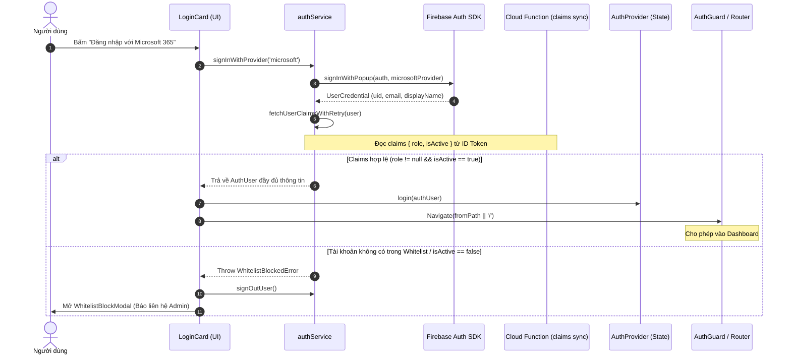

# Kế Hoạch Triển Khai: Bước 4.1 — Feature `auth` (Xác Thực & Whitelist Check)

> **Mã công việc:** Phase 4 - Step 4.1  
> **Feature Folder:** `frontend/src/features/auth/`  
> **Tài liệu quy chuẩn:** [new_architecture.md](file:///Users/tindn/Documents/Code/ContractReview_firestore/new_architecture.md), [AGENTS.md](file:///Users/tindn/Documents/Code/ContractReview_firestore/AGENTS.md), [PROGRESS.md](file:///Users/tindn/Documents/Code/ContractReview_firestore/PROGRESS.md)  
> **Ngày lập kế hoạch:** 2026-09-30  
> **Trạng thái:** Chờ phê duyệt (Pending Approval)

---

## 1. TỔNG QUAN VÀ MỤC TIÊU NGHIỆP VỤ

### 1.1. Mục tiêu
Triển khai hoàn chỉnh module xác thực người dùng (**Feature `auth`**) cho ứng dụng Frontend React, kết nối trực tiếp với Firebase Authentication và hệ thống phân quyền **Custom Claims** (`role`, `isActive`) đã được thiết lập ở Giai đoạn 2.

### 1.2. Yêu cầu Nghiệp vụ cốt lõi
1. **Hỗ trợ 2 phương thức đăng nhập SSO:**
   - **Microsoft 365 (`OAuthProvider('microsoft.com')`)**: Phương thức chính dành cho tài khoản email doanh nghiệp nội bộ (`@foodempire.vn`).
   - **Google Workspace (`GoogleAuthProvider`)**: Phương thức đăng nhập bổ trợ / fallback.
2. **Kiểm tra Whitelist & Đồng bộ Custom Claims:**
   - Sau khi đăng nhập thành công qua Popup, hệ thống gọi `getIdTokenResult(true)` để trích xuất claims `{ role, isActive }`.
   - Nếu claims chưa sẵn sàng (trường hợp user vừa được admin cấp trên console), áp dụng cơ chế Polling Retry nhẹ (tối đa 3 lần, mỗi lần cách nhau 1.5s - 2s).
   - Nếu tài khoản không thuộc Whitelist hoặc cờ `isActive === false`: Ngăn chặn truy cập, hiển thị `WhitelistBlockModal` cảnh báo và tự động đăng xuất an toàn.
3. **Phân quyền Route & Trải nghiệm Người dùng:**
   - Kết nối với `AuthProvider` và `AuthGuard` hiện có của ứng dụng.
   - Sau khi đăng nhập hợp lệ: hiển thị toast thông báo thành công và chuyển hướng về trang người dùng định truy cập trước đó (`state.from`), mặc định là `/` (Dashboard).
   - Hỗ trợ đăng xuất (`signOut`) hoàn toàn, xóa phiên làm việc và trở về trang `/login`.

---

## 2. KIẾN TRÚC MÔ-ĐUN & SƠ ĐỒ LUỒNG (ARCHITECTURE & FLOW)

### 2.1. Sơ đồ Luồng Đăng nhập & Kiểm tra Whitelist


### 2.2. Phân Tầng Tuân Thủ 4-Layer Separation (AGENTS.md & modular-code-architect)
```
┌────────────────────────────────────────────────────────┐
│ 1. Presentation Layer (Giao diện)                      │
│    - LoginCard.tsx (Giao diện đăng nhập Clean Ent.)    │
│    - WhitelistBlockModal.tsx (Hộp thoại chặn truy cập) │
├────────────────────────────────────────────────────────┤
│ 2. Business Logic Layer (Hooks & State)                │
│    - useAuth.ts (Quản lý trạng thái đăng nhập, error)  │
│    - useCurrentUser.ts (Tiện ích lấy user & quyền hạn) │
├────────────────────────────────────────────────────────┤
│ 3. Data / Service Layer                                │
│    - authService.ts (Tương tác trực tiếp Firebase Auth)│
├────────────────────────────────────────────────────────┤
│ 4. Shared / Core Layer                                 │
│    - types.ts (AuthInterfaces, Provider, ErrorTypes)   │
│    - index.ts (Barrel export duy nhất của feature)     │
└────────────────────────────────────────────────────────┘
```

---

## 3. DANH SÁCH FILE THỰC HIỆN

### 3.1. Tạo mới trong Feature `frontend/src/features/auth/`
1. [`frontend/src/features/auth/types.ts`](file:///Users/tindn/Documents/Code/ContractReview_firestore/frontend/src/features/auth/types.ts)
   - Định nghĩa `SignInProvider = 'microsoft' | 'google'`.
   - Định nghĩa `AuthErrorType`, `AuthErrorInfo`, `WhitelistStatus`.
   - Định nghĩa `CustomClaimsPayload`, `AuthResult`.
2. [`frontend/src/features/auth/services/authService.ts`](file:///Users/tindn/Documents/Code/ContractReview_firestore/frontend/src/features/auth/services/authService.ts)
   - Cung cấp:
     - `getMicrosoftProvider()`: Cấu hình `OAuthProvider('microsoft.com')` với tenant phù hợp và prompt consent.
     - `getGoogleProvider()`: Cấu hình `GoogleAuthProvider`.
     - `signInWithProvider(provider)`: Đăng nhập qua Popup.
     - `signOutUser()`: Đăng xuất khỏi Firebase Auth.
     - `fetchClaimsWithRetry(user, maxRetries, delayMs)`: Đọc và refresh token lấy Custom Claims, xử lý retry an toàn.
     - `buildAuthUser(user, claims)`: Chuyển đổi sang `AuthUser` chuẩn dùng chung.
     - `handleAuthError(error)`: Chuẩn hóa mã lỗi Firebase thành thông điệp tiếng Việt thân thiện.
3. [`frontend/src/features/auth/services/authService.test.ts`](file:///Users/tindn/Documents/Code/ContractReview_firestore/frontend/src/features/auth/services/authService.test.ts)
   - Unit tests cho `authService` (mock Firebase Auth SDK):
     - Test đăng nhập Microsoft thành công.
     - Test đăng nhập Google thành công.
     - Test từ chối tài khoản không có claim `role` hoặc `isActive === false`.
     - Test cơ chế retry polling khi claims chưa sẵn sàng.
     - Test xử lý lỗi popup bị chặn hoặc người dùng tự đóng popup.
4. [`frontend/src/features/auth/hooks/useAuth.ts`](file:///Users/tindn/Documents/Code/ContractReview_firestore/frontend/src/features/auth/hooks/useAuth.ts)
   - Custom hook quản lý hành vi đăng nhập:
     - `signIn(provider: SignInProvider)`
     - `signOut()`
     - `isLoggingIn: boolean`
     - `error: AuthErrorInfo | null`
     - `blockedUser: { email: string; displayName?: string } | null`
     - `clearError()`
5. [`frontend/src/features/auth/hooks/useCurrentUser.ts`](file:///Users/tindn/Documents/Code/ContractReview_firestore/frontend/src/features/auth/hooks/useCurrentUser.ts)
   - Custom hook lấy thông tin user hiện tại và cờ phân quyền:
     - `currentUser: AuthUser | null`
     - `isStaff: boolean` (`role === 'LEGAL' || role === 'HOL'`)
     - `isLegal: boolean`
     - `isHOL: boolean`
     - `isUser: boolean`
     - `department?: string`
6. [`frontend/src/features/auth/hooks/useAuth.test.tsx`](file:///Users/tindn/Documents/Code/ContractReview_firestore/frontend/src/features/auth/hooks/useAuth.test.tsx) & [`useCurrentUser.test.tsx`](file:///Users/tindn/Documents/Code/ContractReview_firestore/frontend/src/features/auth/hooks/useCurrentUser.test.tsx)
   - Unit tests cho cả 2 custom hooks.
7. [`frontend/src/features/auth/components/LoginCard.tsx`](file:///Users/tindn/Documents/Code/ContractReview_firestore/frontend/src/features/auth/components/LoginCard.tsx)
   - Component Card đăng nhập Clean Enterprise (Light/Dark mode).
   - Nút Microsoft 365 nổi bật kèm icon thương hiệu.
   - Nút Google Workspace bổ trợ kèm icon thương hiệu.
   - Loading indicator và trạng thái vô hiệu hóa nút khi đang xử lý.
   - Hiển thị thông báo lỗi trực quan nếu có lỗi phát sinh.
8. [`frontend/src/features/auth/components/WhitelistBlockModal.tsx`](file:///Users/tindn/Documents/Code/ContractReview_firestore/frontend/src/features/auth/components/WhitelistBlockModal.tsx)
   - Component Modal thông báo tài khoản chưa được cấp quyền truy cập Whitelist.
   - Cung cấp nút chuyển đổi tài khoản và nút liên hệ Admin.
9. [`frontend/src/features/auth/components/LoginCard.test.tsx`](file:///Users/tindn/Documents/Code/ContractReview_firestore/frontend/src/features/auth/components/LoginCard.test.tsx) & [`WhitelistBlockModal.test.tsx`](file:///Users/tindn/Documents/Code/ContractReview_firestore/frontend/src/features/auth/components/WhitelistBlockModal.test.tsx)
   - Unit tests cho các components.
10. [`frontend/src/features/auth/index.ts`](file:///Users/tindn/Documents/Code/ContractReview_firestore/frontend/src/features/auth/index.ts)
    - Barrel export công khai duy nhất cho toàn bộ feature `auth`.

### 3.2. Cập nhật các module App & Shared
11. [`frontend/src/app/providers.tsx`](file:///Users/tindn/Documents/Code/ContractReview_firestore/frontend/src/app/providers.tsx)
    - Nâng cấp `AuthProvider`: Kết nối lắng nghe `onAuthStateChanged` từ `firebaseClient.getFirebaseAuth()`.
    - Khi có phiên đăng nhập, tự động trích xuất Custom Claims và cập nhật `currentUser`.
    - Xử lý trạng thái `isLoading` mượt mà khi ứng dụng khởi chạy / reload trang.
12. [`frontend/src/app/components/PlaceholderPages.tsx`](file:///Users/tindn/Documents/Code/ContractReview_firestore/frontend/src/app/components/PlaceholderPages.tsx)
    - Thay thế component `LoginView` giả lập bằng `LoginCard` thực tế từ `@/features/auth`.
    - Cải thiện trang `UnauthorizedView` với nút đăng xuất chuyển về `/login`.

---

## 4. CHI TIẾT CÁC BƯỚC THỰC HIỆN NGUYÊN TỬ (ATOMIC IMPLEMENTATION STEPS)

- **Bước 1 (Types & Core Services)**:
  - Tạo `types.ts` và `authService.ts`.
  - Viết `authService.test.ts` kiểm thử đầy đủ logic claims validation, retry và error formatting.
  - Chạy `npm run test` đảm bảo pass 100%.

- **Bước 2 (Custom Hooks)**:
  - Tạo `useAuth.ts` và `useCurrentUser.ts`.
  - Viết `useAuth.test.tsx` và `useCurrentUser.test.tsx`.
  - Chạy `npm run test` đảm bảo pass 100%.

- **Bước 3 (Presentation Components)**:
  - Tạo `LoginCard.tsx` và `WhitelistBlockModal.tsx`.
  - Viết `LoginCard.test.tsx` và `WhitelistBlockModal.test.tsx`.
  - Cập nhật master barrel export `frontend/src/features/auth/index.ts`.
  - Chạy `npm run test` đảm bảo pass 100%.

- **Bước 4 (Tích hợp App Shell & Realtime Session Listener)**:
  - Cập nhật `AuthProvider` trong `frontend/src/app/providers.tsx` lắng nghe `onAuthStateChanged`.
  - Cập nhật `PlaceholderPages.tsx` gắn `LoginCard` thực tế vào trang `/login`.
  - Kiểm thử lại toàn bộ test suite frontend và backend (`179+ tests PASS`).
  - Kiểm tra build production `npm run build` không có bất kỳ lỗi TypeScript hay linter nào.

- **Bước 5 (Cập nhật Tiến độ & Bàn giao)**:
  - Cập nhật mục 4.1 trong [PROGRESS.md](file:///Users/tindn/Documents/Code/ContractReview_firestore/PROGRESS.md).
  - Báo cáo kết quả chi tiết cho User.

---

## 5. TIÊU CHÍ NGHIỆM THU (ACCEPTANCE CRITERIA)
- [ ] 100% code viết bằng TypeScript ở chế độ Strict mode, không chứa kiểu `any`.
- [ ] Tuân thủ giới hạn SRP: mỗi hàm $\le 25$ dòng logic, component $\le 150-300$ dòng.
- [ ] Chỉ import feature `auth` thông qua Barrel export `frontend/src/features/auth/index.ts`.
- [ ] Thư mục code cũ [`OLD_Ver/`](file:///Users/tindn/Documents/Code/ContractReview_firestore/OLD_Ver) được giữ nguyên vẹn 100% (0 file bị thay đổi).
- [ ] Đạt tối thiểu 15+ unit tests mới cho feature `auth`, nâng tổng số test frontend lên $>95$ tests.
- [ ] Toàn bộ test suites frontend và backend **PASS 100%**.
- [ ] Lệnh `tsc -b && vite build` hoàn thành với **0 lỗi**.

---

## 6. QUẢN TRỊ RỦI RO & PHƯƠNG ÁN DỰ PHÒNG (RISKS & MITIGATION)
1. **Rủi ro Popup bị trình duyệt chặn**:
   - *Giải pháp*: Bắt mã lỗi `auth/popup-blocked` và hiển thị hướng dẫn người dùng bấm mở lại hoặc cấp quyền popup.
2. **Rủi ro Claims chưa kịp cập nhật sau khi Admin tạo user**:
   - *Giải pháp*: Thuật toán `fetchClaimsWithRetry` tự động retry 3 lần kèm exponential backoff nhẹ trước khi kết luận tài khoản chưa được whitelist.
3. **Rủi ro Trạng thái Offline / Mạng chập chờn**:
   - *Giải pháp*: Custom claims được lưu cục bộ trong IndexedDB/JWT của Firebase Auth SDK nên kiểm tra phân quyền offline mượt mà không tốn network reads.
